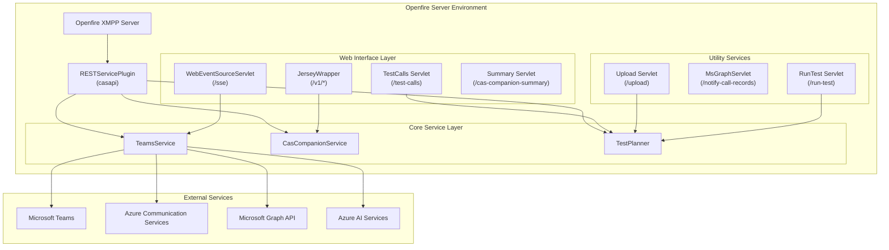
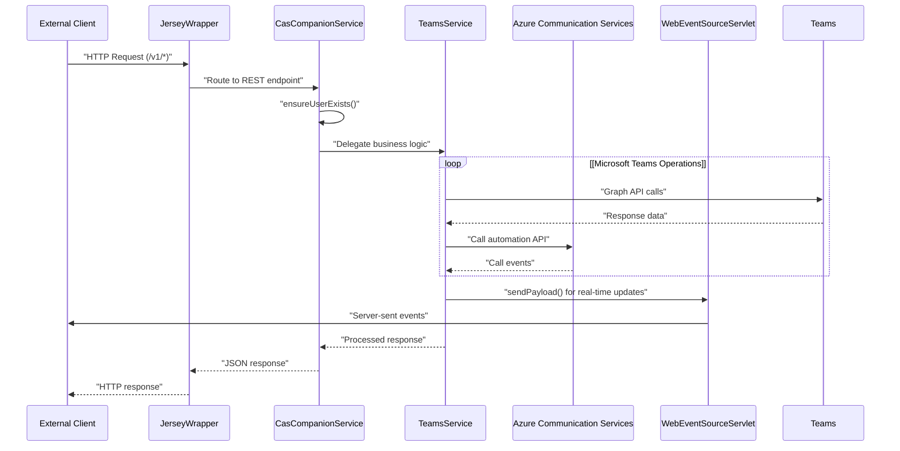
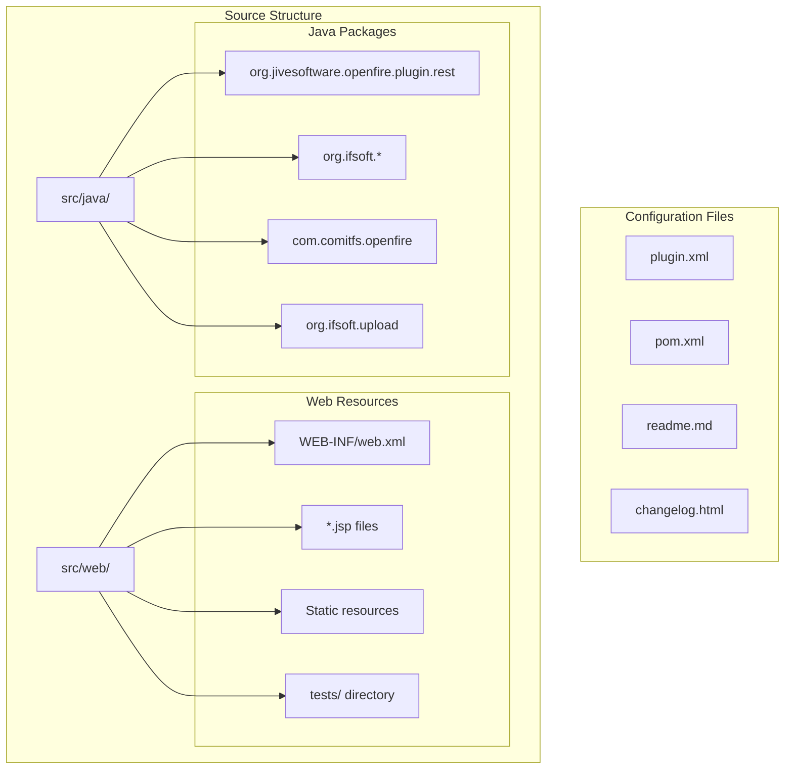

# Overview

> **Relevant source files**
> * [changelog.html](https://github.com/ComitFS/cas-service/blob/b7087e8d/changelog.html)
> * [plugin.xml](https://github.com/ComitFS/cas-service/blob/b7087e8d/plugin.xml)
> * [pom.xml](https://github.com/ComitFS/cas-service/blob/b7087e8d/pom.xml)
> * [readme.html](https://github.com/ComitFS/cas-service/blob/b7087e8d/readme.html)
> * [readme.md](https://github.com/ComitFS/cas-service/blob/b7087e8d/readme.md)
> * [src/java/com/ifsoft/openlink/view/RunTest.java](https://github.com/ComitFS/cas-service/blob/b7087e8d/src/java/com/ifsoft/openlink/view/RunTest.java)
> * [src/java/com/ifsoft/openlink/view/SummariseCall.java](https://github.com/ComitFS/cas-service/blob/b7087e8d/src/java/com/ifsoft/openlink/view/SummariseCall.java)
> * [src/java/org/ifsoft/upload/Servlet.java](https://github.com/ComitFS/cas-service/blob/b7087e8d/src/java/org/ifsoft/upload/Servlet.java)
> * [src/web/WEB-INF/web.xml](https://github.com/ComitFS/cas-service/blob/b7087e8d/src/web/WEB-INF/web.xml)

This document provides a comprehensive introduction to the CAS Service Plugin, an Openfire server extension that integrates Microsoft Teams, Azure Communication Services, and automated call testing capabilities. The plugin serves as a communication automation platform that bridges XMPP messaging, Microsoft cloud services, and telephony systems.

For detailed information about specific service components, see [Core Services](./2-core-services.md). For test automation framework details, see [Test Automation Framework](./3-test-automation-framework.md). For client application documentation, see [Client Applications](./5-client-applications.md).

## System Purpose and Architecture

The CAS Service Plugin extends the `RESTServicePlugin` class to provide a unified communication platform with three primary functions:

1. **Microsoft Teams Integration** - Seamless integration with Teams, Graph API, and Bot Framework
2. **Call Automation** - Azure Communication Services integration for automated call testing and IVR validation
3. **Real-time Communication** - WebSocket-based audio streaming and live event processing

## Plugin Architecture Overview

**Sources:** [plugin.xml L4-L30](https://github.com/ComitFS/cas-service/blob/b7087e8d/plugin.xml#L4-L30)

 [src/web/WEB-INF/web.xml L7-L184](https://github.com/ComitFS/cas-service/blob/b7087e8d/src/web/WEB-INF/web.xml#L7-L184)

 [pom.xml L9-L13](https://github.com/ComitFS/cas-service/blob/b7087e8d/pom.xml#L9-L13)

## Maven Project Structure

The plugin is built as a Maven project with comprehensive dependencies for Microsoft services integration:

| Component Category | Key Dependencies | Purpose |
| --- | --- | --- |
| Microsoft Integration | `microsoft-graph`, `msal4j`, `bot-connector` | Teams and Graph API integration |
| Azure Services | `azure-communication-*`, `azure-identity` | Call automation and messaging |
| Web Framework | `jersey-container-*`, `jackson-*` | REST API and JSON processing |
| Test Automation | `quartz`, `nashorn-core`, `opencsv` | Scheduled testing and script execution |
| Real-time Communication | `netty-all`, `webrtc-java` | WebSocket and WebRTC support |

**Sources:** [pom.xml L47-L340](https://github.com/ComitFS/cas-service/blob/b7087e8d/pom.xml#L47-L340)

## Service Integration Flow

**Sources:** [src/web/WEB-INF/web.xml L106-L108](https://github.com/ComitFS/cas-service/blob/b7087e8d/src/web/WEB-INF/web.xml#L106-L108)

 [src/web/WEB-INF/web.xml L32-L35](https://github.com/ComitFS/cas-service/blob/b7087e8d/src/web/WEB-INF/web.xml#L32-L35)

## Core Capabilities

### Microsoft Teams Integration

The plugin provides deep integration with Microsoft Teams ecosystem through:

* **Teams App Support** - Custom Teams application with multiple tabs and bot functionality
* **Graph API Integration** - Access to user profiles, meetings, and presence information
* **Authentication** - MSAL-based OAuth integration for secure access

### Call Automation Framework

Comprehensive automated testing capabilities include:

* **Test Scenario Management** - CSV and JavaScript-based test definitions
* **Scheduled Execution** - Quartz-based job scheduling for automated test runs
* **IVR Testing** - Automated interaction with phone systems using DTMF and voice recognition
* **Results Reporting** - HTML and JSON output formats for test results

### Real-time Communication

Advanced real-time features support:

* **Audio Streaming** - WebSocket-based live audio processing
* **Speech-to-Text** - Azure AI integration for real-time transcription
* **Event Broadcasting** - Server-sent events for live system updates

**Sources:** [pom.xml L138-L265](https://github.com/ComitFS/cas-service/blob/b7087e8d/pom.xml#L138-L265)

 [src/java/com/ifsoft/openlink/view/SummariseCall.java L64-L70](https://github.com/ComitFS/cas-service/blob/b7087e8d/src/java/com/ifsoft/openlink/view/SummariseCall.java#L64-L70)

## File System Organization

**Sources:** [src/java/org/ifsoft/upload/Servlet.java L1](https://github.com/ComitFS/cas-service/blob/b7087e8d/src/java/org/ifsoft/upload/Servlet.java#L1-L1)

 [src/java/com/ifsoft/openlink/view/SummariseCall.java L1](https://github.com/ComitFS/cas-service/blob/b7087e8d/src/java/com/ifsoft/openlink/view/SummariseCall.java#L1-L1)

 [src/web/WEB-INF/web.xml L1](https://github.com/ComitFS/cas-service/blob/b7087e8d/src/web/WEB-INF/web.xml#L1-L1)

## Admin Console Integration

The plugin extends Openfire's admin console with dedicated management interfaces organized into three main areas:

* **Companion Service** - System overview and REST API settings
* **Teams Integration** - User profiles, settings, and call history management
* **Call Automation** - Test management and call summarization tools

These interfaces are accessible through the admin console at `/cas-companion-summary`, `/teams-settings`, and `/test-calls` respectively.

**Sources:** [plugin.xml L13-L29](https://github.com/ComitFS/cas-service/blob/b7087e8d/plugin.xml#L13-L29)

 [src/web/WEB-INF/web.xml L125-L183](https://github.com/ComitFS/cas-service/blob/b7087e8d/src/web/WEB-INF/web.xml#L125-L183)