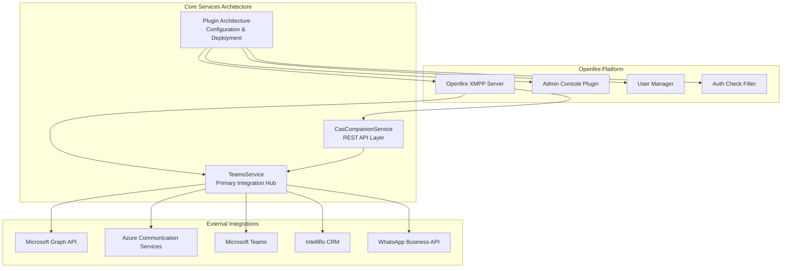
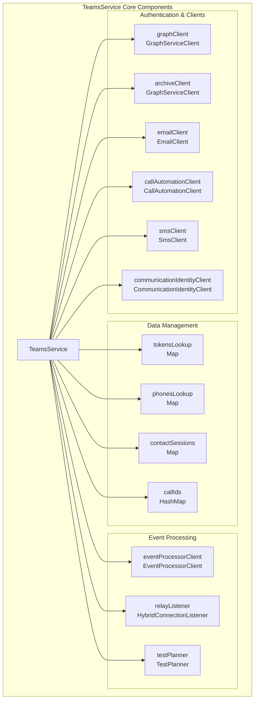
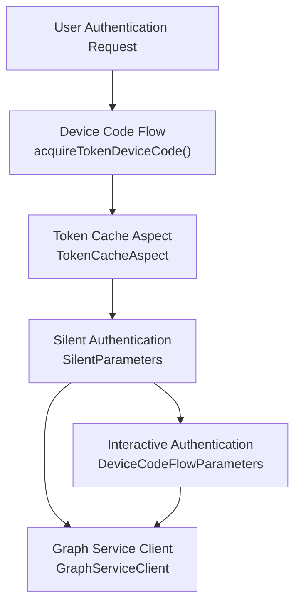
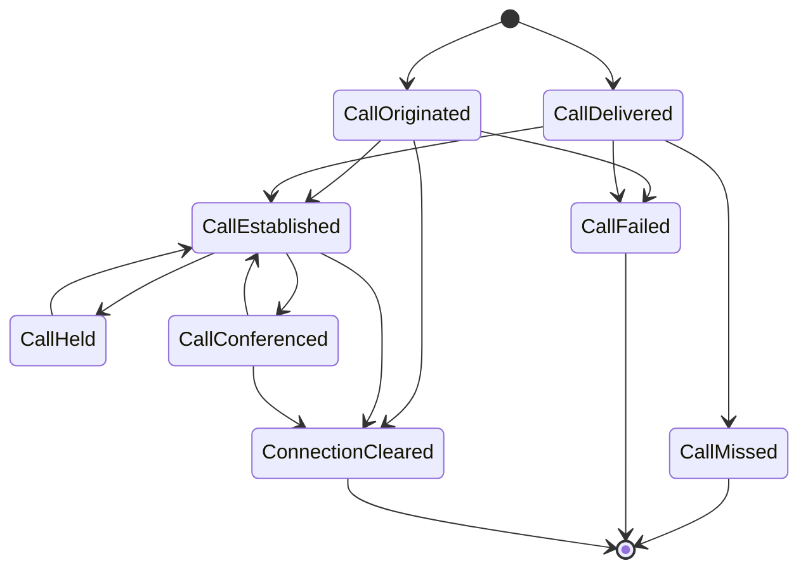
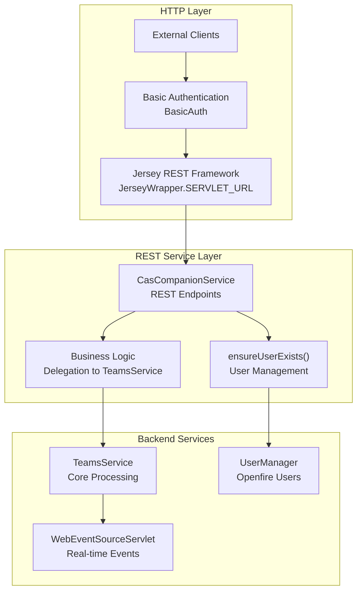
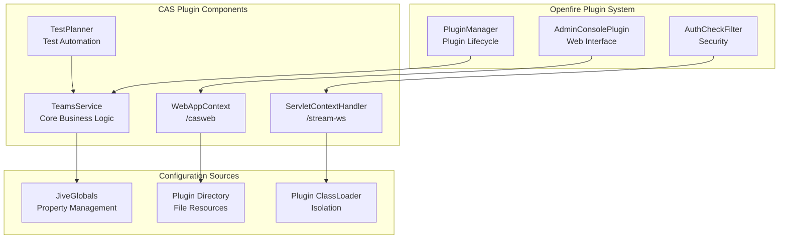

# Core Services

> **Relevant source files**
> * [src/java/com/comitfs/openfire/TeamsService.java](https://github.com/ComitFS/cas-service/blob/b7087e8d/src/java/com/comitfs/openfire/TeamsService.java)

This document covers the main service components that form the backbone of the CAS (comitFS application services). These core services handle the primary business logic, external integrations, and API exposure for the entire platform.

For information about the test automation capabilities, see [Test Automation Framework](./3-test-automation-framework.md). For details about real-time communication features, see [Real-time Communication](./4-real-time-communication.md). For client application interfaces, see [Client Applications](./5-client-applications.md).

## Overview

The CAS system is built around three primary core services that work together to provide a unified communication platform:

**Core Service Responsibilities**

| Service | Purpose | Key Integrations |
| --- | --- | --- |
| `TeamsService` | Primary integration hub handling Microsoft services, call automation, and user management | Graph API, ACS, Teams, Bot Framework |
| `CasCompanionService` | REST API layer exposing system functionality to external clients | Jersey framework, HTTP servlets |
| Plugin Architecture | Openfire plugin structure providing configuration, deployment, and lifecycle management | Openfire server, web contexts, authentication |

Sources: [src/java/com/comitfs/openfire/TeamsService.java L188-L400](https://github.com/ComitFS/cas-service/blob/b7087e8d/src/java/com/comitfs/openfire/TeamsService.java#L188-L400)

## TeamsService Integration Hub

The `TeamsService` class serves as the central coordination point for all external integrations and core business logic. It implements the `ProcessListener` interface and manages multiple client connections, authentication flows, and event processing.

**Key Service Methods**

| Method Category | Key Methods | Purpose |
| --- | --- | --- |
| Initialization | `initializeService()`, `destroyService()` | Plugin lifecycle management |
| Graph API | `setupGraphAPI()`, `createGraphAPI()`, `requestSubscriptions()` | Microsoft Graph integration |
| Call Management | `updateCall()`, `makeCall()`, `processUserAction()` | Call status and control |
| User Management | `setupUserProfiles()`, `getUserProfile()`, `ensureUserExists()` | User synchronization |
| ACS Integration | `setupACS()`, `makeOmniCall()`, `establishStreaming()` | Azure Communication Services |

Sources: [src/java/com/comitfs/openfire/TeamsService.java L305-L381](https://github.com/ComitFS/cas-service/blob/b7087e8d/src/java/com/comitfs/openfire/TeamsService.java#L305-L381)

 [src/java/com/comitfs/openfire/TeamsService.java L408-L473](https://github.com/ComitFS/cas-service/blob/b7087e8d/src/java/com/comitfs/openfire/TeamsService.java#L408-L473)

 [src/java/com/comitfs/openfire/TeamsService.java L3114-L3271](https://github.com/ComitFS/cas-service/blob/b7087e8d/src/java/com/comitfs/openfire/TeamsService.java#L3114-L3271)

### Authentication and Token Management

The service implements sophisticated authentication flows for Microsoft services using MSAL (Microsoft Authentication Library) and device code flows:

The authentication process stores tokens in the `tokensLookup` map and sends device code prompts to users via email and real-time notifications.

Sources: [src/java/com/comitfs/openfire/TeamsService.java L858-L922](https://github.com/ComitFS/cas-service/blob/b7087e8d/src/java/com/comitfs/openfire/TeamsService.java#L858-L922)

 [src/java/com/comitfs/openfire/TeamsService.java L248-L251](https://github.com/ComitFS/cas-service/blob/b7087e8d/src/java/com/comitfs/openfire/TeamsService.java#L248-L251)

### Call Status Management

TeamsService maintains call state through the Openlink protocol, tracking calls across multiple participants and states:

Sources: [src/java/com/comitfs/openfire/TeamsService.java L4036-L4095](https://github.com/ComitFS/cas-service/blob/b7087e8d/src/java/com/comitfs/openfire/TeamsService.java#L4036-L4095)

 [src/java/com/comitfs/openfire/TeamsService.java L3426-L3509](https://github.com/ComitFS/cas-service/blob/b7087e8d/src/java/com/comitfs/openfire/TeamsService.java#L3426-L3509)

## REST API Layer

The REST API layer, implemented through the `CasCompanionService`, provides HTTP endpoints for external clients to interact with the CAS system. This service is built on the Jersey framework and integrates with Openfire's plugin architecture.

**Authentication and Authorization**

The REST API uses basic authentication and integrates with Openfire's user management system. The service automatically creates users if they don't exist and validates credentials against the Openfire user store.

**Key API Endpoints**

| Endpoint Pattern | Purpose | Authentication |
| --- | --- | --- |
| `/casapi/v1/*` | Main REST API endpoints | Basic Auth |
| `/casapi/sse` | Server-Sent Events | Excluded from auth |
| `/casapi/notify-call-records` | Webhook callbacks | Excluded from auth |
| `/casapi/docs/*` | API documentation | Excluded from auth |

Sources: [src/java/com/comitfs/openfire/TeamsService.java L371-L380](https://github.com/ComitFS/cas-service/blob/b7087e8d/src/java/com/comitfs/openfire/TeamsService.java#L371-L380)

 [src/java/com/comitfs/openfire/TeamsService.java L296-L302](https://github.com/ComitFS/cas-service/blob/b7087e8d/src/java/com/comitfs/openfire/TeamsService.java#L296-L302)

## Plugin Architecture & Configuration

The CAS system is implemented as an Openfire plugin, providing deep integration with the XMPP server infrastructure while maintaining modularity and configurability.

**Plugin Lifecycle Management**

The plugin follows standard Openfire plugin patterns with initialization and destruction phases:

| Phase | Method | Purpose |
| --- | --- | --- |
| Initialization | `initializeService()` | Setup services, web contexts, authentication exclusions |
| Runtime | Event processing | Handle calls, messages, user synchronization |
| Destruction | `destroyService()` | Cleanup resources, stop services, remove exclusions |

**Web Context Configuration**

The plugin establishes multiple web contexts:

* **Static Web Content** (`/casweb`): Serves HTML, CSS, JavaScript files
* **WebSocket Endpoints** (`/stream-ws`): Real-time audio streaming and communication
* **Test Interface**: Automated testing and diagnostics

**Authentication Integration**

The plugin modifies Openfire's authentication behavior by adding exclusions to `AuthCheckFilter` for public endpoints while maintaining security for administrative functions.

Sources: [src/java/com/comitfs/openfire/TeamsService.java L305-L381](https://github.com/ComitFS/cas-service/blob/b7087e8d/src/java/com/comitfs/openfire/TeamsService.java#L305-L381)

 [src/java/com/comitfs/openfire/TeamsService.java L270-L303](https://github.com/ComitFS/cas-service/blob/b7087e8d/src/java/com/comitfs/openfire/TeamsService.java#L270-L303)

 [src/java/com/comitfs/openfire/TeamsService.java L337-L378](https://github.com/ComitFS/cas-service/blob/b7087e8d/src/java/com/comitfs/openfire/TeamsService.java#L337-L378)
