# TeamsService Integration Hub

> **Relevant source files**
> * [src/java/com/comitfs/openfire/TeamsService.java](https://github.com/ComitFS/cas-service/blob/b7087e8d/src/java/com/comitfs/openfire/TeamsService.java)

## Purpose and Scope

The `TeamsService` class serves as the central integration hub for the CAS Service Plugin, orchestrating communication between Microsoft Teams, Azure Communication Services, and the Openfire XMPP server. This document covers the architecture, key components, and integration patterns implemented within the `TeamsService` class.

For information about the REST API layer that exposes TeamsService functionality, see [REST API Layer](./2.2-rest-api-layer.md). For details about the test automation framework that TeamsService coordinates with, see [TestPlanner Engine](./3.1-testplanner-engine.md). For WebSocket streaming capabilities, see [WebSocket Audio Streaming](./4.1-websocket-audio-streaming.md).

## Core Architecture

The `TeamsService` class implements a multi-service integration pattern, acting as the primary orchestrator for all external service communications and internal system coordination.

### Service Integration Architecture

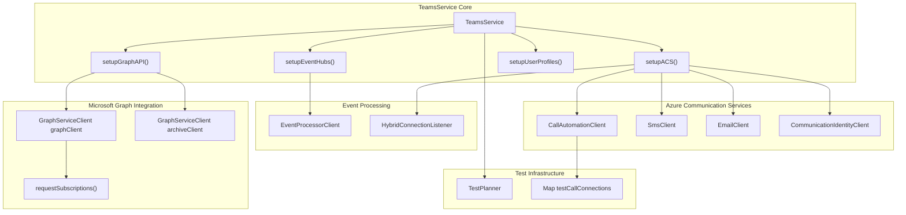

Sources: [src/java/com/comitfs/openfire/TeamsService.java L188-L262](https://github.com/ComitFS/cas-service/blob/b7087e8d/src/java/com/comitfs/openfire/TeamsService.java#L188-L262)

 [src/java/com/comitfs/openfire/TeamsService.java L305-L381](https://github.com/ComitFS/cas-service/blob/b7087e8d/src/java/com/comitfs/openfire/TeamsService.java#L305-L381)

### Class Dependencies and External Services

```mermaid
flowchart TD

MSGraph["Microsoft Graph API"]
MSTeams["Microsoft Teams"]
ACS["Azure Communication Services"]
AzureAI["Azure AI Services"]
EventHubs["Azure Event Hubs"]
BotFramework["Microsoft Bot Framework"]
graphClient["graphClient: GraphServiceClient"]
callAutomationClient["callAutomationClient: CallAutomationClient"]
smsClient["smsClient: SmsClient"]
emailClient["emailClient: EmailClient"]
credentials["credentials: MicrosoftAppCredentials"]
eventProcessorClient["eventProcessorClient: EventProcessorClient"]
tokensLookup["Map tokensLookup"]
phonesLookup["Map phonesLookup"]
msTeamsContacts["Map msTeamsContacts"]
testCallConnections["Map testCallConnections"]

graphClient --> MSGraph
graphClient --> MSTeams
callAutomationClient --> ACS
smsClient --> ACS
emailClient --> ACS
credentials --> BotFramework
eventProcessorClient --> EventHubs
graphClient --> tokensLookup
graphClient --> phonesLookup
graphClient --> msTeamsContacts
callAutomationClient --> testCallConnections

subgraph subGraph2 ["Core Data Structures"]
    tokensLookup
    phonesLookup
    msTeamsContacts
    testCallConnections
end

subgraph subGraph1 ["TeamsService Clients"]
    graphClient
    callAutomationClient
    smsClient
    emailClient
    credentials
    eventProcessorClient
end

subgraph subGraph0 ["External Microsoft Services"]
    MSGraph
    MSTeams
    ACS
    AzureAI
    EventHubs
    BotFramework
end
```

Sources: [src/java/com/comitfs/openfire/TeamsService.java L195-L262](https://github.com/ComitFS/cas-service/blob/b7087e8d/src/java/com/comitfs/openfire/TeamsService.java#L195-L262)

 [src/java/com/comitfs/openfire/TeamsService.java L248-L255](https://github.com/ComitFS/cas-service/blob/b7087e8d/src/java/com/comitfs/openfire/TeamsService.java#L248-L255)

## Service Initialization and Lifecycle

### Initialization Flow

The `TeamsService` follows a conditional initialization pattern based on configuration properties, enabling different service combinations as needed.

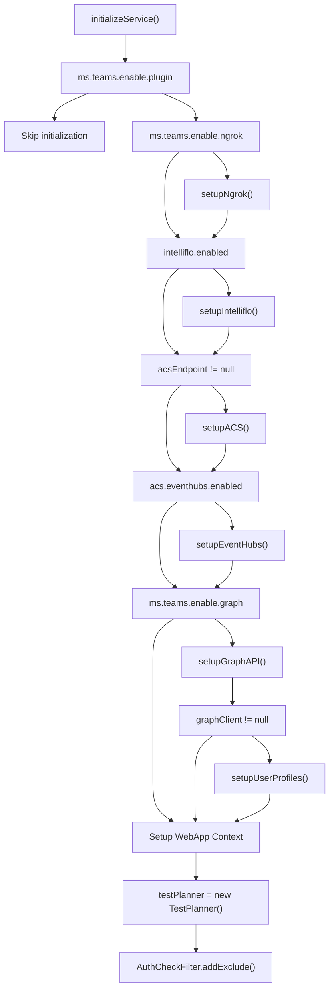

Sources: [src/java/com/comitfs/openfire/TeamsService.java L305-L381](https://github.com/ComitFS/cas-service/blob/b7087e8d/src/java/com/comitfs/openfire/TeamsService.java#L305-L381)

### Service Destruction

The destruction process follows a coordinated shutdown sequence to ensure proper cleanup of resources and connections.

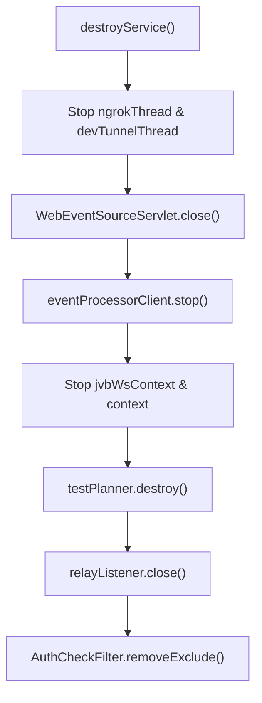

Sources: [src/java/com/comitfs/openfire/TeamsService.java L270-L303](https://github.com/ComitFS/cas-service/blob/b7087e8d/src/java/com/comitfs/openfire/TeamsService.java#L270-L303)

## Microsoft Graph API Integration

### Graph Client Management

The `TeamsService` maintains two separate `GraphServiceClient` instances for different operational contexts:

* `graphClient`: Primary client for real-time operations
* `archiveClient`: Dedicated client for subscription and archival operations

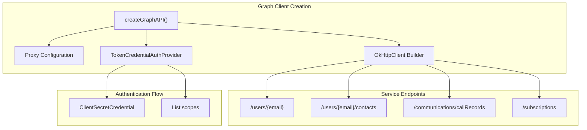

Sources: [src/java/com/comitfs/openfire/TeamsService.java L408-L473](https://github.com/ComitFS/cas-service/blob/b7087e8d/src/java/com/comitfs/openfire/TeamsService.java#L408-L473)

 [src/java/com/comitfs/openfire/TeamsService.java L3114-L3271](https://github.com/ComitFS/cas-service/blob/b7087e8d/src/java/com/comitfs/openfire/TeamsService.java#L3114-L3271)

### Subscription Management

The subscription system enables real-time notifications for Teams events through webhook callbacks.

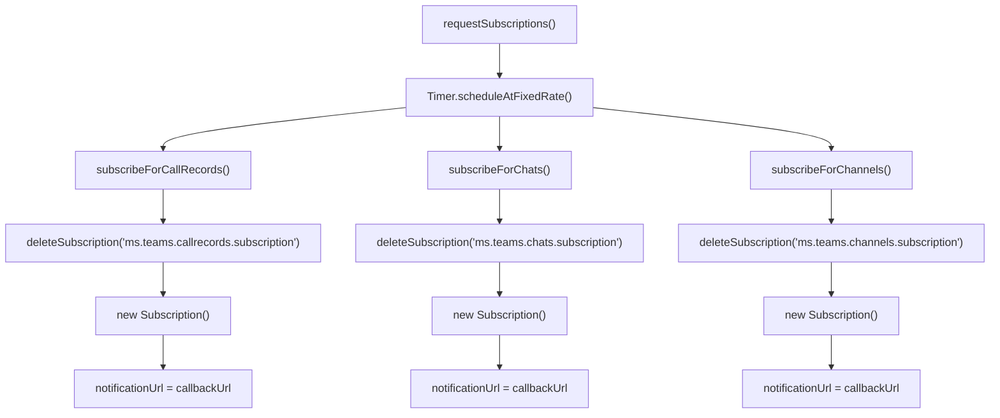

Sources: [src/java/com/comitfs/openfire/TeamsService.java L475-L559](https://github.com/ComitFS/cas-service/blob/b7087e8d/src/java/com/comitfs/openfire/TeamsService.java#L475-L559)

## Azure Communication Services Integration

### ACS Client Initialization

The ACS setup creates multiple specialized clients for different communication services.

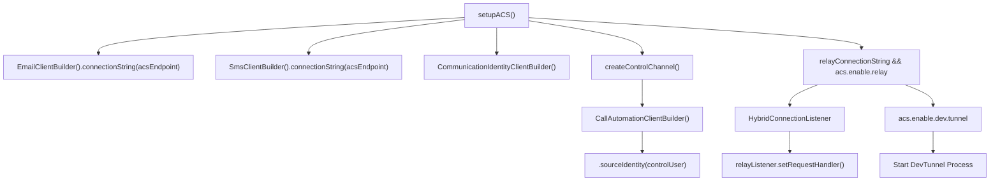

Sources: [src/java/com/comitfs/openfire/TeamsService.java L4514-L4618](https://github.com/ComitFS/cas-service/blob/b7087e8d/src/java/com/comitfs/openfire/TeamsService.java#L4514-L4618)

### Call Automation Workflow

The call automation system provides comprehensive telephony capabilities through ACS.

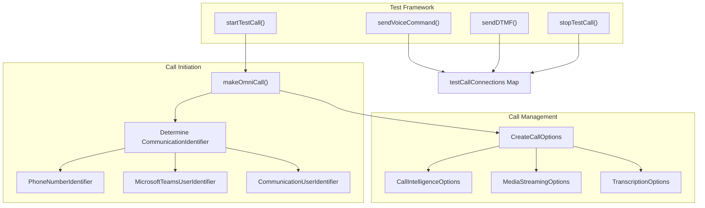

Sources: [src/java/com/comitfs/openfire/TeamsService.java L4645-L4817](https://github.com/ComitFS/cas-service/blob/b7087e8d/src/java/com/comitfs/openfire/TeamsService.java#L4645-L4817)

 [src/java/com/comitfs/openfire/TeamsService.java L4686-L4760](https://github.com/ComitFS/cas-service/blob/b7087e8d/src/java/com/comitfs/openfire/TeamsService.java#L4686-L4760)

## Openlink Protocol Implementation

### Call Status Management

The `TeamsService` implements the Openlink protocol for call control and status reporting.

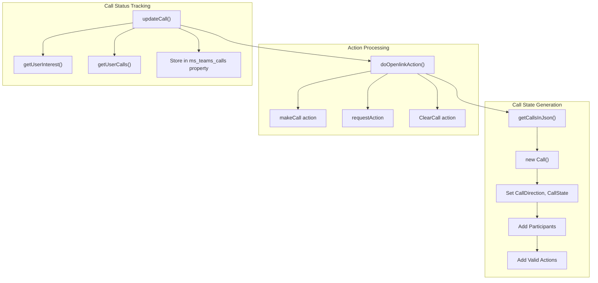

Sources: [src/java/com/comitfs/openfire/TeamsService.java L4036-L4095](https://github.com/ComitFS/cas-service/blob/b7087e8d/src/java/com/comitfs/openfire/TeamsService.java#L4036-L4095)

 [src/java/com/comitfs/openfire/TeamsService.java L3591-L3691](https://github.com/ComitFS/cas-service/blob/b7087e8d/src/java/com/comitfs/openfire/TeamsService.java#L3591-L3691)

 [src/java/com/comitfs/openfire/TeamsService.java L3517-L3575](https://github.com/ComitFS/cas-service/blob/b7087e8d/src/java/com/comitfs/openfire/TeamsService.java#L3517-L3575)

### Interest and User Management

The system maintains user interests and contact relationships for call routing.

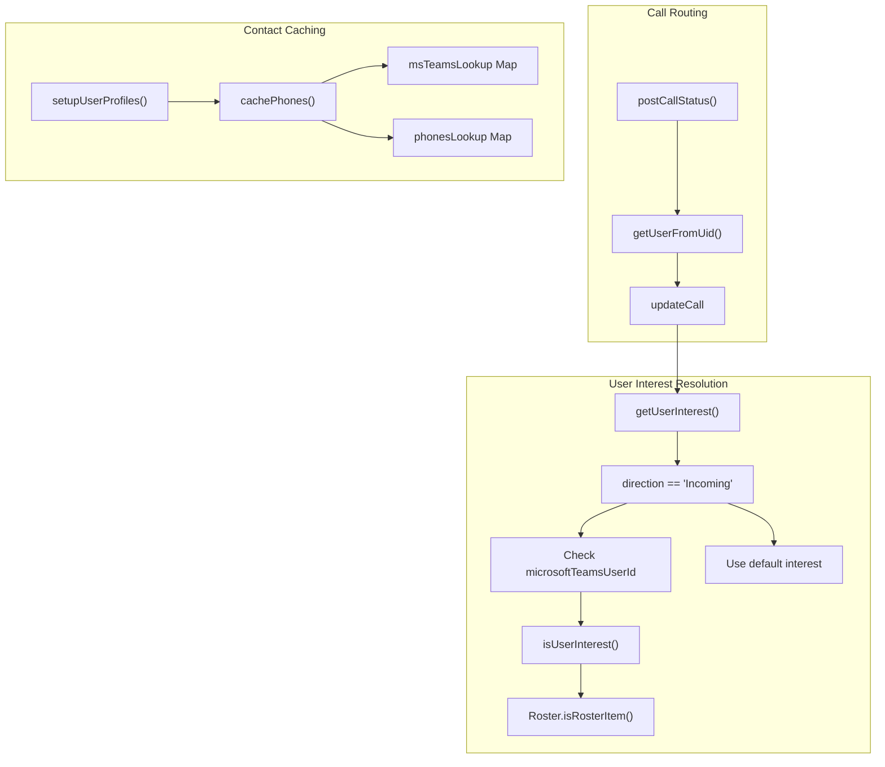

Sources: [src/java/com/comitfs/openfire/TeamsService.java L4097-L4193](https://github.com/ComitFS/cas-service/blob/b7087e8d/src/java/com/comitfs/openfire/TeamsService.java#L4097-L4193)

 [src/java/com/comitfs/openfire/TeamsService.java L4486-L4506](https://github.com/ComitFS/cas-service/blob/b7087e8d/src/java/com/comitfs/openfire/TeamsService.java#L4486-L4506)

 [src/java/com/comitfs/openfire/TeamsService.java L4268-L4450](https://github.com/ComitFS/cas-service/blob/b7087e8d/src/java/com/comitfs/openfire/TeamsService.java#L4268-L4450)

## Event Processing and Webhooks

### Event Hub Processing

The system processes various Azure Communication Services events through Event Hubs.

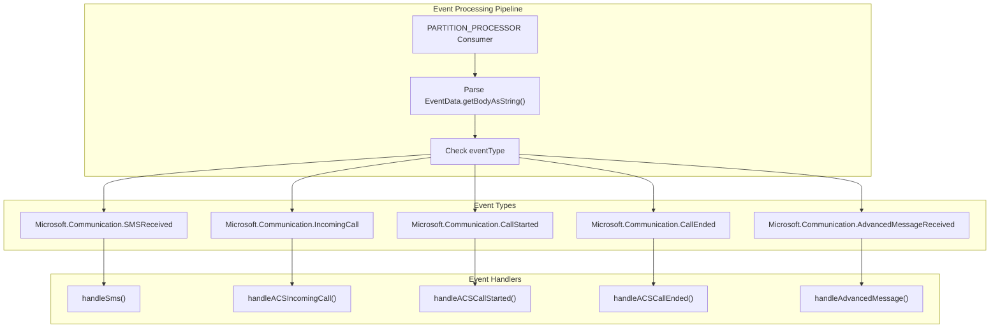

Sources: [src/java/com/comitfs/openfire/TeamsService.java L4890-L5000](https://github.com/ComitFS/cas-service/blob/b7087e8d/src/java/com/comitfs/openfire/TeamsService.java#L4890-L5000)

### Relay Listener Processing

The `HybridConnectionListener` processes real-time events from Azure Service Bus.

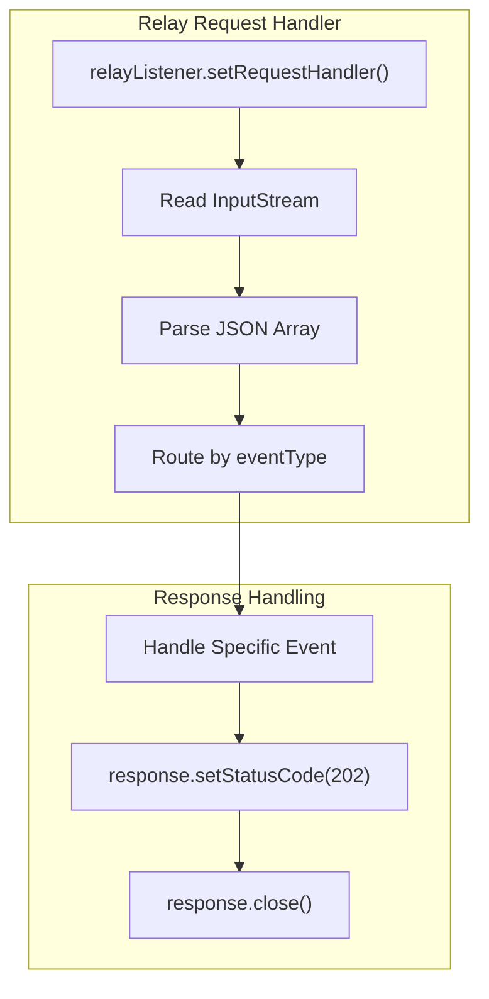

Sources: [src/java/com/comitfs/openfire/TeamsService.java L4528-L4583](https://github.com/ComitFS/cas-service/blob/b7087e8d/src/java/com/comitfs/openfire/TeamsService.java#L4528-L4583)

## Data Structures and State Management

### Core Data Maps

The `TeamsService` maintains several key data structures for state management and lookups.

| Data Structure | Type | Purpose |
| --- | --- | --- |
| `tokensLookup` | `Map<String, String>` | Authentication token management |
| `phonesLookup` | `Map<String, MsContact>` | Phone number to contact mapping |
| `msTeamsContacts` | `Map<String, JSONArray>` | User contacts from Graph API |
| `msTeamsLookup` | `Map<String, String>` | Various identifier lookups |
| `meetingCallIds` | `Map<String, MsContact>` | Meeting call tracking |
| `testCallConnections` | `Map<String, CallConnection>` | Active test call connections |
| `callIds` | `HashMap<String, String>` | Call ID to interest mapping |

Sources: [src/java/com/comitfs/openfire/TeamsService.java L248-L262](https://github.com/ComitFS/cas-service/blob/b7087e8d/src/java/com/comitfs/openfire/TeamsService.java#L248-L262)

### Configuration Properties

Key configuration properties that control service behavior:

| Property | Default | Purpose |
| --- | --- | --- |
| `ms.teams.enable.plugin` | `true` | Enable/disable TeamsService |
| `ms.teams.enable.graph` | `false` | Enable Graph API integration |
| `acs.endpoint` | `null` | Azure Communication Services endpoint |
| `ms.teams.enable.subscription` | `false` | Enable Teams subscriptions |
| `acs.eventhubs.enabled` | `false` | Enable Event Hub processing |

Sources: [src/java/com/comitfs/openfire/TeamsService.java L199-L224](https://github.com/ComitFS/cas-service/blob/b7087e8d/src/java/com/comitfs/openfire/TeamsService.java#L199-L224)

## Integration Patterns

### Callback URL Strategy

The service uses a unified callback URL pattern for webhook notifications:

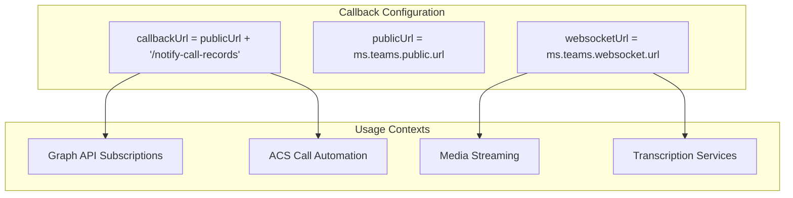

Sources: [src/java/com/comitfs/openfire/TeamsService.java L221-L224](https://github.com/ComitFS/cas-service/blob/b7087e8d/src/java/com/comitfs/openfire/TeamsService.java#L221-L224)

The `TeamsService` class represents a sophisticated integration hub that coordinates multiple Microsoft and Azure services while maintaining compatibility with the Openfire XMPP server architecture. Its modular design allows for flexible deployment scenarios while providing comprehensive communication and collaboration capabilities.