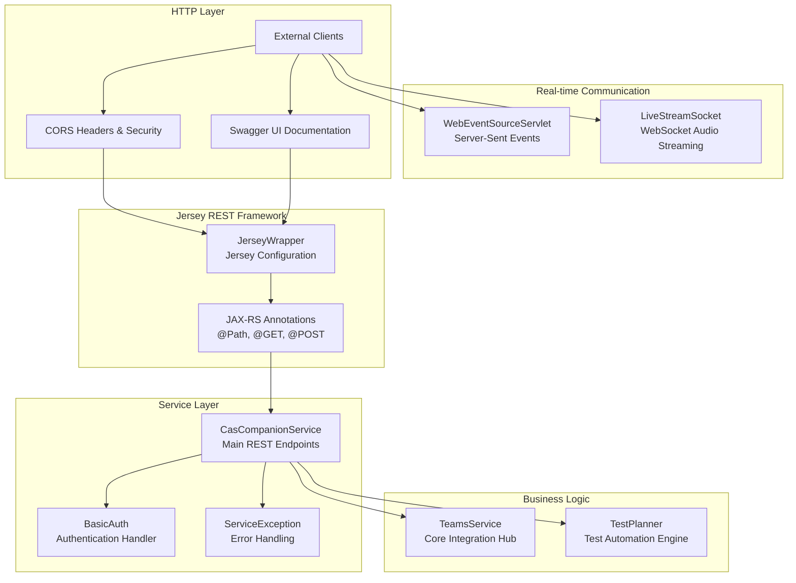
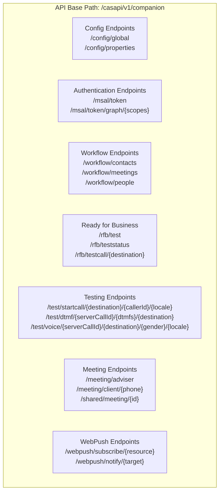
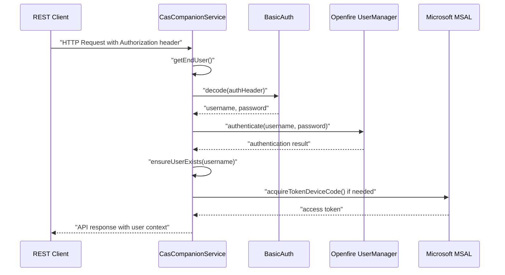
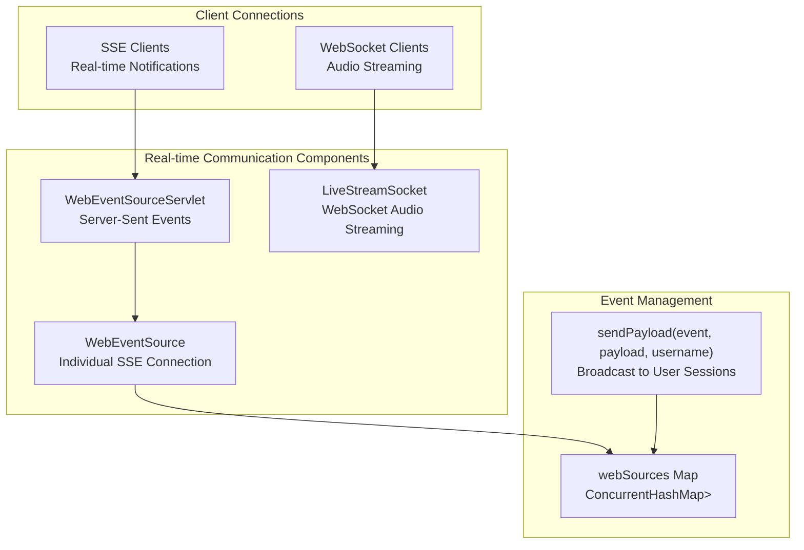
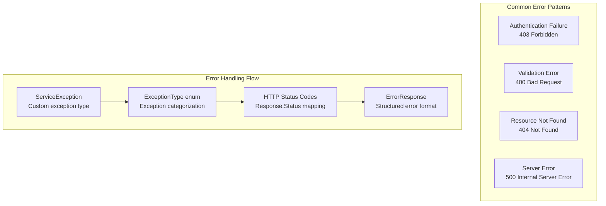

# REST API Layer

> **Relevant source files**
> * [src/java/com/ifsoft/openlink/view/Summary.java](https://github.com/ComitFS/cas-service/blob/b7087e8d/src/java/com/ifsoft/openlink/view/Summary.java)
> * [src/java/org/ifsoft/openfire/WebEventSourceServlet.java](https://github.com/ComitFS/cas-service/blob/b7087e8d/src/java/org/ifsoft/openfire/WebEventSourceServlet.java)
> * [src/java/org/jivesoftware/openfire/plugin/rest/service/CasCompanionService.java](https://github.com/ComitFS/cas-service/blob/b7087e8d/src/java/org/jivesoftware/openfire/plugin/rest/service/CasCompanionService.java)
> * [src/web/docs/index.html](https://github.com/ComitFS/cas-service/blob/b7087e8d/src/web/docs/index.html)
> * [src/web/docs/openapi.yaml](https://github.com/ComitFS/cas-service/blob/b7087e8d/src/web/docs/openapi.yaml)

## Purpose and Scope

The REST API Layer provides the HTTP-based interface for external clients to interact with the CAS Service Plugin. This layer exposes endpoints for Microsoft Teams integration, call automation, testing, and workflow management through a comprehensive RESTful API. The API supports authentication, real-time event streaming, and extensive integration capabilities with Microsoft Graph, Azure Communication Services, and third-party platforms.

For information about the core service orchestration that these APIs delegate to, see [TeamsService Integration Hub](./2.1-teamsservice-integration-hub.md). For details about the test automation capabilities exposed through these APIs, see [Test Automation Framework](./3-test-automation-framework.md).

## REST Service Architecture

The REST API Layer is built using the Jersey JAX-RS framework and follows a service-oriented architecture with clear separation between HTTP handling and business logic delegation.

**Sources:** [src/java/org/jivesoftware/openfire/plugin/rest/service/CasCompanionService.java L75-L78](https://github.com/ComitFS/cas-service/blob/b7087e8d/src/java/org/jivesoftware/openfire/plugin/rest/service/CasCompanionService.java#L75-L78)

 [src/java/org/ifsoft/openfire/WebEventSourceServlet.java L40-L43](https://github.com/ComitFS/cas-service/blob/b7087e8d/src/java/org/ifsoft/openfire/WebEventSourceServlet.java#L40-L43)

 [src/web/docs/openapi.yaml L1-L44](https://github.com/ComitFS/cas-service/blob/b7087e8d/src/web/docs/openapi.yaml#L1-L44)

## API Endpoint Categories

The REST API is organized into distinct functional categories, each serving specific aspects of the CAS system functionality.

**Sources:** [src/web/docs/openapi.yaml L45-L1112](https://github.com/ComitFS/cas-service/blob/b7087e8d/src/web/docs/openapi.yaml#L45-L1112)

 [src/java/org/jivesoftware/openfire/plugin/rest/service/CasCompanionService.java L91-L848](https://github.com/ComitFS/cas-service/blob/b7087e8d/src/java/org/jivesoftware/openfire/plugin/rest/service/CasCompanionService.java#L91-L848)

## Authentication and Authorization

The REST API implements Basic Authentication with integration into the Openfire user management system and Microsoft identity services.

| Component | Purpose | Implementation |
| --- | --- | --- |
| `BasicAuth` | HTTP Basic Authentication decoder | [org.jivesoftware.openfire.plugin.rest.BasicAuth](https://github.com/ComitFS/cas-service/blob/b7087e8d/org.jivesoftware.openfire.plugin.rest.BasicAuth) |
| `getEndUser()` | Extract authenticated user from request | [src/java/org/jivesoftware/openfire/plugin/rest/service/CasCompanionService.java L177-L201](https://github.com/ComitFS/cas-service/blob/b7087e8d/src/java/org/jivesoftware/openfire/plugin/rest/service/CasCompanionService.java#L177-L201) |
| `ensureUserExists()` | Create/retrieve Openfire user | [src/java/org/jivesoftware/openfire/plugin/rest/service/CasCompanionService.java L106](https://github.com/ComitFS/cas-service/blob/b7087e8d/src/java/org/jivesoftware/openfire/plugin/rest/service/CasCompanionService.java#L106-L106) |
| MSAL Token Endpoints | Microsoft identity integration | [src/java/org/jivesoftware/openfire/plugin/rest/service/CasCompanionService.java L204-L256](https://github.com/ComitFS/cas-service/blob/b7087e8d/src/java/org/jivesoftware/openfire/plugin/rest/service/CasCompanionService.java#L204-L256) |

**Sources:** [src/java/org/jivesoftware/openfire/plugin/rest/service/CasCompanionService.java L177-L229](https://github.com/ComitFS/cas-service/blob/b7087e8d/src/java/org/jivesoftware/openfire/plugin/rest/service/CasCompanionService.java#L177-L229)

 [src/java/org/ifsoft/openfire/WebEventSourceServlet.java L176-L201](https://github.com/ComitFS/cas-service/blob/b7087e8d/src/java/org/ifsoft/openfire/WebEventSourceServlet.java#L176-L201)

## Core Service Endpoints

### Configuration and User Management

The API provides endpoints for retrieving system configuration and user properties that integrate with both Openfire and Microsoft services.

| Endpoint | Method | Purpose | Key Data |
| --- | --- | --- | --- |
| `/config/global` | GET | Global server properties | ACS endpoint, phone numbers, client IDs |
| `/config/properties` | GET | User configuration and groups | User properties, group memberships, contact lists |
| `/msal/token` | GET | Microsoft authentication token | Device code flow for Teams integration |

**Sources:** [src/java/org/jivesoftware/openfire/plugin/rest/service/CasCompanionService.java L91-L256](https://github.com/ComitFS/cas-service/blob/b7087e8d/src/java/org/jivesoftware/openfire/plugin/rest/service/CasCompanionService.java#L91-L256)

### Microsoft Teams Workflow Integration

These endpoints provide deep integration with Microsoft Graph API and Teams services for contact management and meeting orchestration.

```mermaid
flowchart TD

getContacts["/workflow/contacts<br>GraphServiceClient.customRequest('/me/contacts')"]
getPeople["/workflow/people<br>GraphServiceClient.customRequest('/me/people')"]
getMeetings["/workflow/meetings<br>GraphServiceClient.customRequest('/me/calendarView')"]
getPhoto["/workflow/photo/{email}/{name}<br>TeamsService.getUserPhoto()"]
getUserByEmail["/workflow/user/{email}<br>GraphServiceClient.customRequest('/users/{email}')"]
getSharedMeeting["/shared/meeting/{id}<br>GraphServiceClient.customRequest('/me/onlineMeetings/createOrGet')"]
GraphContacts["Contacts API"]
GraphPeople["People API"]
GraphCalendar["Calendar API"]
GraphUsers["Users API"]
GraphMeetings["Online Meetings API"]

getContacts --> GraphContacts
getPeople --> GraphPeople
getMeetings --> GraphCalendar
getUserByEmail --> GraphUsers
getSharedMeeting --> GraphMeetings

subgraph subGraph1 ["Microsoft Graph API"]
    GraphContacts
    GraphPeople
    GraphCalendar
    GraphUsers
    GraphMeetings
end

subgraph subGraph0 ["Teams Workflow Endpoints"]
    getContacts
    getPeople
    getMeetings
    getPhoto
    getUserByEmail
    getSharedMeeting
end
```

**Sources:** [src/java/org/jivesoftware/openfire/plugin/rest/service/CasCompanionService.java L478-L593](https://github.com/ComitFS/cas-service/blob/b7087e8d/src/java/org/jivesoftware/openfire/plugin/rest/service/CasCompanionService.java#L478-L593)

### Call Automation and Testing

The testing endpoints provide comprehensive call automation capabilities through Azure Communication Services integration.

| Endpoint Pattern | Purpose | ACS Integration |
| --- | --- | --- |
| `/test/startcall/{destination}/{callerId}/{locale}` | Initiate test call | `TeamsService.startTestCall()` |
| `/test/dtmf/{serverCallId}/{dtmfs}/{destination}` | Send DTMF tones | `TeamsService.sendDTMF()` |
| `/test/voice/{serverCallId}/{destination}/{gender}/{locale}` | Send voice commands | `TeamsService.sendVoiceCommand()` |
| `/test/stopcall/{serverCallId}` | Terminate call | `TeamsService.stopTestCall()` |
| `/test/transcript/{serverCallId}` | Retrieve call transcript | `TestPlanner.getTranscript()` |

**Sources:** [src/java/org/jivesoftware/openfire/plugin/rest/service/CasCompanionService.java L736-L848](https://github.com/ComitFS/cas-service/blob/b7087e8d/src/java/org/jivesoftware/openfire/plugin/rest/service/CasCompanionService.java#L736-L848)

## Real-time Communication Layer

The system provides real-time communication capabilities through Server-Sent Events and WebSocket connections for live audio streaming and system notifications.

### Server-Sent Events Implementation

The `WebEventSourceServlet` manages persistent connections for real-time event delivery to authenticated users.

| Component | Purpose | Key Methods |
| --- | --- | --- |
| `webSources` | Connection registry | `ConcurrentHashMap<String, ArrayList<WebEventSource>>` |
| `sendPayload()` | Event broadcasting | Static method for sending events to specific users |
| `WebEventSource` | Individual connection | Implements `EventSource` interface |
| Authentication | User validation | Integration with BasicAuth and Openfire users |

**Sources:** [src/java/org/ifsoft/openfire/WebEventSourceServlet.java L40-L202](https://github.com/ComitFS/cas-service/blob/b7087e8d/src/java/org/ifsoft/openfire/WebEventSourceServlet.java#L40-L202)

## Error Handling and Response Management

The API implements comprehensive error handling with structured exception management and HTTP status code mapping.

**Sources:** [src/java/org/jivesoftware/openfire/plugin/rest/service/CasCompanionService.java L40-L44](https://github.com/ComitFS/cas-service/blob/b7087e8d/src/java/org/jivesoftware/openfire/plugin/rest/service/CasCompanionService.java#L40-L44)

 [src/java/org/jivesoftware/openfire/plugin/rest/service/CasCompanionService.java L434-L438](https://github.com/ComitFS/cas-service/blob/b7087e8d/src/java/org/jivesoftware/openfire/plugin/rest/service/CasCompanionService.java#L434-L438)

## API Documentation and Testing Interface

The system provides comprehensive API documentation through Swagger UI integration with automatic OpenAPI specification generation.

### Documentation Infrastructure

| Component | Purpose | Location |
| --- | --- | --- |
| OpenAPI Specification | API contract definition | [src/web/docs/openapi.yaml](https://github.com/ComitFS/cas-service/blob/b7087e8d/src/web/docs/openapi.yaml) |
| Swagger UI | Interactive documentation | [src/web/docs/index.html](https://github.com/ComitFS/cas-service/blob/b7087e8d/src/web/docs/index.html) |
| Summary Interface | System status dashboard | [src/java/com/ifsoft/openlink/view/Summary.java](https://github.com/ComitFS/cas-service/blob/b7087e8d/src/java/com/ifsoft/openlink/view/Summary.java) |

The Swagger UI is accessible at `/plugins/casapi/docs/index.html` and provides interactive testing capabilities for all REST endpoints.

**Sources:** [src/web/docs/index.html L1-L64](https://github.com/ComitFS/cas-service/blob/b7087e8d/src/web/docs/index.html#L1-L64)

 [src/web/docs/openapi.yaml L1-L44](https://github.com/ComitFS/cas-service/blob/b7087e8d/src/web/docs/openapi.yaml#L1-L44)

 [src/java/com/ifsoft/openlink/view/Summary.java L24-L203](https://github.com/ComitFS/cas-service/blob/b7087e8d/src/java/com/ifsoft/openlink/view/Summary.java#L24-L203)