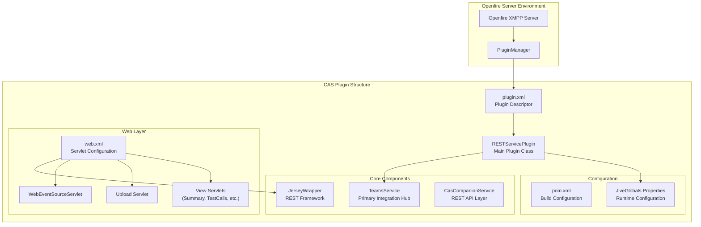
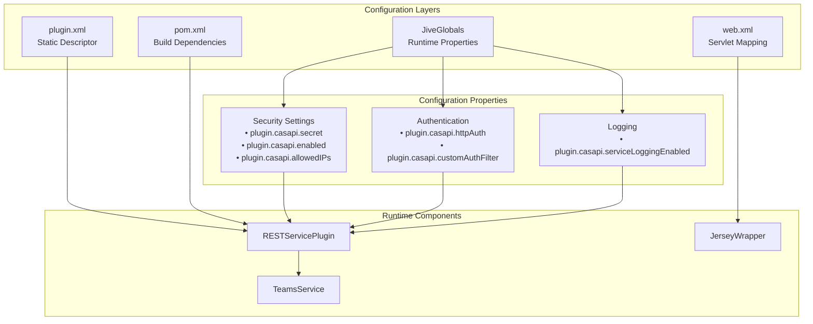
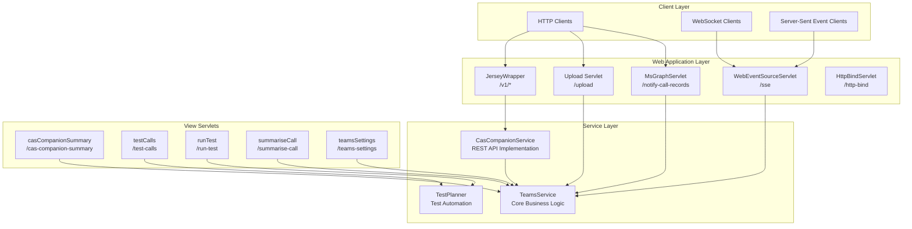
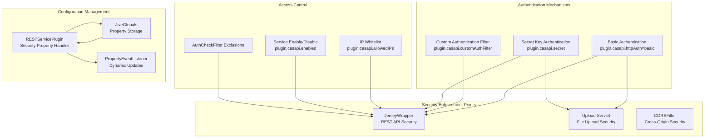
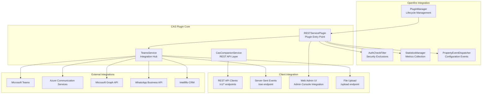

# Plugin Architecture & Configuration

> **Relevant source files**
> * [changelog.html](https://github.com/ComitFS/cas-service/blob/b7087e8d/changelog.html)
> * [classes/apps/ngrok](https://github.com/ComitFS/cas-service/blob/b7087e8d/classes/apps/ngrok)
> * [classes/apps/ngrok.exe](https://github.com/ComitFS/cas-service/blob/b7087e8d/classes/apps/ngrok.exe)
> * [plugin.xml](https://github.com/ComitFS/cas-service/blob/b7087e8d/plugin.xml)
> * [pom.xml](https://github.com/ComitFS/cas-service/blob/b7087e8d/pom.xml)
> * [src/java/com/ifsoft/openlink/view/RunTest.java](https://github.com/ComitFS/cas-service/blob/b7087e8d/src/java/com/ifsoft/openlink/view/RunTest.java)
> * [src/java/com/ifsoft/openlink/view/SummariseCall.java](https://github.com/ComitFS/cas-service/blob/b7087e8d/src/java/com/ifsoft/openlink/view/SummariseCall.java)
> * [src/java/org/ifsoft/upload/Servlet.java](https://github.com/ComitFS/cas-service/blob/b7087e8d/src/java/org/ifsoft/upload/Servlet.java)
> * [src/java/org/jivesoftware/openfire/plugin/rest/CORSFilter.java](https://github.com/ComitFS/cas-service/blob/b7087e8d/src/java/org/jivesoftware/openfire/plugin/rest/CORSFilter.java)
> * [src/java/org/jivesoftware/openfire/plugin/rest/RESTServicePlugin.java](https://github.com/ComitFS/cas-service/blob/b7087e8d/src/java/org/jivesoftware/openfire/plugin/rest/RESTServicePlugin.java)
> * [src/web/WEB-INF/web.xml](https://github.com/ComitFS/cas-service/blob/b7087e8d/src/web/WEB-INF/web.xml)

This document covers the architectural foundation and configuration mechanisms of the CAS Service Plugin, explaining how it integrates with the Openfire XMPP server as a standard plugin while extending it with comprehensive REST APIs, web interfaces, and Microsoft Teams integration capabilities.

For information about the core service implementations, see [Core Services](./2-core-services.md). For deployment and build processes, see [Build System & CI/CD](./7.1-build-system-and-cicd.md).

## Plugin Structure and Lifecycle

The CAS Service Plugin follows the standard Openfire plugin architecture pattern, implementing the `Plugin` interface to integrate seamlessly with the Openfire server lifecycle. The plugin serves as an extension of the Openfire REST Plugin, adding specialized functionality for call automation and Microsoft Teams integration.

**Plugin Lifecycle Management**

The `RESTServicePlugin` class manages the complete plugin lifecycle through standard Openfire plugin methods:

* **Initialization**: [`initializePlugin()`](https://github.com/ComitFS/cas-service/blob/b7087e8d/`initializePlugin()`)  loads configuration, sets up security, and initializes the `TeamsService`
* **Destruction**: [`destroyPlugin()`](https://github.com/ComitFS/cas-service/blob/b7087e8d/`destroyPlugin()`)  performs cleanup, removes statistics, and destroys the `TeamsService`
* **Property Management**: Implements `PropertyEventListener` for dynamic configuration updates

Sources: [plugin.xml L1-L31](https://github.com/ComitFS/cas-service/blob/b7087e8d/plugin.xml#L1-L31)

 [src/java/org/jivesoftware/openfire/plugin/rest/RESTServicePlugin.java L37-L292](https://github.com/ComitFS/cas-service/blob/b7087e8d/src/java/org/jivesoftware/openfire/plugin/rest/RESTServicePlugin.java#L37-L292)

## Configuration Management

The plugin uses a multi-layered configuration approach combining static descriptors, build-time configuration, and runtime properties managed through Openfire's `JiveGlobals` system.

**Key Configuration Properties**

| Property | Default | Purpose |
| --- | --- | --- |
| `plugin.casapi.secret` | Random string | Authentication secret for API access |
| `plugin.casapi.enabled` | `true` | Enable/disable the REST service |
| `plugin.casapi.httpAuth` | `"basic"` | HTTP authentication mechanism |
| `plugin.casapi.allowedIPs` | Empty | IP whitelist for service access |
| `plugin.casapi.customAuthFilter` | Empty | Custom authentication filter class |
| `plugin.casapi.serviceLoggingEnabled` | `false` | Enable service request logging |

**Plugin Descriptor Configuration**

The [`plugin.xml`](https://github.com/ComitFS/cas-service/blob/b7087e8d/`plugin.xml`)

 defines the plugin's integration with Openfire's admin console, creating a comprehensive administrative interface with multiple tabs and sidebar sections for different functional areas.

Sources: [plugin.xml L1-L31](https://github.com/ComitFS/cas-service/blob/b7087e8d/plugin.xml#L1-L31)

 [src/java/org/jivesoftware/openfire/plugin/rest/RESTServicePlugin.java L73-L108](https://github.com/ComitFS/cas-service/blob/b7087e8d/src/java/org/jivesoftware/openfire/plugin/rest/RESTServicePlugin.java#L73-L108)

 [pom.xml L1-L414](https://github.com/ComitFS/cas-service/blob/b7087e8d/pom.xml#L1-L414)

## Web Application Architecture

The plugin implements a sophisticated web application layer using Jersey JAX-RS framework for REST APIs and traditional servlets for specialized functionality. The architecture separates REST endpoints from real-time communication and file upload capabilities.

**Servlet Configuration and URL Mapping**

The [`web.xml`](https://github.com/ComitFS/cas-service/blob/b7087e8d/`web.xml`)

 configuration establishes the complete web application structure:

* **REST API**: `JerseyWrapper` handles all `/v1/*` endpoints through JAX-RS
* **Real-time Communication**: `WebEventSourceServlet` provides server-sent events at `/sse`
* **File Operations**: Upload servlet manages test file uploads at `/upload`
* **Microsoft Integration**: `MsGraphServlet` receives webhooks at `/notify-call-records`
* **Administrative UI**: Multiple view servlets provide web-based management interfaces

**Jersey Framework Integration**

The [`JerseyWrapper`](https://github.com/ComitFS/cas-service/blob/b7087e8d/`JerseyWrapper`)

 servlet container configuration integrates the Jersey JAX-RS framework, enabling annotation-driven REST API development with automatic serialization, validation, and routing.

Sources: [src/web/WEB-INF/web.xml L1-L186](https://github.com/ComitFS/cas-service/blob/b7087e8d/src/web/WEB-INF/web.xml#L1-L186)

 [src/java/org/jivesoftware/openfire/plugin/rest/RESTServicePlugin.java L105-L106](https://github.com/ComitFS/cas-service/blob/b7087e8d/src/java/org/jivesoftware/openfire/plugin/rest/RESTServicePlugin.java#L105-L106)

## Security and Authentication

The plugin implements a comprehensive security model supporting multiple authentication mechanisms, IP-based access control, and custom authentication filters. Security configuration is managed through the `RESTServicePlugin` class and enforced at multiple layers.

**Authentication Filter Chain**

The plugin supports pluggable authentication through the `customAuthFilter` property, allowing organizations to integrate with existing authentication systems while maintaining backward compatibility with basic authentication.

**CORS and Cross-Origin Security**

The [`CORSFilter`](https://github.com/ComitFS/cas-service/blob/b7087e8d/`CORSFilter`)

 implementation provides comprehensive cross-origin resource sharing support, enabling secure browser-based access to the REST APIs from web applications.

**Dynamic Security Configuration**

Security settings can be modified at runtime through the Openfire admin console, with changes immediately reflected through the `PropertyEventListener` implementation in [`RESTServicePlugin`](https://github.com/ComitFS/cas-service/blob/b7087e8d/`RESTServicePlugin`)

Sources: [src/java/org/jivesoftware/openfire/plugin/rest/RESTServicePlugin.java L39-L292](https://github.com/ComitFS/cas-service/blob/b7087e8d/src/java/org/jivesoftware/openfire/plugin/rest/RESTServicePlugin.java#L39-L292)

 [src/java/org/jivesoftware/openfire/plugin/rest/CORSFilter.java L1-L96](https://github.com/ComitFS/cas-service/blob/b7087e8d/src/java/org/jivesoftware/openfire/plugin/rest/CORSFilter.java#L1-L96)

 [src/java/org/ifsoft/upload/Servlet.java L23-L92](https://github.com/ComitFS/cas-service/blob/b7087e8d/src/java/org/ifsoft/upload/Servlet.java#L23-L92)

## Integration Points

The plugin architecture provides multiple integration points for external systems, internal Openfire components, and client applications. These integration points enable the plugin to serve as a comprehensive communication automation platform.

**Openfire Server Integration**

The plugin integrates deeply with Openfire's infrastructure:

* **Plugin Lifecycle**: Managed through `PluginManager` with proper initialization and cleanup
* **Security Integration**: Uses `AuthCheckFilter.addExclude()` to bypass authentication for REST endpoints
* **Statistics Collection**: Registers custom statistics with `StatisticsManager` for monitoring
* **Configuration Management**: Leverages `PropertyEventDispatcher` for dynamic configuration updates

**Administrative Console Integration**

The [`plugin.xml`](https://github.com/ComitFS/cas-service/blob/b7087e8d/`plugin.xml`)

 configuration creates a comprehensive admin console presence with dedicated tabs for CAS Service management, Teams integration, and call automation, providing both technical configuration and operational monitoring capabilities.

Sources: [plugin.xml L13-L29](https://github.com/ComitFS/cas-service/blob/b7087e8d/plugin.xml#L13-L29)

 [src/java/org/jivesoftware/openfire/plugin/rest/RESTServicePlugin.java L73-L127](https://github.com/ComitFS/cas-service/blob/b7087e8d/src/java/org/jivesoftware/openfire/plugin/rest/RESTServicePlugin.java#L73-L127)

 [pom.xml L47-L340](https://github.com/ComitFS/cas-service/blob/b7087e8d/pom.xml#L47-L340)