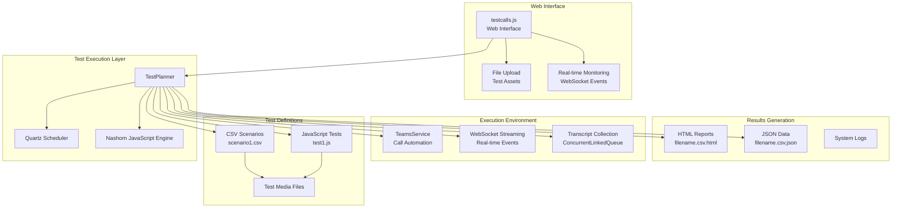
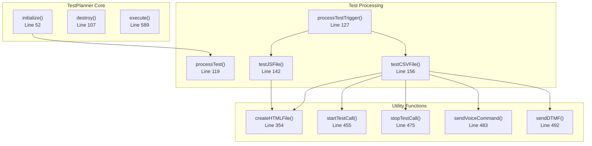
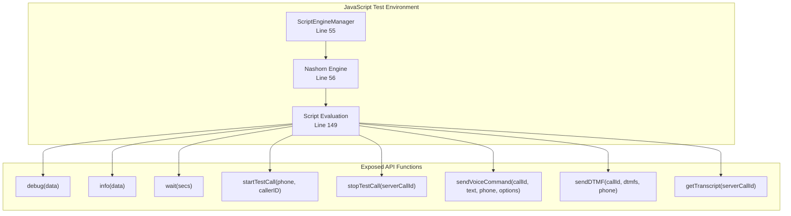
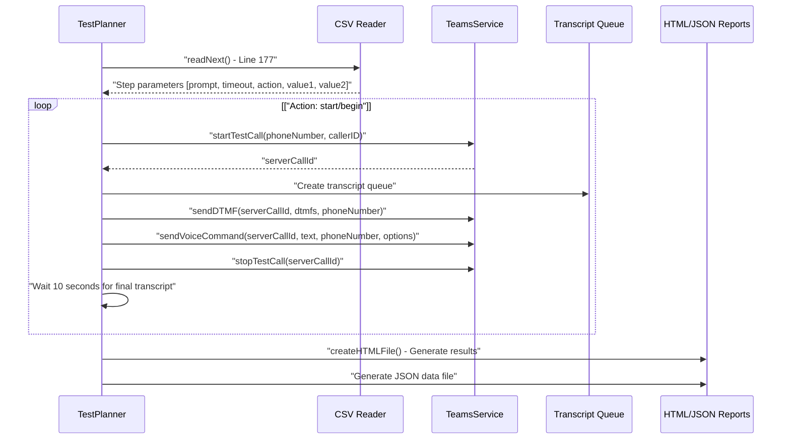
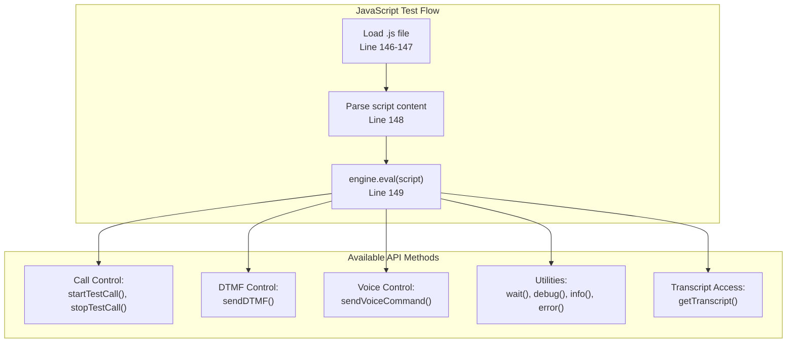
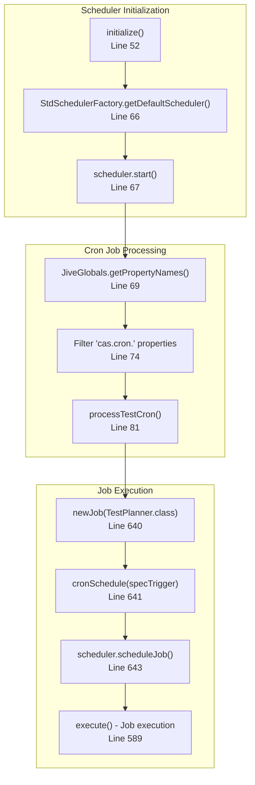
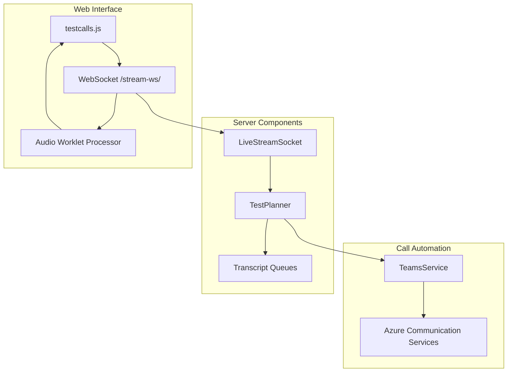
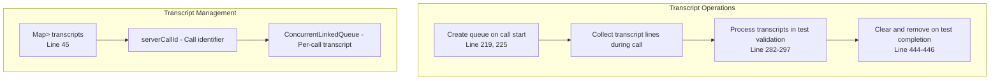

# Test Automation Framework

> **Relevant source files**
> * [src/java/com/comitfs/openfire/TestPlanner.java](https://github.com/ComitFS/cas-service/blob/b7087e8d/src/java/com/comitfs/openfire/TestPlanner.java)
> * [src/web/javascripts/testcalls.js](https://github.com/ComitFS/cas-service/blob/b7087e8d/src/web/javascripts/testcalls.js)

The Test Automation Framework provides comprehensive automated testing capabilities for call flows, IVR systems, and communication workflows. This framework enables both CSV-driven scenario testing and JavaScript-based custom test execution, with integrated scheduling, real-time monitoring, and detailed reporting capabilities.

For information about the core TestPlanner engine implementation, see [TestPlanner Engine](./3.1-testplanner-engine.md). For details about creating test scenarios, see [Test Scenario Definitions](./3.2-test-scenario-definitions.md). For test results and reporting formats, see [Test Results & Reporting](./3.3-test-results-and-reporting.md). For the web-based management interface, see [Test Management Web Interface](./3.4-test-management-web-interface.md).

## Architecture Overview

The Test Automation Framework is built around the `TestPlanner` class which serves as the central orchestrator for all testing activities. It integrates with Azure Communication Services for call automation, Quartz Scheduler for job management, and provides both CSV and JavaScript-based test execution engines.

**Sources:** [src/java/com/comitfs/openfire/TestPlanner.java L1-L653](https://github.com/ComitFS/cas-service/blob/b7087e8d/src/java/com/comitfs/openfire/TestPlanner.java#L1-L653)

 [src/web/javascripts/testcalls.js L1-L208](https://github.com/ComitFS/cas-service/blob/b7087e8d/src/web/javascripts/testcalls.js#L1-L208)

## Core Components

### TestPlanner Class Structure

The `TestPlanner` class implements multiple interfaces and provides comprehensive test automation capabilities:

| Component | Purpose | Implementation |
| --- | --- | --- |
| **Job Interface** | Quartz scheduler integration | `TestPlanner implements Job` |
| **Script Engine** | JavaScript test execution | Nashorn engine initialization |
| **Transcript Management** | Real-time transcription collection | `ConcurrentLinkedQueue<String>` |
| **Cron Job Management** | Scheduled test execution | Quartz `CronTrigger` configuration |
| **Report Generation** | HTML and JSON output | File-based result persistence |

**Sources:** [src/java/com/comitfs/openfire/TestPlanner.java L41-L653](https://github.com/ComitFS/cas-service/blob/b7087e8d/src/java/com/comitfs/openfire/TestPlanner.java#L41-L653)

### JavaScript Engine Integration

The framework uses the Nashorn JavaScript engine to execute custom test scripts with direct access to TestPlanner functionality:

**Sources:** [src/java/com/comitfs/openfire/TestPlanner.java L55-L57](https://github.com/ComitFS/cas-service/blob/b7087e8d/src/java/com/comitfs/openfire/TestPlanner.java#L55-L57)

 [src/java/com/comitfs/openfire/TestPlanner.java L465-L515](https://github.com/ComitFS/cas-service/blob/b7087e8d/src/java/com/comitfs/openfire/TestPlanner.java#L465-L515)

## Test Scenario Types

### CSV-Based Test Scenarios

CSV scenarios provide structured, data-driven test execution with predefined columns for test steps:

| Column | Purpose | Example Values |
| --- | --- | --- |
| **Prompt** | Expected audio response | "Press 1 for sales" |
| **Timeout** | Wait duration (seconds) | "5", "10" |
| **Action** | Test operation | "start", "dtmf", "voice", "stop" |
| **Value1** | Primary parameter | Phone number, DTMF digits, text |
| **Value2** | Secondary parameter | Caller ID, voice options |

The CSV test execution follows this process flow:

**Sources:** [src/java/com/comitfs/openfire/TestPlanner.java L156-L352](https://github.com/ComitFS/cas-service/blob/b7087e8d/src/java/com/comitfs/openfire/TestPlanner.java#L156-L352)

### JavaScript Test Scripts

JavaScript tests provide full programmatic control with access to all TestPlanner API functions:

**Sources:** [src/java/com/comitfs/openfire/TestPlanner.java L142-L154](https://github.com/ComitFS/cas-service/blob/b7087e8d/src/java/com/comitfs/openfire/TestPlanner.java#L142-L154)

 [src/java/com/comitfs/openfire/TestPlanner.java L465-L515](https://github.com/ComitFS/cas-service/blob/b7087e8d/src/java/com/comitfs/openfire/TestPlanner.java#L465-L515)

## Scheduling and Job Management

### Quartz Integration

The framework uses Quartz Scheduler for automated test execution with cron-based scheduling:

**Sources:** [src/java/com/comitfs/openfire/TestPlanner.java L52-L100](https://github.com/ComitFS/cas-service/blob/b7087e8d/src/java/com/comitfs/openfire/TestPlanner.java#L52-L100)

 [src/java/com/comitfs/openfire/TestPlanner.java L602-L651](https://github.com/ComitFS/cas-service/blob/b7087e8d/src/java/com/comitfs/openfire/TestPlanner.java#L602-L651)

### Job Configuration Properties

Cron jobs are configured through Openfire properties with the pattern `cas.cron.<key>`:

| Property Pattern | Purpose | Example |
| --- | --- | --- |
| `cas.cron.{key}` | Cron schedule expression | `0 0 8 * * ?` (daily at 8 AM) |
| Job key | Test file identifier | `scenario1.csv`, `test1.js` |
| Trigger parsing | Optional title extraction | `0 0 8 * * ?(Daily Test)` |

**Sources:** [src/java/com/comitfs/openfire/TestPlanner.java L74-L88](https://github.com/ComitFS/cas-service/blob/b7087e8d/src/java/com/comitfs/openfire/TestPlanner.java#L74-L88)

 [src/java/com/comitfs/openfire/TestPlanner.java L630-L638](https://github.com/ComitFS/cas-service/blob/b7087e8d/src/java/com/comitfs/openfire/TestPlanner.java#L630-L638)

## Real-time Communication Integration

### WebSocket Integration

The framework integrates with the live streaming system for real-time test monitoring and audio processing:

**Sources:** [src/web/javascripts/testcalls.js L68-L163](https://github.com/ComitFS/cas-service/blob/b7087e8d/src/web/javascripts/testcalls.js#L68-L163)

 [src/java/com/comitfs/openfire/TestPlanner.java L44-L45](https://github.com/ComitFS/cas-service/blob/b7087e8d/src/java/com/comitfs/openfire/TestPlanner.java#L44-L45)

### Transcript Collection

Real-time transcription data is collected during test execution using concurrent data structures:

**Sources:** [src/java/com/comitfs/openfire/TestPlanner.java L45](https://github.com/ComitFS/cas-service/blob/b7087e8d/src/java/com/comitfs/openfire/TestPlanner.java#L45-L45)

 [src/java/com/comitfs/openfire/TestPlanner.java L219-L226](https://github.com/ComitFS/cas-service/blob/b7087e8d/src/java/com/comitfs/openfire/TestPlanner.java#L219-L226)

 [src/java/com/comitfs/openfire/TestPlanner.java L282-L297](https://github.com/ComitFS/cas-service/blob/b7087e8d/src/java/com/comitfs/openfire/TestPlanner.java#L282-L297)