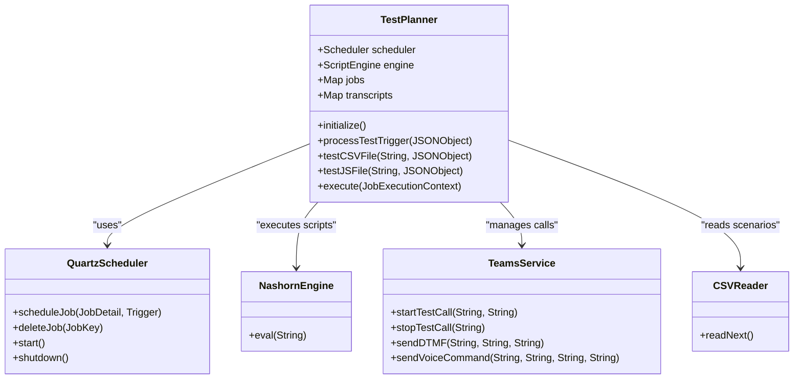
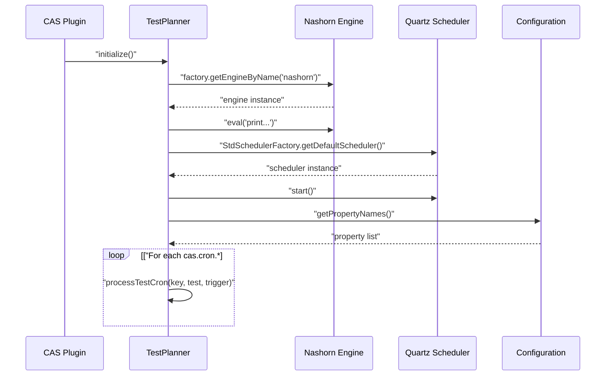
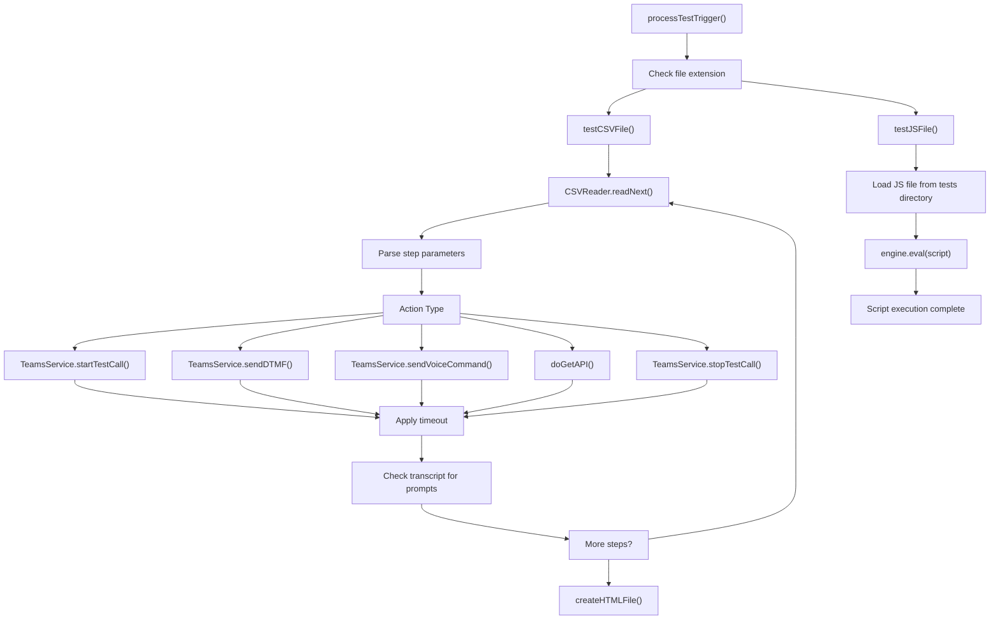
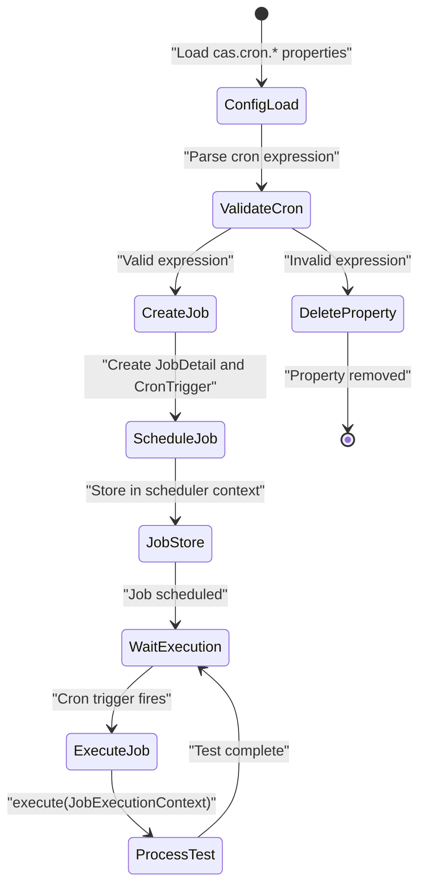
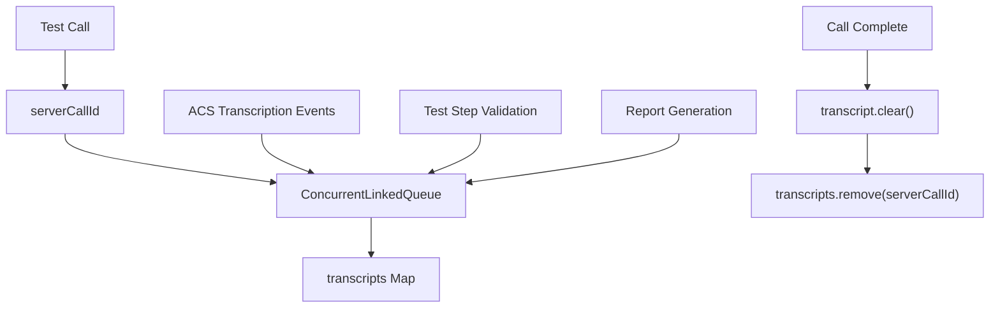
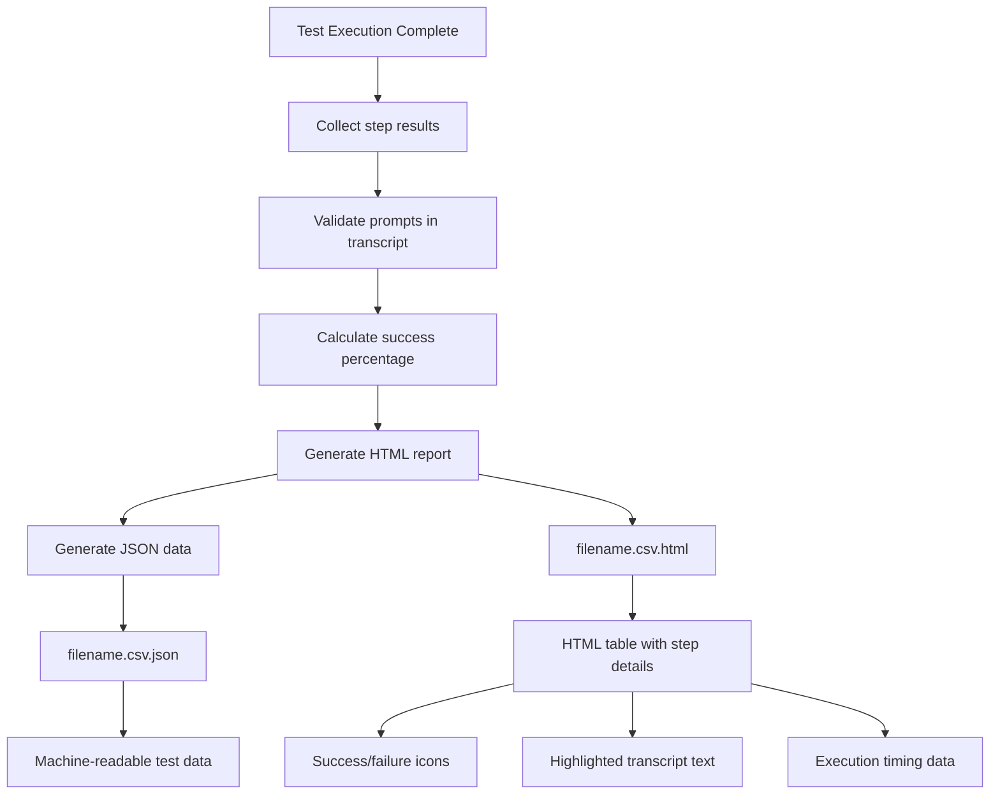
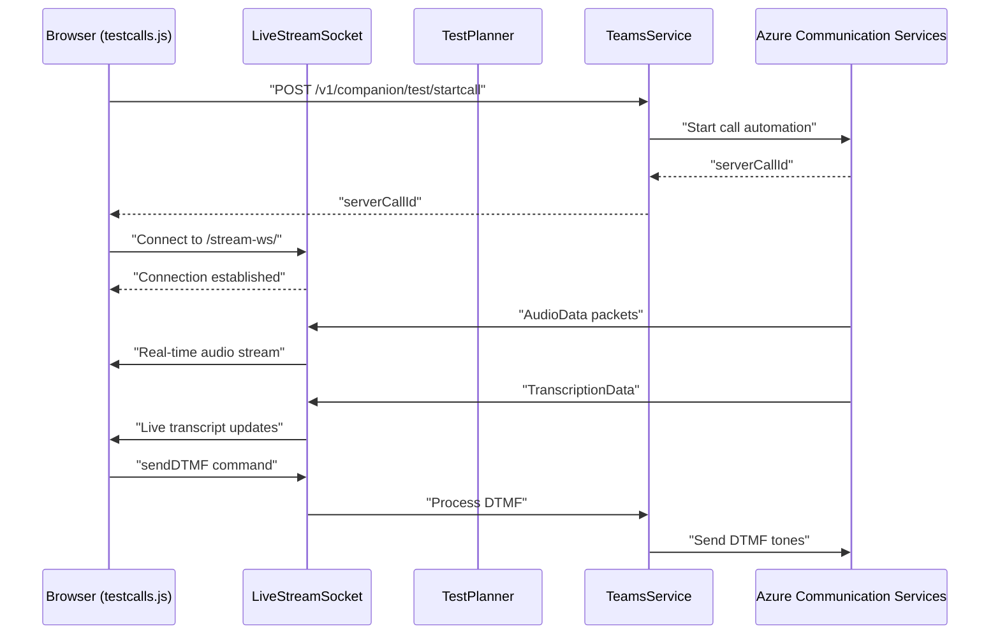

# TestPlanner Engine

> **Relevant source files**
> * [src/java/com/comitfs/openfire/TestPlanner.java](https://github.com/ComitFS/cas-service/blob/b7087e8d/src/java/com/comitfs/openfire/TestPlanner.java)
> * [src/web/javascripts/testcalls.js](https://github.com/ComitFS/cas-service/blob/b7087e8d/src/web/javascripts/testcalls.js)

The TestPlanner Engine is the core component responsible for orchestrating automated call testing and script execution within the CAS service. It provides comprehensive testing capabilities for IVR systems, call flows, and telephony automation through both CSV-driven test scenarios and JavaScript-based test scripts.

For information about test scenario definitions and formats, see [Test Scenario Definitions](./3.2-test-scenario-definitions.md). For details about generated reports and results, see [Test Results & Reporting](./3.3-test-results-and-reporting.md). For the web-based management interface, see [Test Management Web Interface](./3.4-test-management-web-interface.md).

## Core Architecture

The TestPlanner Engine is built around the `TestPlanner` class which implements Quartz's `Job` interface, enabling scheduled test execution. The engine integrates multiple components to provide a complete testing framework.

Sources: [src/java/com/comitfs/openfire/TestPlanner.java L41-L652](https://github.com/ComitFS/cas-service/blob/b7087e8d/src/java/com/comitfs/openfire/TestPlanner.java#L41-L652)

## Engine Initialization

The TestPlanner Engine initializes with two primary components: the Nashorn JavaScript engine for script execution and the Quartz scheduler for job management.

The initialization process loads existing cron jobs from the Openfire configuration and validates them during startup.

Sources: [src/java/com/comitfs/openfire/TestPlanner.java L52-L100](https://github.com/ComitFS/cas-service/blob/b7087e8d/src/java/com/comitfs/openfire/TestPlanner.java#L52-L100)

## Test Execution Flow

The engine supports two primary test execution modes: CSV-driven scenarios and JavaScript-based tests. Both modes integrate with the TeamsService for actual call automation.

### CSV Test Processing

The CSV processing engine reads test scenarios line by line, executing actions such as starting calls, sending DTMF tones, playing voice prompts, and validating transcript responses.

Sources: [src/java/com/comitfs/openfire/TestPlanner.java L156-L352](https://github.com/ComitFS/cas-service/blob/b7087e8d/src/java/com/comitfs/openfire/TestPlanner.java#L156-L352)

### JavaScript Test Execution

JavaScript tests provide more flexibility and programmatic control over test execution. The engine exposes several utility functions to JavaScript scripts.

| Function | Purpose | Parameters |
| --- | --- | --- |
| `startTestCall()` | Initiate test call | `phoneNumber`, `callerId` |
| `stopTestCall()` | Terminate test call | `serverCallId` |
| `sendDTMF()` | Send DTMF tones | `serverCallId`, `dtmf`, `phoneNumber` |
| `sendVoiceCommand()` | Play voice prompts | `serverCallId`, `text`, `phoneNumber`, `options` |
| `getTranscript()` | Retrieve call transcript | `serverCallId` |
| `wait()` | Pause execution | `seconds` |
| `debug()`, `info()`, `error()` | Logging functions | `message` |

Sources: [src/java/com/comitfs/openfire/TestPlanner.java L142-L154](https://github.com/ComitFS/cas-service/blob/b7087e8d/src/java/com/comitfs/openfire/TestPlanner.java#L142-L154)

 [src/java/com/comitfs/openfire/TestPlanner.java L455-L515](https://github.com/ComitFS/cas-service/blob/b7087e8d/src/java/com/comitfs/openfire/TestPlanner.java#L455-L515)

## Scheduling and Automation

The TestPlanner leverages Quartz Scheduler for automated test execution based on cron expressions stored in Openfire configuration properties.

Cron jobs are managed through Openfire configuration properties with the prefix `cas.cron.`. Each property defines a test file and its execution schedule.

Sources: [src/java/com/comitfs/openfire/TestPlanner.java L602-L651](https://github.com/ComitFS/cas-service/blob/b7087e8d/src/java/com/comitfs/openfire/TestPlanner.java#L602-L651)

 [src/java/com/comitfs/openfire/TestPlanner.java L589-L600](https://github.com/ComitFS/cas-service/blob/b7087e8d/src/java/com/comitfs/openfire/TestPlanner.java#L589-L600)

## Transcript Management

The engine maintains real-time transcript data for active test calls using concurrent data structures to handle multiple simultaneous tests.

Transcripts are stored in `ConcurrentLinkedQueue` objects mapped by `serverCallId`, allowing thread-safe access during test execution and report generation.

Sources: [src/java/com/comitfs/openfire/TestPlanner.java L44-L45](https://github.com/ComitFS/cas-service/blob/b7087e8d/src/java/com/comitfs/openfire/TestPlanner.java#L44-L45)

 [src/java/com/comitfs/openfire/TestPlanner.java L440-L447](https://github.com/ComitFS/cas-service/blob/b7087e8d/src/java/com/comitfs/openfire/TestPlanner.java#L440-L447)

## Report Generation

The engine generates both HTML and JSON reports for test results, providing comprehensive analysis of test execution and call transcript validation.

Reports include step-by-step execution details, prompt validation results, transcript analysis, and success metrics.

Sources: [src/java/com/comitfs/openfire/TestPlanner.java L354-L453](https://github.com/ComitFS/cas-service/blob/b7087e8d/src/java/com/comitfs/openfire/TestPlanner.java#L354-L453)

## Web Interface Integration

The TestPlanner integrates with web-based interfaces through the `testcalls.js` client-side application, providing real-time test monitoring and manual test execution capabilities.

The web interface provides real-time audio streaming, transcript display, and interactive call control capabilities for manual testing scenarios.

Sources: [src/web/javascripts/testcalls.js L1-L208](https://github.com/ComitFS/cas-service/blob/b7087e8d/src/web/javascripts/testcalls.js#L1-L208)