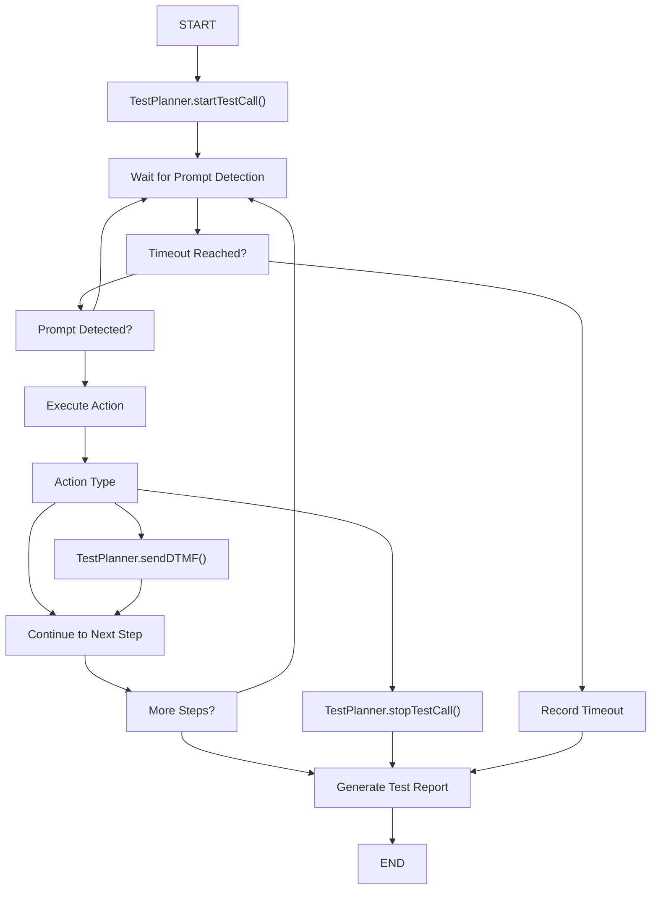
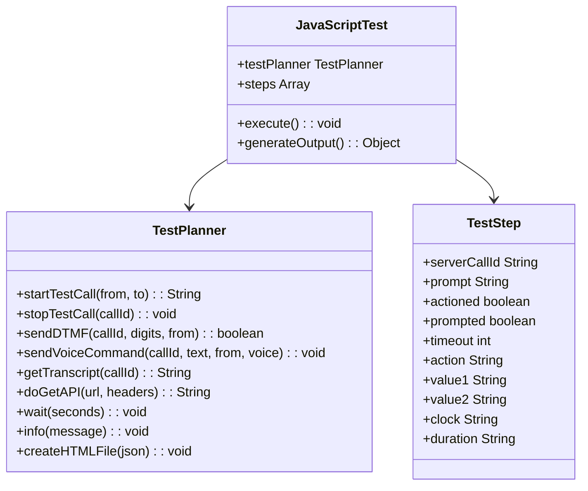
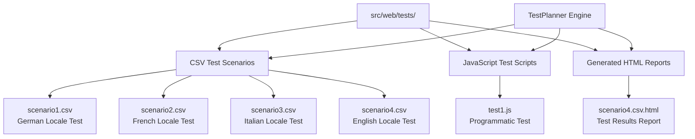

# Test Scenario Definitions

> **Relevant source files**
> * [src/web/tests/scenario1.csv](https://github.com/ComitFS/cas-service/blob/b7087e8d/src/web/tests/scenario1.csv)
> * [src/web/tests/scenario2.csv](https://github.com/ComitFS/cas-service/blob/b7087e8d/src/web/tests/scenario2.csv)
> * [src/web/tests/scenario3.csv](https://github.com/ComitFS/cas-service/blob/b7087e8d/src/web/tests/scenario3.csv)
> * [src/web/tests/scenario4.csv](https://github.com/ComitFS/cas-service/blob/b7087e8d/src/web/tests/scenario4.csv)
> * [src/web/tests/scenario4.csv.html](https://github.com/ComitFS/cas-service/blob/b7087e8d/src/web/tests/scenario4.csv.html)
> * [src/web/tests/test1.js](https://github.com/ComitFS/cas-service/blob/b7087e8d/src/web/tests/test1.js)

This document covers the structure and format of test scenario definitions used by the CAS test automation framework. Test scenarios define the call flows, user interactions, and validation steps that the TestPlanner engine executes against IVR systems and call automation services.

For information about the test execution engine that processes these scenarios, see [TestPlanner Engine](./3.1-testplanner-engine.md). For details about test results and reporting formats, see [Test Results & Reporting](./3.3-test-results-and-reporting.md).

## Test Scenario Types

The CAS test automation framework supports two primary types of test scenario definitions:

* **CSV Test Scenarios**: Tabular format for defining linear call flows with prompts, timeouts, and DTMF actions
* **JavaScript Test Scripts**: Programmatic format for complex test logic with API calls and dynamic behavior

## CSV Test Scenario Format

CSV test scenarios provide a structured, tabular format for defining call flow tests. Each CSV file represents a single test scenario with a sequence of steps that simulate user interactions with an IVR system.

### CSV Column Structure

The CSV format uses five columns to define each test step:

| Column | Purpose | Description |
| --- | --- | --- |
| `Prompt` | Audio detection | Text snippet to detect in call audio/transcript |
| `Timeout` | Wait duration | Maximum seconds to wait for prompt detection |
| `Action` | Step type | Action to perform (`START`, `DTMF`, `STOP`, or empty for wait) |
| `Value1` | Primary value | Phone number, DTMF digits, or action parameter |
| `Value2` | Secondary value | Destination number, locale, or additional parameters |

### Test Flow Structure

**Test Scenario Execution Flow**



Sources: [src/web/tests/scenario1.csv L1-L11](https://github.com/ComitFS/cas-service/blob/b7087e8d/src/web/tests/scenario1.csv#L1-L11)

 [src/web/tests/scenario4.csv L1-L11](https://github.com/ComitFS/cas-service/blob/b7087e8d/src/web/tests/scenario4.csv#L1-L11)

### Call Initiation

The first row with a `START` action initiates the test call:

```
,,START,+41584049146,+441933718587|de-DE
```

* `Value1`: Source phone number (calling from)
* `Value2`: Destination phone number and optional locale (e.g., `|de-DE`, `|fr-FR`, `|it-IT`)

Sources: [src/web/tests/scenario1.csv L2](https://github.com/ComitFS/cas-service/blob/b7087e8d/src/web/tests/scenario1.csv#L2-L2)

 [src/web/tests/scenario2.csv L2](https://github.com/ComitFS/cas-service/blob/b7087e8d/src/web/tests/scenario2.csv#L2-L2)

 [src/web/tests/scenario3.csv L2](https://github.com/ComitFS/cas-service/blob/b7087e8d/src/web/tests/scenario3.csv#L2-L2)

### Prompt Detection Steps

Steps that wait for specific audio prompts:

```
your call landed,2,,,
country code and without,5,DTMF,446666666,
```

* `Prompt`: Text to detect in call transcript
* `Timeout`: Maximum wait time in seconds
* `Action`: `DTMF` if input required, empty for passive listening
* `Value1`: DTMF digits to send when prompt detected

Sources: [src/web/tests/scenario1.csv L3-L4](https://github.com/ComitFS/cas-service/blob/b7087e8d/src/web/tests/scenario1.csv#L3-L4)

 [src/web/tests/scenario4.csv L3-L4](https://github.com/ComitFS/cas-service/blob/b7087e8d/src/web/tests/scenario4.csv#L3-L4)

### DTMF Input Actions

Steps that send touch-tone inputs to the IVR system:

```
welcome to,30,DTMF,1,
sie diese mit der,18,DTMF,11612457#,
```

* Complex DTMF sequences can include digits and the hash key (`#`)
* Timeout represents maximum wait before the action is performed

Sources: [src/web/tests/scenario1.csv L5-L6](https://github.com/ComitFS/cas-service/blob/b7087e8d/src/web/tests/scenario1.csv#L5-L6)

 [src/web/tests/scenario4.csv L5-L6](https://github.com/ComitFS/cas-service/blob/b7087e8d/src/web/tests/scenario4.csv#L5-L6)

### Multi-Language Support

Test scenarios support different locales by appending language codes to the destination number:

* `|de-DE`: German (Germany)
* `|fr-FR`: French (France)
* `|it-IT`: Italian (Italy)

This enables testing of IVR systems with multiple language options.

Sources: [src/web/tests/scenario1.csv L2](https://github.com/ComitFS/cas-service/blob/b7087e8d/src/web/tests/scenario1.csv#L2-L2)

 [src/web/tests/scenario2.csv L2](https://github.com/ComitFS/cas-service/blob/b7087e8d/src/web/tests/scenario2.csv#L2-L2)

 [src/web/tests/scenario3.csv L2](https://github.com/ComitFS/cas-service/blob/b7087e8d/src/web/tests/scenario3.csv#L2-L2)

## JavaScript Test Scripts

JavaScript test scripts provide programmatic control over test execution, allowing for complex logic, API calls, and dynamic test flows.

### TestPlanner API Integration

**JavaScript Test Script Architecture**



Sources: [src/web/tests/test1.js L1-L42](https://github.com/ComitFS/cas-service/blob/b7087e8d/src/web/tests/test1.js#L1-L42)

### Script Structure and Capabilities

JavaScript test scripts access the `TestPlanner` Java class and can perform the following operations:

**Call Management:**

```javascript
var callId = testPlanner.startTestCall("+441634251467", "+441933718587");
testPlanner.stopTestCall(callId);
```

**DTMF Input:**

```javascript
var ok = testPlanner.sendDTMF(callId, "12345", "+441634251467");
```

**Voice Commands:**

```
testPlanner.sendVoiceCommand(callId, "My IP adress is " + json.ip, "+441634251467", "female|en-GB");
```

**External API Calls:**

```javascript
var result = testPlanner.doGetAPI("https://api.ipify.org/?format=json", null);
```

**Transcript Retrieval:**

```javascript
var transcript = testPlanner.getTranscript(callId);
```

Sources: [src/web/tests/test1.js L6](https://github.com/ComitFS/cas-service/blob/b7087e8d/src/web/tests/test1.js#L6-L6)

 [src/web/tests/test1.js L26](https://github.com/ComitFS/cas-service/blob/b7087e8d/src/web/tests/test1.js#L26-L26)

 [src/web/tests/test1.js L20](https://github.com/ComitFS/cas-service/blob/b7087e8d/src/web/tests/test1.js#L20-L20)

 [src/web/tests/test1.js L14](https://github.com/ComitFS/cas-service/blob/b7087e8d/src/web/tests/test1.js#L14-L14)

 [src/web/tests/test1.js L33](https://github.com/ComitFS/cas-service/blob/b7087e8d/src/web/tests/test1.js#L33-L33)

### Test Step Tracking

JavaScript tests manually track test steps for reporting:

```javascript
var steps = [];
steps.push({
    serverCallId: callId, 
    prompt: "pin number", 
    actioned: ok,
    prompted: false, 
    timeout: 5, 
    action: "dtmf", 
    value1: "12345", 
    value2: "", 
    clock: "", 
    duration: "5"
});
```

Sources: [src/web/tests/test1.js L3](https://github.com/ComitFS/cas-service/blob/b7087e8d/src/web/tests/test1.js#L3-L3)

 [src/web/tests/test1.js L27](https://github.com/ComitFS/cas-service/blob/b7087e8d/src/web/tests/test1.js#L27-L27)

### Report Generation

JavaScript tests generate structured output for HTML report creation:

```javascript
var output = {
    steps: steps, 
    transcript: transcript, 
    duration: 0, 
    success: 100, 
    filename: "test1.js"
};
testPlanner.createHTMLFile(JSON.stringify(output));
```

Sources: [src/web/tests/test1.js L40-L41](https://github.com/ComitFS/cas-service/blob/b7087e8d/src/web/tests/test1.js#L40-L41)

## Test File Organization

**Test Scenario File Structure**



Sources: [src/web/tests/scenario1.csv](https://github.com/ComitFS/cas-service/blob/b7087e8d/src/web/tests/scenario1.csv)

 [src/web/tests/scenario2.csv](https://github.com/ComitFS/cas-service/blob/b7087e8d/src/web/tests/scenario2.csv)

 [src/web/tests/scenario3.csv](https://github.com/ComitFS/cas-service/blob/b7087e8d/src/web/tests/scenario3.csv)

 [src/web/tests/scenario4.csv](https://github.com/ComitFS/cas-service/blob/b7087e8d/src/web/tests/scenario4.csv)

 [src/web/tests/test1.js](https://github.com/ComitFS/cas-service/blob/b7087e8d/src/web/tests/test1.js)

 [src/web/tests/scenario4.csv.html](https://github.com/ComitFS/cas-service/blob/b7087e8d/src/web/tests/scenario4.csv.html)

### File Naming Conventions

* **CSV scenarios**: `scenarioN.csv` where N is a sequential number
* **JavaScript tests**: `testN.js` where N is a sequential number
* **HTML reports**: `scenarioN.csv.html` for CSV test results

### Test Scenario Categories

Based on the available test files:

* **Multi-language IVR testing**: Testing the same call flow across different language locales
* **Banking IVR simulation**: Testing contract number entry, agent transfer, and menu navigation
* **Programmatic testing**: Dynamic tests with API calls and conditional logic

Sources: [src/web/tests/scenario1.csv L2](https://github.com/ComitFS/cas-service/blob/b7087e8d/src/web/tests/scenario1.csv#L2-L2)

 [src/web/tests/scenario2.csv L2](https://github.com/ComitFS/cas-service/blob/b7087e8d/src/web/tests/scenario2.csv#L2-L2)

 [src/web/tests/scenario3.csv L2](https://github.com/ComitFS/cas-service/blob/b7087e8d/src/web/tests/scenario3.csv#L2-L2)

 [src/web/tests/test1.js L1-L42](https://github.com/ComitFS/cas-service/blob/b7087e8d/src/web/tests/test1.js#L1-L42)