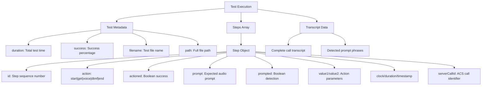
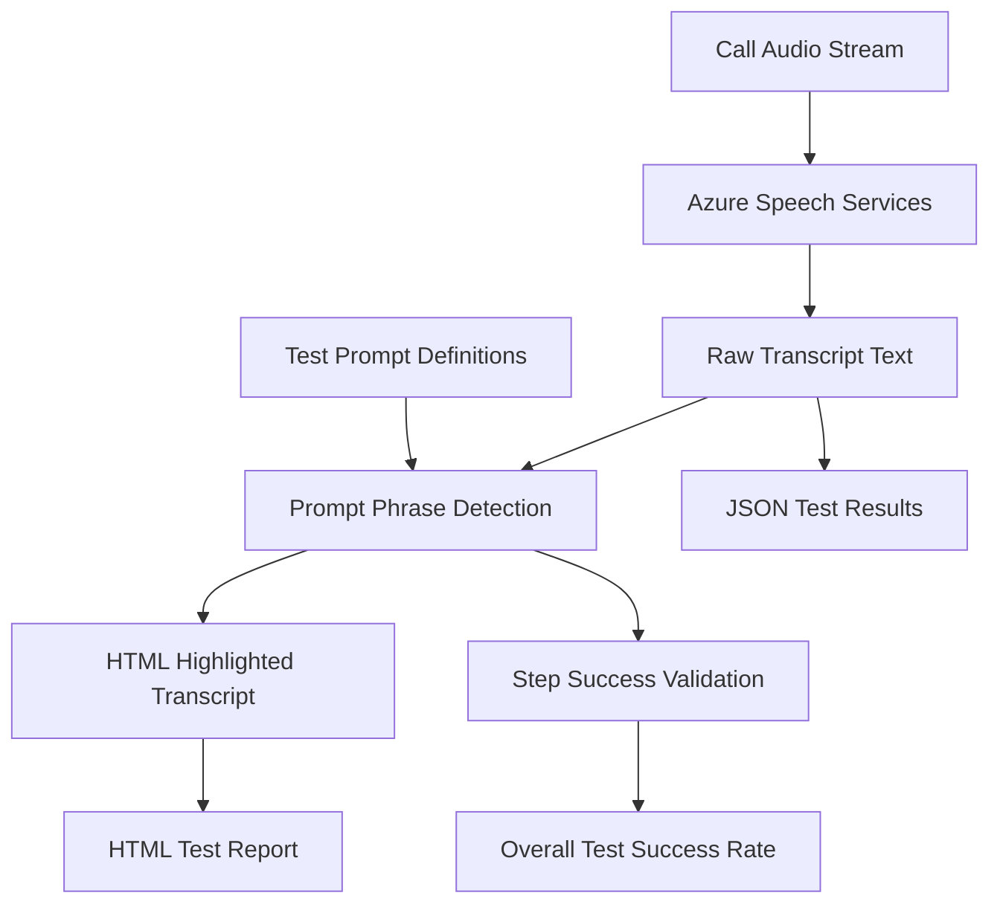
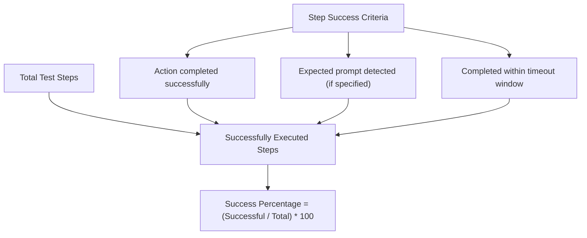
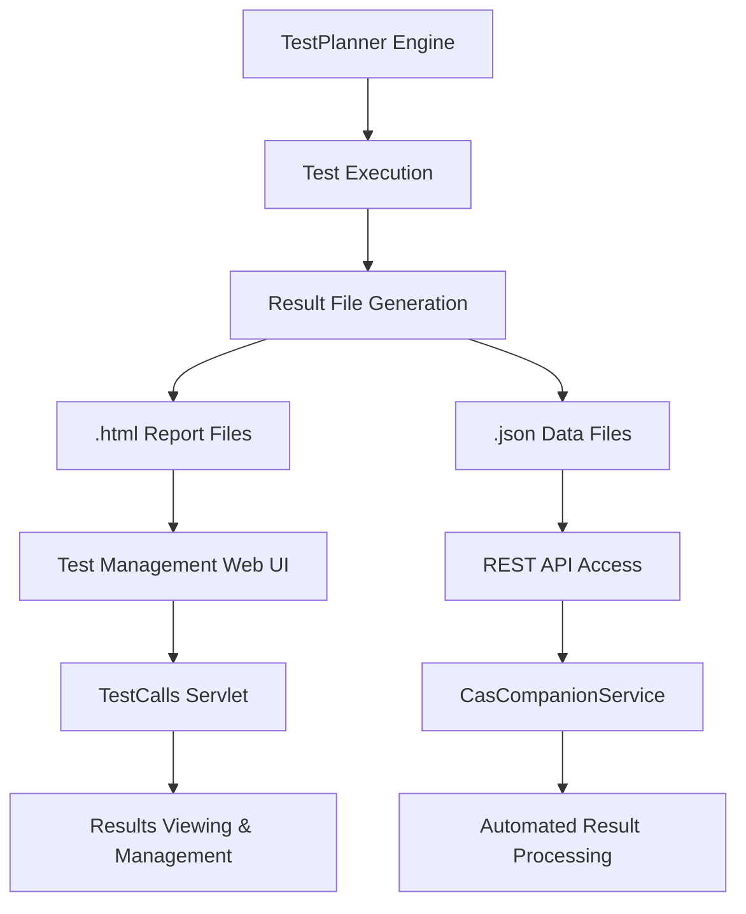

# Test Results & Reporting

> **Relevant source files**
> * [src/web/tests/scenario1.csv.html](https://github.com/ComitFS/cas-service/blob/b7087e8d/src/web/tests/scenario1.csv.html)
> * [src/web/tests/scenario1.csv.json](https://github.com/ComitFS/cas-service/blob/b7087e8d/src/web/tests/scenario1.csv.json)
> * [src/web/tests/scenario2.csv.html](https://github.com/ComitFS/cas-service/blob/b7087e8d/src/web/tests/scenario2.csv.html)
> * [src/web/tests/scenario2.csv.json](https://github.com/ComitFS/cas-service/blob/b7087e8d/src/web/tests/scenario2.csv.json)
> * [src/web/tests/scenario3.csv.html](https://github.com/ComitFS/cas-service/blob/b7087e8d/src/web/tests/scenario3.csv.html)
> * [src/web/tests/scenario3.csv.json](https://github.com/ComitFS/cas-service/blob/b7087e8d/src/web/tests/scenario3.csv.json)
> * [src/web/tests/test1.js.html](https://github.com/ComitFS/cas-service/blob/b7087e8d/src/web/tests/test1.js.html)
> * [src/web/tests/test1.js.json](https://github.com/ComitFS/cas-service/blob/b7087e8d/src/web/tests/test1.js.json)
> * [src/web/tests/test2.csv.html](https://github.com/ComitFS/cas-service/blob/b7087e8d/src/web/tests/test2.csv.html)
> * [src/web/tests/test2.csv.json](https://github.com/ComitFS/cas-service/blob/b7087e8d/src/web/tests/test2.csv.json)

This document covers the test result formats, reporting mechanisms, and data structures generated by the CAS service test automation framework. It details how test execution data is captured, processed, and presented through both machine-readable JSON and human-readable HTML formats.

For information about test execution and orchestration, see [TestPlanner Engine](./3.1-testplanner-engine.md). For details on creating test scenarios, see [Test Scenario Definitions](./3.2-test-scenario-definitions.md). For the web interfaces used to view and manage these results, see [Test Management Web Interface](./3.4-test-management-web-interface.md).

## Test Result Output Formats

The CAS test automation system generates two complementary output formats for each test execution:

### HTML Reports

Human-readable test reports are generated as HTML files with tabular layouts showing step-by-step test execution details. These reports use the Openfire admin console styling with success/failure icons and formatted transcript data.

### JSON Data Files

Machine-readable test results are stored as JSON files containing structured execution data, timing metrics, success rates, and complete transcription information.

**Sources:** [src/web/tests/test2.csv.html L1-L64](https://github.com/ComitFS/cas-service/blob/b7087e8d/src/web/tests/test2.csv.html#L1-L64)

 [src/web/tests/test2.csv.json L1-L2](https://github.com/ComitFS/cas-service/blob/b7087e8d/src/web/tests/test2.csv.json#L1-L2)

 [src/web/tests/scenario1.csv.html L1-L124](https://github.com/ComitFS/cas-service/blob/b7087e8d/src/web/tests/scenario1.csv.html#L1-L124)

 [src/web/tests/test1.js.html L1-L52](https://github.com/ComitFS/cas-service/blob/b7087e8d/src/web/tests/test1.js.html#L1-L52)

## Test Result Data Structure

The test execution results follow a consistent data model across both CSV-driven and JavaScript-driven tests:

**Sources:** [src/web/tests/test2.csv.json L1-L2](https://github.com/ComitFS/cas-service/blob/b7087e8d/src/web/tests/test2.csv.json#L1-L2)

 [src/web/tests/scenario1.csv.json L1-L2](https://github.com/ComitFS/cas-service/blob/b7087e8d/src/web/tests/scenario1.csv.json#L1-L2)

 [src/web/tests/test1.js.json L1-L2](https://github.com/ComitFS/cas-service/blob/b7087e8d/src/web/tests/test1.js.json#L1-L2)

## Test Execution Tracking

Each test step captures detailed execution metrics and outcomes:

| Field | Type | Description |
| --- | --- | --- |
| `id` | Integer | Sequential step number within test |
| `action` | String | Action type: `start`, `get`, `voice`, `dtmf`, `end`/`stop` |
| `actioned` | Boolean | Whether action executed successfully |
| `prompt` | String | Expected audio prompt text to detect |
| `prompted` | Boolean | Whether expected prompt was detected |
| `value1` | String | Primary action parameter (phone number, URL, DTMF sequence) |
| `value2` | String | Secondary parameter (caller ID, voice settings) |
| `timeout` | String | Maximum wait time for step completion |
| `duration` | Integer | Actual execution time in seconds |
| `clock` | String | Human-readable timestamp (HH:MM:SS) |
| `timestamp` | Long | Unix timestamp in milliseconds |
| `serverCallId` | String | Base64-encoded Azure Communication Services call ID |

**Sources:** [src/web/tests/test2.csv.json L1-L2](https://github.com/ComitFS/cas-service/blob/b7087e8d/src/web/tests/test2.csv.json#L1-L2)

 [src/web/tests/scenario3.csv.json L1-L2](https://github.com/ComitFS/cas-service/blob/b7087e8d/src/web/tests/scenario3.csv.json#L1-L2)

## Transcript Processing and Speech Recognition

Test results include comprehensive speech transcription data with phrase detection highlighting:

The transcript processing includes:

* **Real-time transcription** via Azure Communication Services speech recognition
* **Phrase detection** matching expected prompts from test scenarios
* **HTML highlighting** using `<b>` tags for detected phrases in reports
* **Paragraph formatting** with `
` tags for readability in HTML output

**Sources:** [src/web/tests/scenario1.csv.html L13](https://github.com/ComitFS/cas-service/blob/b7087e8d/src/web/tests/scenario1.csv.html#L13-L13)

 [src/web/tests/scenario2.csv.html L13](https://github.com/ComitFS/cas-service/blob/b7087e8d/src/web/tests/scenario2.csv.html#L13-L13)

 [src/web/tests/test2.csv.json L1-L2](https://github.com/ComitFS/cas-service/blob/b7087e8d/src/web/tests/test2.csv.json#L1-L2)

## Success Rate Calculation

Test success rates are calculated based on step completion and prompt detection:

Examples from test results:

* `test2.csv`: 80% success (4 out of 5 steps successful)
* `scenario1.csv`: 100% success (all steps completed)
* `test1.js`: 100% success (all steps completed)

**Sources:** [src/web/tests/test2.csv.json L1-L2](https://github.com/ComitFS/cas-service/blob/b7087e8d/src/web/tests/test2.csv.json#L1-L2)

 [src/web/tests/scenario1.csv.json L1-L2](https://github.com/ComitFS/cas-service/blob/b7087e8d/src/web/tests/scenario1.csv.json#L1-L2)

 [src/web/tests/test1.js.json L1-L2](https://github.com/ComitFS/cas-service/blob/b7087e8d/src/web/tests/test1.js.json#L1-L2)

## HTML Report Generation

HTML test reports provide formatted, human-readable results with visual indicators:

### Report Structure

* **Title**: `Test Results - {filename}`
* **Meta tag**: `pageID='test-calls'` for integration with Openfire admin console
* **Table layout**: Jive-styled table matching Openfire UI patterns
* **Visual indicators**: Success/failure icons from `/images/success-16x16.gif` and `/images/delete-16x16.gif`

### Transcript Display

* **Rowspan formatting**: Transcript spans all test steps in a single cell
* **Phrase highlighting**: Detected prompts wrapped in `<b>` tags
* **Paragraph structure**: Multiple `
` elements for readability

**Sources:** [src/web/tests/test2.csv.html L1-L64](https://github.com/ComitFS/cas-service/blob/b7087e8d/src/web/tests/test2.csv.html#L1-L64)

 [src/web/tests/scenario1.csv.html L1-L124](https://github.com/ComitFS/cas-service/blob/b7087e8d/src/web/tests/scenario1.csv.html#L1-L124)

 [src/web/tests/test1.js.html L1-L52](https://github.com/ComitFS/cas-service/blob/b7087e8d/src/web/tests/test1.js.html#L1-L52)

## Integration with Test Management

Test results integrate with the broader test automation framework:

The generated result files are stored in the `src/web/tests/` directory and accessed through:

* **Web interface**: Direct HTML file serving for human review
* **REST API**: JSON data access for programmatic processing
* **File system**: Direct file access for result archival and analysis

**Sources:** [src/web/tests/test2.csv.html L1-L64](https://github.com/ComitFS/cas-service/blob/b7087e8d/src/web/tests/test2.csv.html#L1-L64)

 [src/web/tests/test2.csv.json L1-L2](https://github.com/ComitFS/cas-service/blob/b7087e8d/src/web/tests/test2.csv.json#L1-L2)