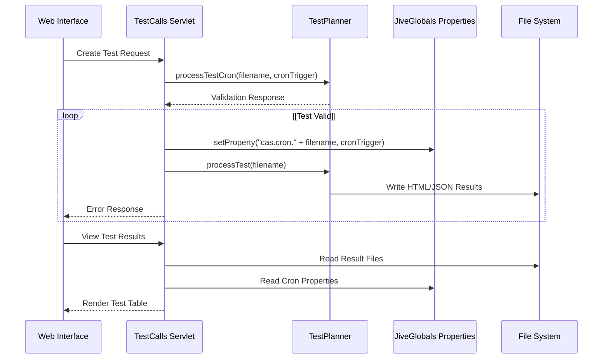

# Test Management Web Interface

> **Relevant source files**
> * [classes/wwwroot/teams-app/manifest/manifest.json](https://github.com/ComitFS/cas-service/blob/b7087e8d/classes/wwwroot/teams-app/manifest/manifest.json)
> * [classes/wwwroot/teams-app/manifest/manifest.zip](https://github.com/ComitFS/cas-service/blob/b7087e8d/classes/wwwroot/teams-app/manifest/manifest.zip)
> * [src/java/com/ifsoft/openlink/view/TestCalls.java](https://github.com/ComitFS/cas-service/blob/b7087e8d/src/java/com/ifsoft/openlink/view/TestCalls.java)
> * [src/java/com/ifsoft/openlink/view/Testing.java](https://github.com/ComitFS/cas-service/blob/b7087e8d/src/java/com/ifsoft/openlink/view/Testing.java)
> * [src/java/org/jivesoftware/openfire/plugin/rest/service/JerseyWrapper.java](https://github.com/ComitFS/cas-service/blob/b7087e8d/src/java/org/jivesoftware/openfire/plugin/rest/service/JerseyWrapper.java)
> * [src/web/tests/test1.csv](https://github.com/ComitFS/cas-service/blob/b7087e8d/src/web/tests/test1.csv)
> * [src/web/tests/test2.csv](https://github.com/ComitFS/cas-service/blob/b7087e8d/src/web/tests/test2.csv)

## Purpose and Scope

The Test Management Web Interface provides web-based user interfaces for managing, scheduling, monitoring, and executing automated call tests within the CAS service. This system includes two primary servlets that handle different aspects of test management: automated test scheduling and execution (`TestCalls`) and individual user diagnostics (`Testing`).

For information about the underlying test execution engine, see [TestPlanner Engine](./3.1-testplanner-engine.md). For details on test scenario definitions and formats, see [Test Scenario Definitions](./3.2-test-scenario-definitions.md). For information about test results and reporting formats, see [Test Results & Reporting](./3.3-test-results-and-reporting.md).

## Interface Architecture Overview

The test management web interface consists of two main servlet components that provide different testing capabilities within the Openfire plugin framework.

```

```

**Sources:** [src/java/com/ifsoft/openlink/view/TestCalls.java L34-L296](https://github.com/ComitFS/cas-service/blob/b7087e8d/src/java/com/ifsoft/openlink/view/TestCalls.java#L34-L296)

 [src/java/com/ifsoft/openlink/view/Testing.java L31-L394](https://github.com/ComitFS/cas-service/blob/b7087e8d/src/java/com/ifsoft/openlink/view/Testing.java#L31-L394)

## TestCalls Servlet - Automated Test Management

The `TestCalls` servlet provides the primary interface for managing automated call tests, including test scheduling, execution monitoring, and manual test calls.

### Test List Management

The servlet displays a comprehensive table of all configured tests with their current status and execution history.

```

```

**Sources:** [src/java/com/ifsoft/openlink/view/TestCalls.java L104-L185](https://github.com/ComitFS/cas-service/blob/b7087e8d/src/java/com/ifsoft/openlink/view/TestCalls.java#L104-L185)

 [src/java/com/ifsoft/openlink/view/TestCalls.java L63-L73](https://github.com/ComitFS/cas-service/blob/b7087e8d/src/java/com/ifsoft/openlink/view/TestCalls.java#L63-L73)

### Test Table Structure

The main test management interface displays tests in a structured table format:

| Column | Data Source | Description |
| --- | --- | --- |
| Script Name | Property key (without `cas.cron.` prefix) | Test scenario filename |
| Schedule | `JiveGlobals.getProperty()` | Quartz cron expression |
| Tested | File existence check | Test execution status icon |
| Results | JSON file parsing | Success percentage |
| Duration | JSON file parsing | Execution time in seconds |
| Details | HTML file link | Link to detailed test report |
| Date | File modification time | Last execution timestamp |

**Sources:** [src/java/com/ifsoft/openlink/view/TestCalls.java L87-L99](https://github.com/ComitFS/cas-service/blob/b7087e8d/src/java/com/ifsoft/openlink/view/TestCalls.java#L87-L99)

 [src/java/com/ifsoft/openlink/view/TestCalls.java L119-L139](https://github.com/ComitFS/cas-service/blob/b7087e8d/src/java/com/ifsoft/openlink/view/TestCalls.java#L119-L139)

### Manual Test Interface

The servlet provides manual test capabilities with configurable parameters:

```

```

**Sources:** [src/java/com/ifsoft/openlink/view/TestCalls.java L220-L287](https://github.com/ComitFS/cas-service/blob/b7087e8d/src/java/com/ifsoft/openlink/view/TestCalls.java#L220-L287)

 [src/java/com/ifsoft/openlink/view/TestCalls.java L263-L285](https://github.com/ComitFS/cas-service/blob/b7087e8d/src/java/com/ifsoft/openlink/view/TestCalls.java#L263-L285)

## Testing Servlet - User Diagnostics Interface

The `Testing` servlet focuses on individual user testing and diagnostics, particularly for Microsoft Teams integration testing.

### User-Specific Testing Features

The servlet provides comprehensive user testing capabilities:

```

```

**Sources:** [src/java/com/ifsoft/openlink/view/Testing.java L52-L95](https://github.com/ComitFS/cas-service/blob/b7087e8d/src/java/com/ifsoft/openlink/view/Testing.java#L52-L95)

 [src/java/com/ifsoft/openlink/view/Testing.java L88-L102](https://github.com/ComitFS/cas-service/blob/b7087e8d/src/java/com/ifsoft/openlink/view/Testing.java#L88-L102)

### Diagnostic Results Display

The servlet renders comprehensive diagnostic information when test results are available:

| Category | Data Fields | Source |
| --- | --- | --- |
| Client Info | Browser, OS, Connected, Bandwidth | `ms_teams_test` JSON |
| Device Status | Microphone, Camera, Speaker | `device` JSON object |
| Compliance | Voice Recording, Incoming Call | Policy and call status |
| Media Diagnostics | Jitter, Packet Loss, RTT | Audio/Video diagnostics |

**Sources:** [src/java/com/ifsoft/openlink/view/Testing.java L228-L347](https://github.com/ComitFS/cas-service/blob/b7087e8d/src/java/com/ifsoft/openlink/view/Testing.java#L228-L347)

 [src/java/com/ifsoft/openlink/view/Testing.java L247-L284](https://github.com/ComitFS/cas-service/blob/b7087e8d/src/java/com/ifsoft/openlink/view/Testing.java#L247-L284)

## Integration with Test Execution Engine

Both servlets integrate closely with the core test execution components:



**Sources:** [src/java/com/ifsoft/openlink/view/TestCalls.java L63-L73](https://github.com/ComitFS/cas-service/blob/b7087e8d/src/java/com/ifsoft/openlink/view/TestCalls.java#L63-L73)

 [src/java/com/ifsoft/openlink/view/TestCalls.java L119-L128](https://github.com/ComitFS/cas-service/blob/b7087e8d/src/java/com/ifsoft/openlink/view/TestCalls.java#L119-L128)

## Real-time Features

Both servlets integrate with real-time communication systems for live monitoring and interaction:

### WebSocket Integration

The interfaces support real-time updates through WebSocket connections:

```

```

**Sources:** [src/java/com/ifsoft/openlink/view/TestCalls.java L80](https://github.com/ComitFS/cas-service/blob/b7087e8d/src/java/com/ifsoft/openlink/view/TestCalls.java#L80-L80)

 [src/java/com/ifsoft/openlink/view/Testing.java L218](https://github.com/ComitFS/cas-service/blob/b7087e8d/src/java/com/ifsoft/openlink/view/Testing.java#L218-L218)

 [src/java/com/ifsoft/openlink/view/Testing.java L341-L347](https://github.com/ComitFS/cas-service/blob/b7087e8d/src/java/com/ifsoft/openlink/view/Testing.java#L341-L347)

### Live Audio Processing

The Testing servlet includes support for real-time audio waveform display and recording capabilities when users are online:

**Sources:** [src/java/com/ifsoft/openlink/view/Testing.java L357-L371](https://github.com/ComitFS/cas-service/blob/b7087e8d/src/java/com/ifsoft/openlink/view/Testing.java#L357-L371)

 [src/java/com/ifsoft/openlink/view/Testing.java L382-L393](https://github.com/ComitFS/cas-service/blob/b7087e8d/src/java/com/ifsoft/openlink/view/Testing.java#L382-L393)

## File Management and Test Creation

The TestCalls servlet handles test file uploads and creation through a multi-step process:

1. **File Upload**: JavaScript handles file selection and uploads via HTML5 file input
2. **Cron Scheduling**: Quartz cron expressions define test execution schedules
3. **Test Storage**: Tests are stored in the `plugins/casapi/web/tests` directory
4. **Result Generation**: Execution generates both HTML reports and JSON data files

**Sources:** [src/java/com/ifsoft/openlink/view/TestCalls.java L191-L217](https://github.com/ComitFS/cas-service/blob/b7087e8d/src/java/com/ifsoft/openlink/view/TestCalls.java#L191-L217)

 [src/web/tests/test1.csv L1-L13](https://github.com/ComitFS/cas-service/blob/b7087e8d/src/web/tests/test1.csv#L1-L13)

 [src/web/tests/test2.csv L1-L6](https://github.com/ComitFS/cas-service/blob/b7087e8d/src/web/tests/test2.csv#L1-L6)