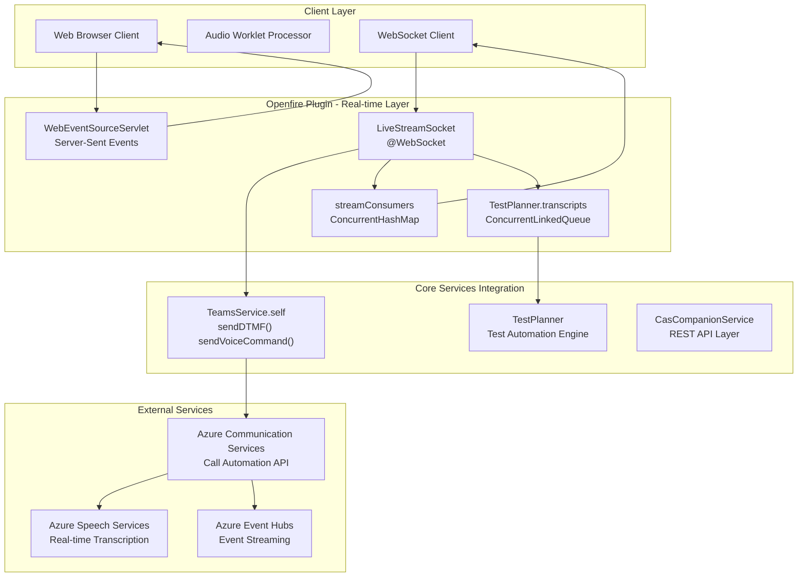
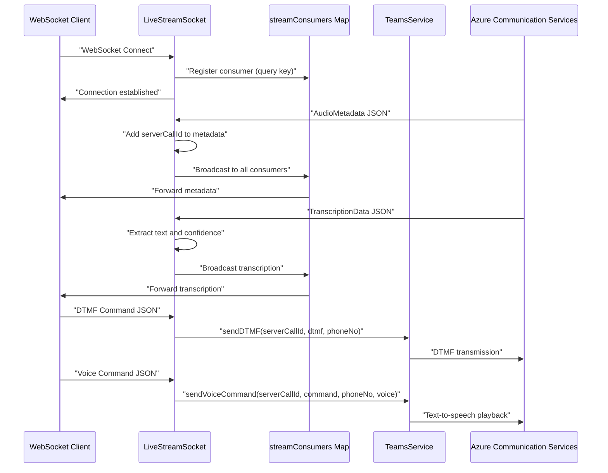
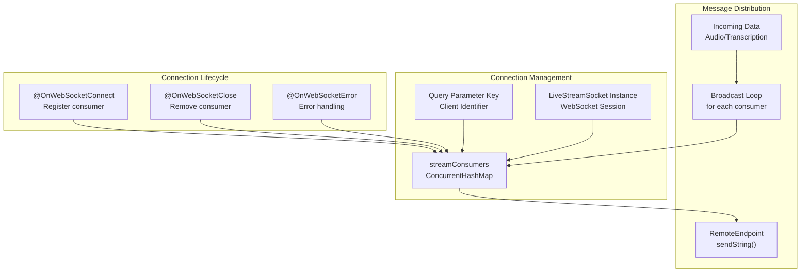
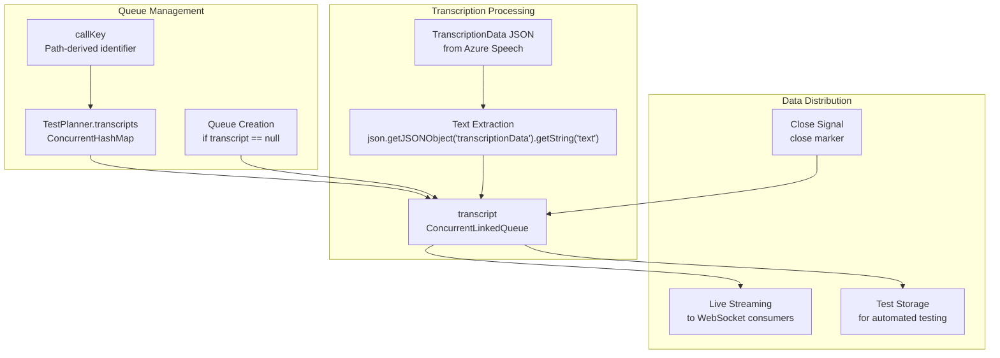

# Real-time Communication

> **Relevant source files**
> * [src/java/org/ifsoft/websockets/LiveStreamSocket.java](https://github.com/ComitFS/cas-service/blob/b7087e8d/src/java/org/ifsoft/websockets/LiveStreamSocket.java)

This document covers the real-time communication infrastructure of the CAS Service Plugin, including WebSocket-based audio streaming, live transcription processing, and bi-directional command transmission. The system enables real-time interaction with Azure Communication Services call automation, live audio processing, and event distribution to connected clients.

For specific WebSocket audio streaming implementation details, see [WebSocket Audio Streaming](./4.1-websocket-audio-streaming.md). For client-side audio processing capabilities, see [Client-Side Audio Processing](./4.2-client-side-audio-processing.md). For WebRTC media streaming integration, see [WebRTC Integration](./4.3-webrtc-integration.md).

## System Architecture

The real-time communication system operates through multiple interconnected components that handle different aspects of live data processing and transmission.



Sources: [src/java/org/ifsoft/websockets/LiveStreamSocket.java L31-L248](https://github.com/ComitFS/cas-service/blob/b7087e8d/src/java/org/ifsoft/websockets/LiveStreamSocket.java#L31-L248)

## Data Flow Types

The system processes multiple categories of real-time data, each with distinct handling patterns and distribution mechanisms.

| Data Type | Source | Processing | Distribution |
| --- | --- | --- | --- |
| Audio Metadata | Azure Communication Services | JSON parsing and server call ID injection | Broadcast to all stream consumers |
| Audio Data | Azure Communication Services | Base64 encoded PCM audio streams | Real-time streaming to WebSocket clients |
| Transcription Data | Azure Speech Services | Text extraction and confidence scoring | Queue storage and consumer broadcast |
| DTMF Commands | Client applications | Command validation and ACS forwarding | Direct execution via TeamsService |
| Voice Commands | Client applications | Text-to-speech parameter processing | ACS call automation integration |
| System Events | Internal services | Event serialization | Server-Sent Events distribution |

Sources: [src/java/org/ifsoft/websockets/LiveStreamSocket.java L97-L210](https://github.com/ComitFS/cas-service/blob/b7087e8d/src/java/org/ifsoft/websockets/LiveStreamSocket.java#L97-L210)

## WebSocket Communication Protocol

The `LiveStreamSocket` class implements the primary WebSocket endpoint for real-time data exchange, supporting bidirectional communication between clients and Azure Communication Services.



Sources: [src/java/org/ifsoft/websockets/LiveStreamSocket.java L53-L69](https://github.com/ComitFS/cas-service/blob/b7087e8d/src/java/org/ifsoft/websockets/LiveStreamSocket.java#L53-L69)

 [src/java/org/ifsoft/websockets/LiveStreamSocket.java L173-L181](https://github.com/ComitFS/cas-service/blob/b7087e8d/src/java/org/ifsoft/websockets/LiveStreamSocket.java#L173-L181)

 [src/java/org/ifsoft/websockets/LiveStreamSocket.java L187-L206](https://github.com/ComitFS/cas-service/blob/b7087e8d/src/java/org/ifsoft/websockets/LiveStreamSocket.java#L187-L206)

## Stream Consumer Management

The system maintains active WebSocket connections through a concurrent mapping structure that enables efficient message distribution to multiple connected clients.



Sources: [src/java/org/ifsoft/websockets/LiveStreamSocket.java L42](https://github.com/ComitFS/cas-service/blob/b7087e8d/src/java/org/ifsoft/websockets/LiveStreamSocket.java#L42-L42)

 [src/java/org/ifsoft/websockets/LiveStreamSocket.java L56-L58](https://github.com/ComitFS/cas-service/blob/b7087e8d/src/java/org/ifsoft/websockets/LiveStreamSocket.java#L56-L58)

 [src/java/org/ifsoft/websockets/LiveStreamSocket.java L74-L75](https://github.com/ComitFS/cas-service/blob/b7087e8d/src/java/org/ifsoft/websockets/LiveStreamSocket.java#L74-L75)

## Transcript Queue Processing

Live transcription data from Azure Speech Services is captured and queued for both real-time distribution and persistent storage during test execution.



Sources: [src/java/org/ifsoft/websockets/LiveStreamSocket.java L59-L66](https://github.com/ComitFS/cas-service/blob/b7087e8d/src/java/org/ifsoft/websockets/LiveStreamSocket.java#L59-L66)

 [src/java/org/ifsoft/websockets/LiveStreamSocket.java L163-L170](https://github.com/ComitFS/cas-service/blob/b7087e8d/src/java/org/ifsoft/websockets/LiveStreamSocket.java#L163-L170)

 [src/java/org/ifsoft/websockets/LiveStreamSocket.java L78-L80](https://github.com/ComitFS/cas-service/blob/b7087e8d/src/java/org/ifsoft/websockets/LiveStreamSocket.java#L78-L80)

## Command Processing

The WebSocket endpoint processes interactive commands from client applications, enabling real-time control of active call sessions through Azure Communication Services.

### DTMF Command Structure

```json
{
  "action": "sendDTMF",
  "dtmf": "1",
  "phoneNo": "+1234567890",
  "serverCallId": "call-session-id"
}
```

### Voice Command Structure

```json
{
  "action": "voiceCommand",
  "command": "Press 1 for sales",
  "phoneNo": "+1234567890",
  "serverCallId": "call-session-id",
  "gender": "female",
  "language": "en-US"
}
```

Sources: [src/java/org/ifsoft/websockets/LiveStreamSocket.java L184-L207](https://github.com/ComitFS/cas-service/blob/b7087e8d/src/java/org/ifsoft/websockets/LiveStreamSocket.java#L184-L207)

## Audio Data Processing

Real-time audio streams from Azure Communication Services are processed and forwarded to connected WebSocket clients with metadata enhancement.

### Audio Metadata Structure

```json
{
  "kind": "AudioMetadata",
  "audioMetadata": {
    "subscriptionId": "subscription-uuid",
    "encoding": "PCM",
    "sampleRate": 24000,
    "channels": 1,
    "length": 960
  },
  "serverCallId": "enhanced-call-id"
}
```

### Audio Data Structure

```json
{
  "kind": "AudioData",
  "audioData": {
    "timestamp": "2024-12-10T16:04:22.535Z",
    "data": "base64-encoded-pcm-audio",
    "silent": false
  }
}
```

Sources: [src/java/org/ifsoft/websockets/LiveStreamSocket.java L100-L118](https://github.com/ComitFS/cas-service/blob/b7087e8d/src/java/org/ifsoft/websockets/LiveStreamSocket.java#L100-L118)

 [src/java/org/ifsoft/websockets/LiveStreamSocket.java L158-L160](https://github.com/ComitFS/cas-service/blob/b7087e8d/src/java/org/ifsoft/websockets/LiveStreamSocket.java#L158-L160)