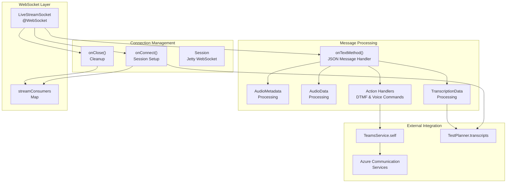
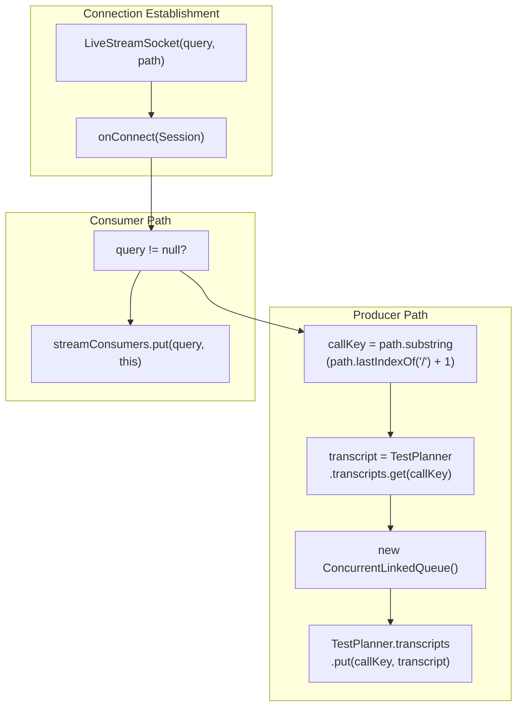
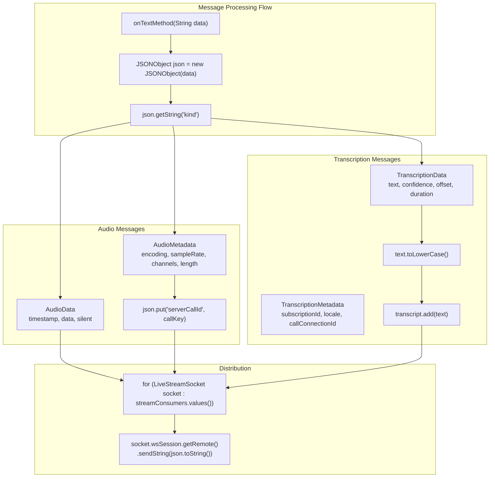
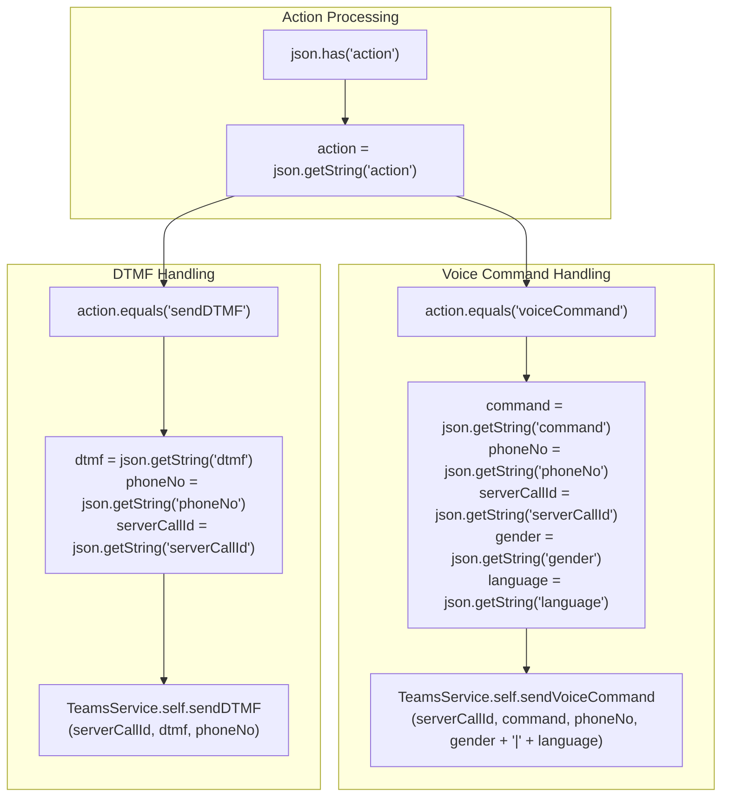
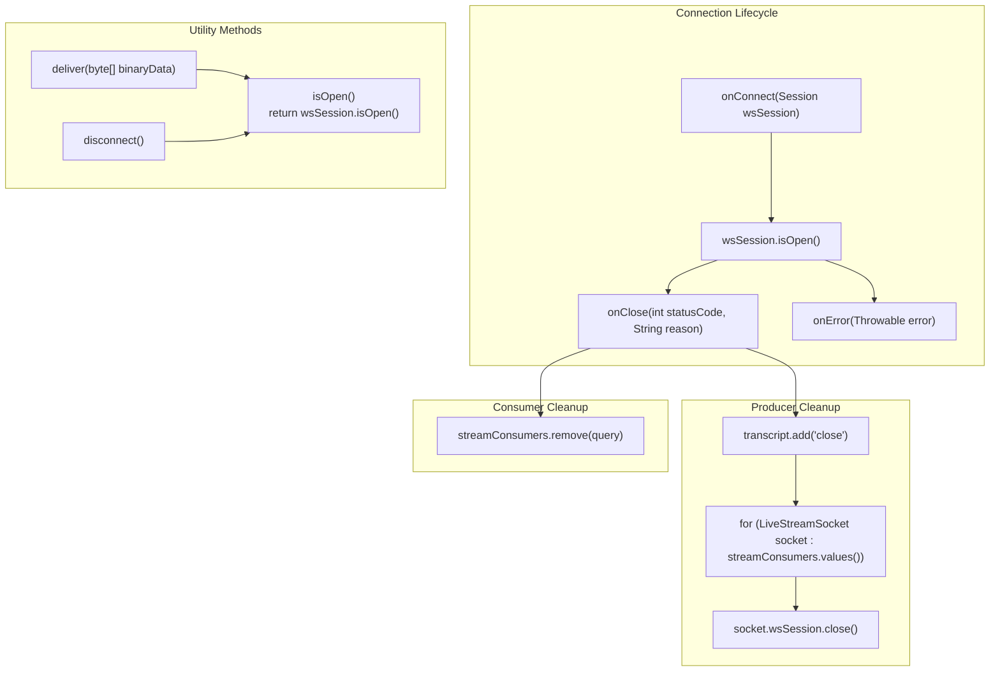
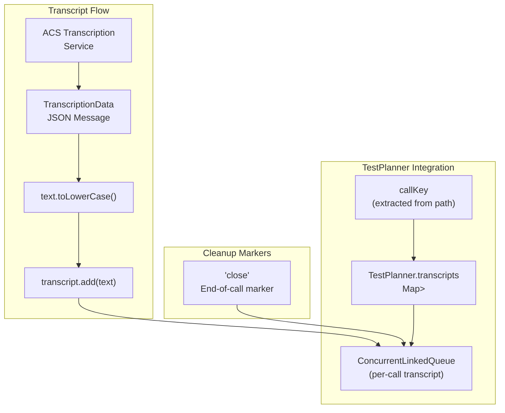

# WebSocket Audio Streaming

> **Relevant source files**
> * [src/java/org/ifsoft/openfire/WebEventSourceServlet.java](https://github.com/ComitFS/cas-service/blob/b7087e8d/src/java/org/ifsoft/openfire/WebEventSourceServlet.java)
> * [src/java/org/ifsoft/websockets/LiveStreamSocket.java](https://github.com/ComitFS/cas-service/blob/b7087e8d/src/java/org/ifsoft/websockets/LiveStreamSocket.java)
> * [src/web/docs/index.html](https://github.com/ComitFS/cas-service/blob/b7087e8d/src/web/docs/index.html)
> * [src/web/docs/openapi.yaml](https://github.com/ComitFS/cas-service/blob/b7087e8d/src/web/docs/openapi.yaml)

## Purpose and Scope

This document covers the server-side WebSocket implementation for real-time audio streaming in the CAS Service Plugin. The `LiveStreamSocket` class provides bidirectional audio data transmission, real-time transcription processing, and call control capabilities between Azure Communication Services (ACS) and connected clients.

For client-side audio processing and Web Audio API integration, see [Client-Side Audio Processing](./4.2-client-side-audio-processing.md). For WebRTC peer connection management, see [WebRTC Integration](./4.3-webrtc-integration.md).

## LiveStreamSocket Architecture

The `LiveStreamSocket` class serves as the primary WebSocket endpoint for audio streaming functionality, implementing the Eclipse Jetty WebSocket API to handle real-time communication between ACS calls and web clients.

Sources: [src/java/org/ifsoft/websockets/LiveStreamSocket.java L31-L68](https://github.com/ComitFS/cas-service/blob/b7087e8d/src/java/org/ifsoft/websockets/LiveStreamSocket.java#L31-L68)

## Connection Types and Initialization

The `LiveStreamSocket` supports two distinct connection types based on the initialization parameters, each serving different purposes in the audio streaming workflow.

| Connection Type | Identifier | Purpose | Transcript Storage |
| --- | --- | --- | --- |
| Stream Consumer | `query` parameter | Receives published audio/transcription data | No |
| Call Producer | `path` parameter with `callKey` | Produces audio data from ACS calls | Yes |

Sources: [src/java/org/ifsoft/websockets/LiveStreamSocket.java L44-L68](https://github.com/ComitFS/cas-service/blob/b7087e8d/src/java/org/ifsoft/websockets/LiveStreamSocket.java#L44-L68)

## Message Types and Processing

The WebSocket endpoint processes structured JSON messages representing different types of audio and control data from Azure Communication Services.

### Audio and Transcription Messages

Sources: [src/java/org/ifsoft/websockets/LiveStreamSocket.java L97-L180](https://github.com/ComitFS/cas-service/blob/b7087e8d/src/java/org/ifsoft/websockets/LiveStreamSocket.java#L97-L180)

### Control Action Processing

The WebSocket endpoint handles two types of call control actions: DTMF tone transmission and voice command synthesis.

| Action Type | Parameters | Integration Method |
| --- | --- | --- |
| `sendDTMF` | `dtmf`, `phoneNo`, `serverCallId` | `TeamsService.self.sendDTMF()` |
| `voiceCommand` | `command`, `phoneNo`, `serverCallId`, `gender`, `language` | `TeamsService.self.sendVoiceCommand()` |

Sources: [src/java/org/ifsoft/websockets/LiveStreamSocket.java L184-L206](https://github.com/ComitFS/cas-service/blob/b7087e8d/src/java/org/ifsoft/websockets/LiveStreamSocket.java#L184-L206)

## Connection Management and Cleanup

The WebSocket implementation provides robust connection lifecycle management with proper cleanup procedures for both consumer and producer connections.

Sources: [src/java/org/ifsoft/websockets/LiveStreamSocket.java L49-L51](https://github.com/ComitFS/cas-service/blob/b7087e8d/src/java/org/ifsoft/websockets/LiveStreamSocket.java#L49-L51)

 [src/java/org/ifsoft/websockets/LiveStreamSocket.java L71-L91](https://github.com/ComitFS/cas-service/blob/b7087e8d/src/java/org/ifsoft/websockets/LiveStreamSocket.java#L71-L91)

 [src/java/org/ifsoft/websockets/LiveStreamSocket.java L217-L247](https://github.com/ComitFS/cas-service/blob/b7087e8d/src/java/org/ifsoft/websockets/LiveStreamSocket.java#L217-L247)

## Integration with Testing Framework

The `LiveStreamSocket` integrates closely with the `TestPlanner` for automated call testing, providing real-time transcript collection and call monitoring capabilities.

### Transcript Management

| Component | Data Structure | Purpose |
| --- | --- | --- |
| `TestPlanner.transcripts` | `Map<String, ConcurrentLinkedQueue<String>>` | Stores per-call transcription text |
| `callKey` | `String` (from path) | Unique identifier for call session |
| `transcript` | `ConcurrentLinkedQueue<String>` | Thread-safe transcript storage |

Sources: [src/java/org/ifsoft/websockets/LiveStreamSocket.java L60-L65](https://github.com/ComitFS/cas-service/blob/b7087e8d/src/java/org/ifsoft/websockets/LiveStreamSocket.java#L60-L65)

 [src/java/org/ifsoft/websockets/LiveStreamSocket.java L167-L169](https://github.com/ComitFS/cas-service/blob/b7087e8d/src/java/org/ifsoft/websockets/LiveStreamSocket.java#L167-L169)

 [src/java/org/ifsoft/websockets/LiveStreamSocket.java L78-L80](https://github.com/ComitFS/cas-service/blob/b7087e8d/src/java/org/ifsoft/websockets/LiveStreamSocket.java#L78-L80)

## REST API Integration

The WebSocket audio streaming functionality is exposed through the REST API endpoint for establishing streaming connections between ACS calls and the CAS service.

### Stream Establishment Endpoint

| Endpoint | Method | Parameters | Purpose |
| --- | --- | --- | --- |
| `/casapi/v1/companion/stream/{callId}/{confId}` | POST | `callId`, `confId` | Establish bi-directional audio streaming |

The endpoint is documented in the OpenAPI specification as supporting the establishment of bi-directional audio streaming between an ACS call and the CAS Audiobridge service.

Sources: [src/web/docs/openapi.yaml L94-L117](https://github.com/ComitFS/cas-service/blob/b7087e8d/src/web/docs/openapi.yaml#L94-L117)