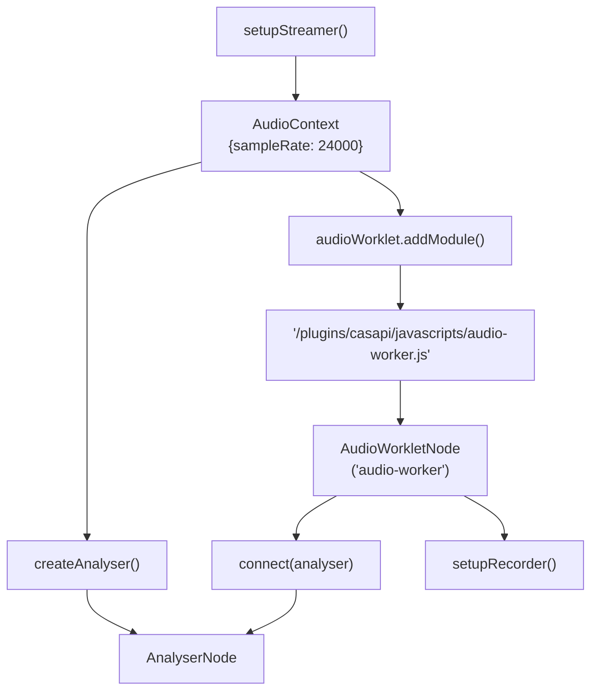
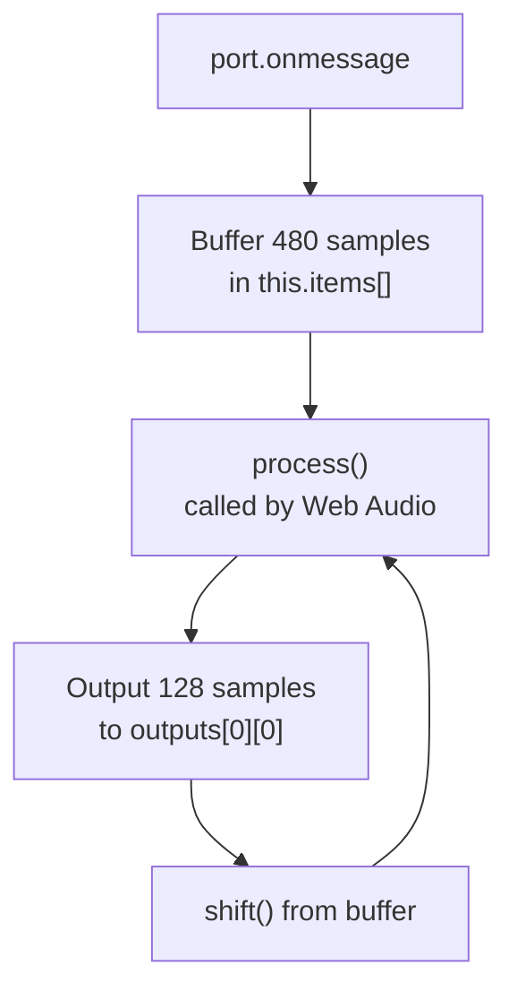
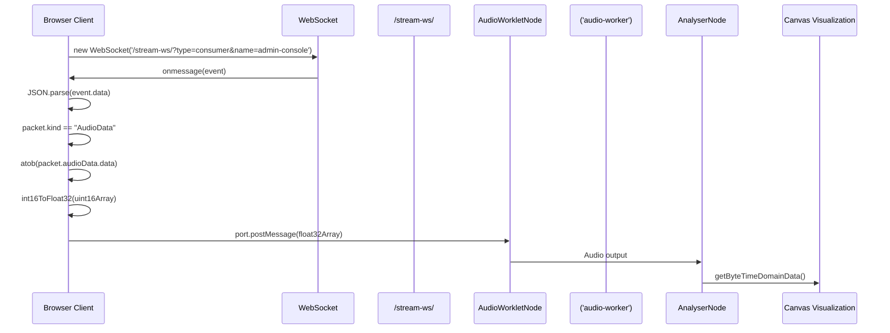
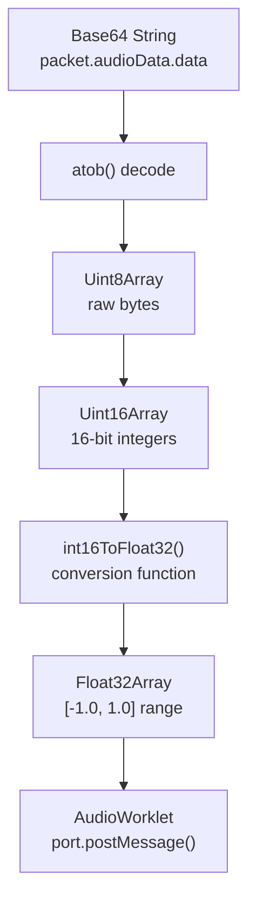
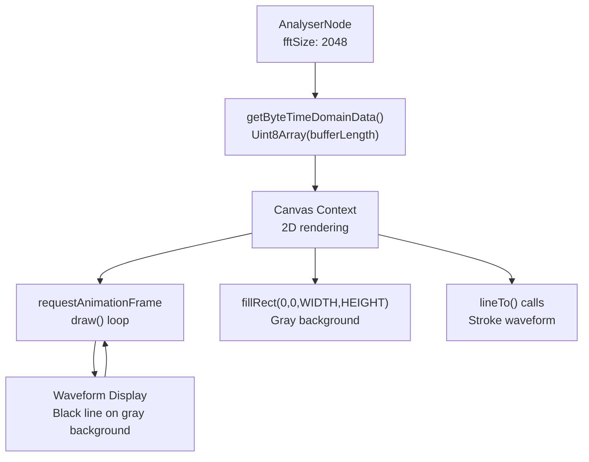
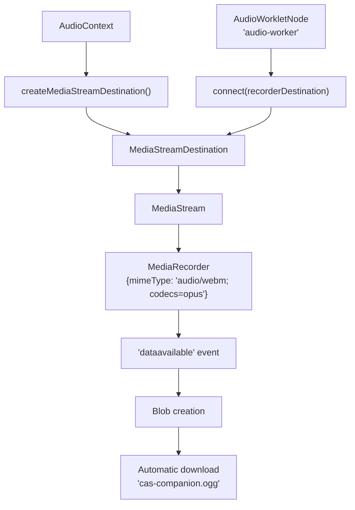

# Client-Side Audio Processing

> **Relevant source files**
> * [src/web/javascripts/audio-worker.js](https://github.com/ComitFS/cas-service/blob/b7087e8d/src/web/javascripts/audio-worker.js)
> * [src/web/javascripts/index.js](https://github.com/ComitFS/cas-service/blob/b7087e8d/src/web/javascripts/index.js)

## Purpose and Scope

This document covers the browser-based audio processing system that enables real-time audio streaming, visualization, and recording within the CAS service. The client-side audio processing layer receives audio data via WebSocket connections, processes it through the Web Audio API using AudioWorklet technology, and provides visualization and recording capabilities.

For server-side WebSocket audio streaming implementation, see [WebSocket Audio Streaming](./4.1-websocket-audio-streaming.md). For WebRTC integration and peer connection management, see [WebRTC Integration](./4.3-webrtc-integration.md).

## Audio Context and Worklet Architecture

The client-side audio processing system is built around the Web Audio API's AudioWorklet technology, providing low-latency audio processing capabilities in the browser.

### Audio Context Setup

The audio system initializes with a fixed sample rate of 24kHz to match the expected audio format from the server. The `AudioWorkletNode` is created using the custom `'audio-worker'` processor for real-time audio processing.

**Sources:** [src/web/javascripts/index.js L21-L27](https://github.com/ComitFS/cas-service/blob/b7087e8d/src/web/javascripts/index.js#L21-L27)

### AudioWorklet Processor Implementation

The `AudioWorker` class extends `AudioWorkletProcessor` and implements a buffering system that receives 480-sample chunks via port messages and outputs 128-sample chunks during each `process()` call.

**Sources:** [src/web/javascripts/audio-worker.js L1-L30](https://github.com/ComitFS/cas-service/blob/b7087e8d/src/web/javascripts/audio-worker.js#L1-L30)

## WebSocket Audio Data Pipeline

The client receives audio data through a WebSocket connection and processes it through the audio worklet system.

### WebSocket Connection and Data Flow

The WebSocket connection is established with specific query parameters (`type=consumer&name=admin-console`) to identify the client as an audio data consumer.

**Sources:** [src/web/javascripts/index.js L112-L133](https://github.com/ComitFS/cas-service/blob/b7087e8d/src/web/javascripts/index.js#L112-L133)

### Audio Data Format Conversion

The system converts incoming audio data from base64-encoded int16 format to float32 format required by the Web Audio API:

The `int16ToFloat32()` function handles the conversion from 16-bit signed integers to normalized float32 values, properly handling negative values using two's complement representation.

**Sources:** [src/web/javascripts/index.js L121-L131](https://github.com/ComitFS/cas-service/blob/b7087e8d/src/web/javascripts/index.js#L121-L131)

 [src/web/javascripts/index.js L189-L199](https://github.com/ComitFS/cas-service/blob/b7087e8d/src/web/javascripts/index.js#L189-L199)

## Audio Visualization System

The system provides real-time audio visualization using HTML5 Canvas and the Web Audio API's AnalyserNode.

### Waveform Visualization Pipeline

The visualization system uses time-domain data to draw a real-time waveform representation with a 2048-sample FFT size for smooth visualization.

**Sources:** [src/web/javascripts/index.js L39-L74](https://github.com/ComitFS/cas-service/blob/b7087e8d/src/web/javascripts/index.js#L39-L74)

## Audio Recording Capabilities

The system supports recording processed audio to downloadable files using the MediaRecorder API.

### Recording Pipeline Architecture

The recording system creates a `MediaStreamDestination` node to capture the processed audio output and uses the MediaRecorder API with WebM/Opus encoding for efficient file compression.

**Sources:** [src/web/javascripts/index.js L141-L187](https://github.com/ComitFS/cas-service/blob/b7087e8d/src/web/javascripts/index.js#L141-L187)

### Recording State Management

The recording functionality toggles between start and stop states through a single button interface:

| State | Button Text | Action |
| --- | --- | --- |
| Idle | "Start Recording" | Initialize MediaRecorder and begin recording |
| Recording | "Stop Recording" | Stop recording and trigger file download |

**Sources:** [src/web/javascripts/index.js L149-L183](https://github.com/ComitFS/cas-service/blob/b7087e8d/src/web/javascripts/index.js#L149-L183)

## Data Format Specifications

### Int16 to Float32 Conversion Algorithm

The conversion function handles signed 16-bit integers and converts them to normalized float32 values in the range [-1.0, 1.0]:

* **Positive values:** `int / 0x7FFF` (divide by 32767)
* **Negative values:** `-(0x10000 - int) / 0x8000` (two's complement handling)

This ensures proper audio signal representation in the Web Audio API's expected format.

**Sources:** [src/web/javascripts/index.js L189-L199](https://github.com/ComitFS/cas-service/blob/b7087e8d/src/web/javascripts/index.js#L189-L199)

### AudioWorklet Buffer Management

The AudioWorklet processor maintains an internal buffer system:

* **Input buffer:** Receives 480-sample chunks via port messages
* **Output buffer:** Provides 128-sample chunks per process() call
* **Buffer ratio:** 480:128 = 3.75:1 input-to-output ratio

This buffering system accommodates the different chunk sizes between WebSocket data delivery and Web Audio API processing requirements.

**Sources:** [src/web/javascripts/audio-worker.js L9-L26](https://github.com/ComitFS/cas-service/blob/b7087e8d/src/web/javascripts/audio-worker.js#L9-L26)