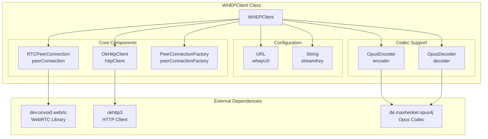
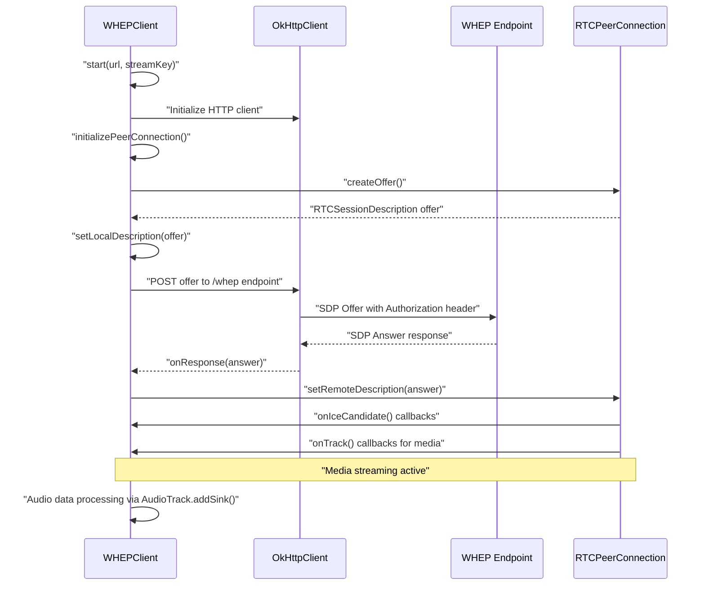
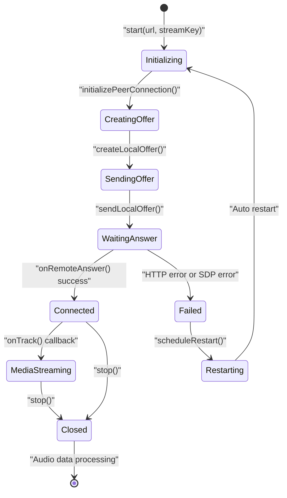
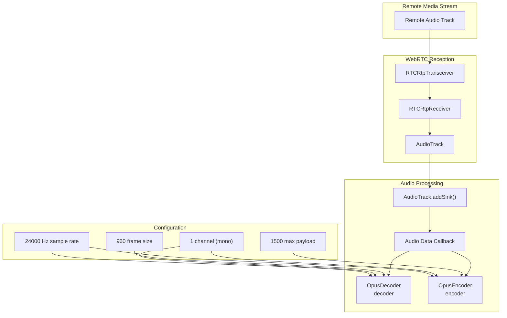
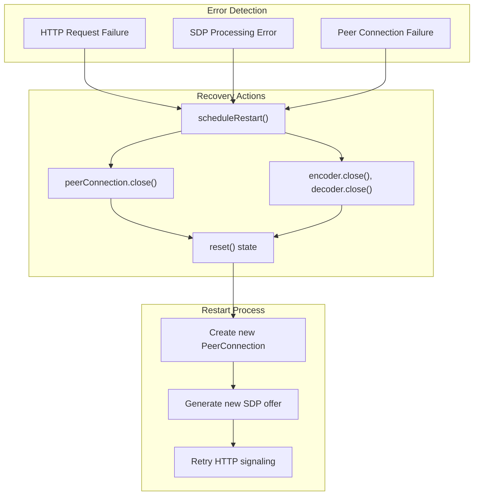

# WebRTC Integration

> **Relevant source files**
> * [src/java/org/ifsoft/webrtc/WHEPClient.java](https://github.com/ComitFS/cas-service/blob/b7087e8d/src/java/org/ifsoft/webrtc/WHEPClient.java)
> * [src/java/org/ifsoft/webrtc/example.txt](https://github.com/ComitFS/cas-service/blob/b7087e8d/src/java/org/ifsoft/webrtc/example.txt)

This document covers the WebRTC integration components in the CAS service, specifically the WHEP (WebRTC HTTP Egress Protocol) client implementation for receiving real-time media streams. The WebRTC integration enables the system to consume audio and video streams from remote endpoints using standardized WebRTC protocols.

For information about client-side audio processing and Web Audio API integration, see [Client-Side Audio Processing](./4.2-client-side-audio-processing.md). For WebSocket-based audio streaming capabilities, see [WebSocket Audio Streaming](./4.1-websocket-audio-streaming.md).

## WHEP Protocol Implementation

The CAS service implements a WHEP client through the `WHEPClient` class, which handles the WebRTC HTTP Egress Protocol for receiving media streams from remote endpoints.

### WHEP Client Architecture



**Sources:** [src/java/org/ifsoft/webrtc/WHEPClient.java L1-L238](https://github.com/ComitFS/cas-service/blob/b7087e8d/src/java/org/ifsoft/webrtc/WHEPClient.java#L1-L238)

### WHEP Protocol Flow



**Sources:** [src/java/org/ifsoft/webrtc/WHEPClient.java L55-L76](https://github.com/ComitFS/cas-service/blob/b7087e8d/src/java/org/ifsoft/webrtc/WHEPClient.java#L55-L76)

 [src/java/org/ifsoft/webrtc/WHEPClient.java L133-L160](https://github.com/ComitFS/cas-service/blob/b7087e8d/src/java/org/ifsoft/webrtc/WHEPClient.java#L133-L160)

 [src/java/org/ifsoft/webrtc/WHEPClient.java L162-L192](https://github.com/ComitFS/cas-service/blob/b7087e8d/src/java/org/ifsoft/webrtc/WHEPClient.java#L162-L192)

## WebRTC Peer Connection Management

The `WHEPClient` manages WebRTC peer connections with focus on receive-only audio streaming capabilities.

### Peer Connection Configuration

| Component | Configuration | Purpose |
| --- | --- | --- |
| `RTCConfiguration` | `iceTransportPolicy = RTCIceTransportPolicy.ALL` | Accept all ICE transport types |
| `RTCRtpTransceiverInit` | `direction = RTCRtpTransceiverDirection.RECV_ONLY` | Receive-only mode for media |
| `AudioOptions` | Default configuration | Audio track source settings |
| Connection Pool | 5 connections, 5 minute timeout | HTTP client optimization |

### Connection Lifecycle Management



**Sources:** [src/java/org/ifsoft/webrtc/WHEPClient.java L93-L131](https://github.com/ComitFS/cas-service/blob/b7087e8d/src/java/org/ifsoft/webrtc/WHEPClient.java#L93-L131)

 [src/java/org/ifsoft/webrtc/WHEPClient.java L78-L91](https://github.com/ComitFS/cas-service/blob/b7087e8d/src/java/org/ifsoft/webrtc/WHEPClient.java#L78-L91)

 [src/java/org/ifsoft/webrtc/WHEPClient.java L211-L223](https://github.com/ComitFS/cas-service/blob/b7087e8d/src/java/org/ifsoft/webrtc/WHEPClient.java#L211-L223)

## Audio Processing Pipeline

The WebRTC integration includes Opus codec support for efficient audio encoding and decoding.

### Audio Track Processing



**Sources:** [src/java/org/ifsoft/webrtc/WHEPClient.java L105-L119](https://github.com/ComitFS/cas-service/blob/b7087e8d/src/java/org/ifsoft/webrtc/WHEPClient.java#L105-L119)

 [src/java/org/ifsoft/webrtc/WHEPClient.java L63-L67](https://github.com/ComitFS/cas-service/blob/b7087e8d/src/java/org/ifsoft/webrtc/WHEPClient.java#L63-L67)

### Opus Codec Configuration

The system configures Opus codecs for VOIP-optimized audio processing:

```
// Opus encoder configuration
encoder = new OpusEncoder(24000, 1, OpusEncoder.Application.VOIP);
encoder.setMaxPayloadSize(1500);

// Opus decoder configuration  
decoder = new OpusDecoder(24000, 1);
decoder.setFrameSize(960);
```

**Sources:** [src/java/org/ifsoft/webrtc/WHEPClient.java L63-L67](https://github.com/ComitFS/cas-service/blob/b7087e8d/src/java/org/ifsoft/webrtc/WHEPClient.java#L63-L67)

## HTTP Signaling Layer

The WHEP implementation uses HTTP for WebRTC signaling, following the WHEP specification for media consumption.

### HTTP Request Structure

| Method | Endpoint | Content-Type | Purpose |
| --- | --- | --- | --- |
| POST | `/whep` | `application/sdp` | Send SDP offer |
| Authorization | Bearer token | `streamKey` | Stream authentication |

### Error Handling and Recovery



**Sources:** [src/java/org/ifsoft/webrtc/WHEPClient.java L166-L191](https://github.com/ComitFS/cas-service/blob/b7087e8d/src/java/org/ifsoft/webrtc/WHEPClient.java#L166-L191)

 [src/java/org/ifsoft/webrtc/WHEPClient.java L211-L223](https://github.com/ComitFS/cas-service/blob/b7087e8d/src/java/org/ifsoft/webrtc/WHEPClient.java#L211-L223)

 [src/java/org/ifsoft/webrtc/WHEPClient.java L78-L91](https://github.com/ComitFS/cas-service/blob/b7087e8d/src/java/org/ifsoft/webrtc/WHEPClient.java#L78-L91)

## Integration Points

The WebRTC integration connects with the broader CAS system through several integration points:

### Initialization and Configuration

The `WHEPClient` provides a hardcoded initialization example that demonstrates integration with a media server:

```
public void init() {
    start("https://pade.chat:5443/orinayo/api", "2be5d3c9-068b-4d6a-89d0-c337449aba27");
}
```

### System Dependencies

| Dependency | Purpose | Integration |
| --- | --- | --- |
| `dev.onvoid.webrtc` | Core WebRTC functionality | Native WebRTC operations |
| `okhttp3` | HTTP client operations | WHEP protocol communication |
| `de.maxhenkel.opus4j` | Opus audio codec | Audio encoding/decoding |
| SLF4J | Logging framework | System logging integration |

**Sources:** [src/java/org/ifsoft/webrtc/WHEPClient.java L51-L53](https://github.com/ComitFS/cas-service/blob/b7087e8d/src/java/org/ifsoft/webrtc/WHEPClient.java#L51-L53)

 [src/java/org/ifsoft/webrtc/WHEPClient.java L16-L40](https://github.com/ComitFS/cas-service/blob/b7087e8d/src/java/org/ifsoft/webrtc/WHEPClient.java#L16-L40)

The WebRTC integration provides the foundation for real-time media consumption within the CAS service, enabling the system to receive and process audio streams from remote WebRTC endpoints using the standardized WHEP protocol.