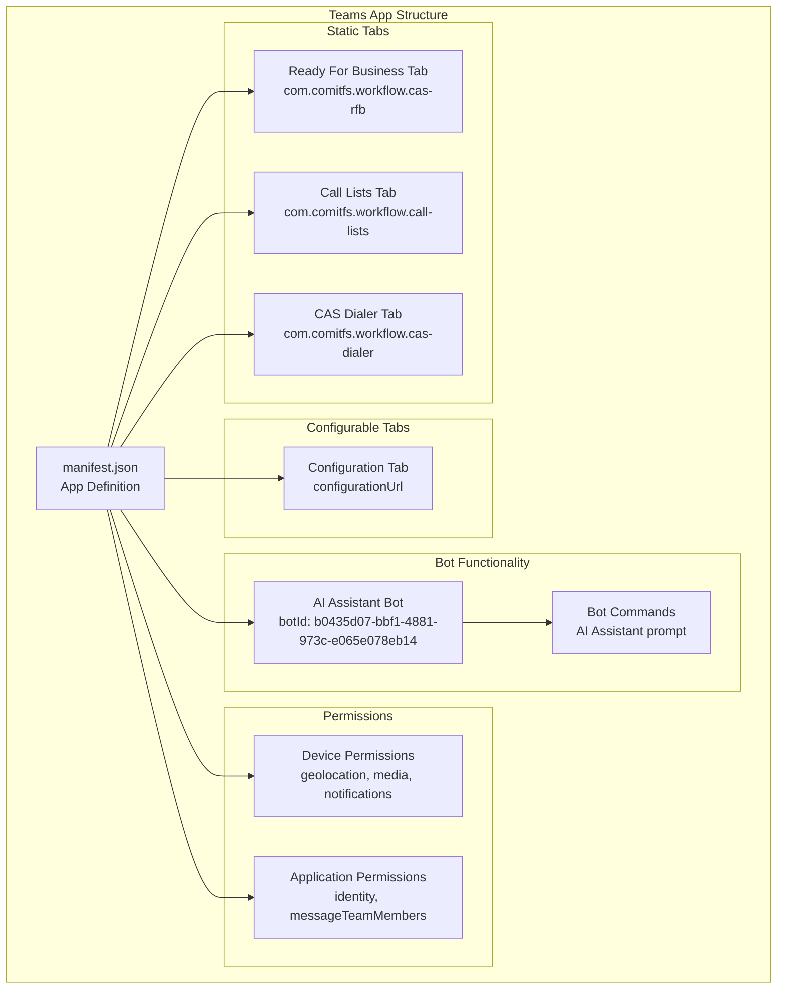
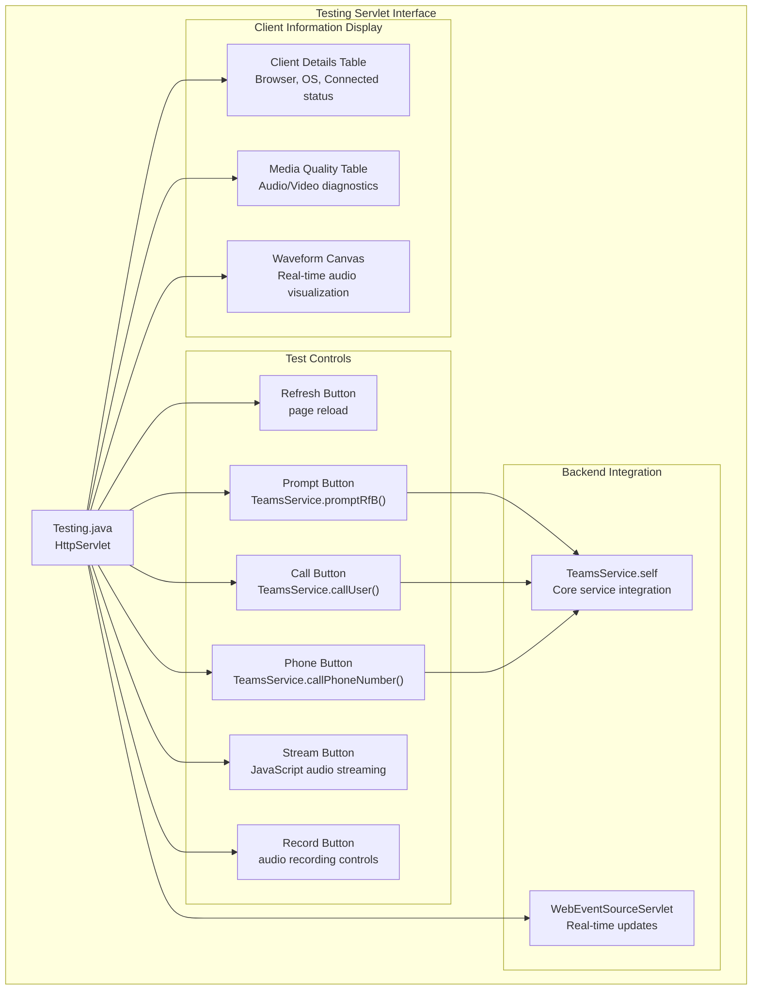
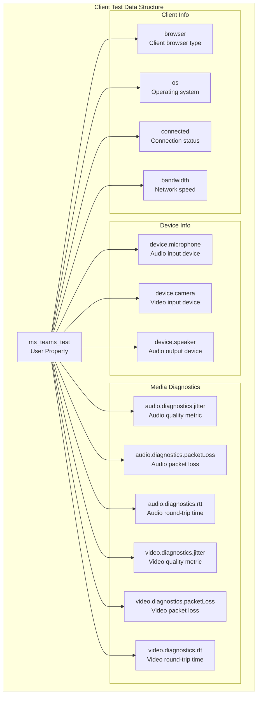
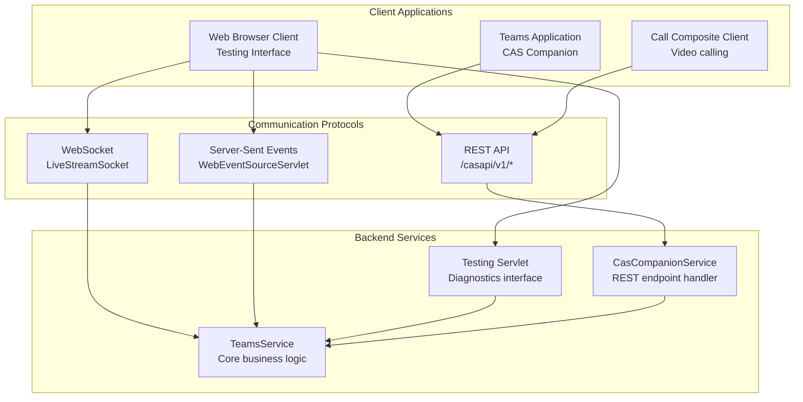
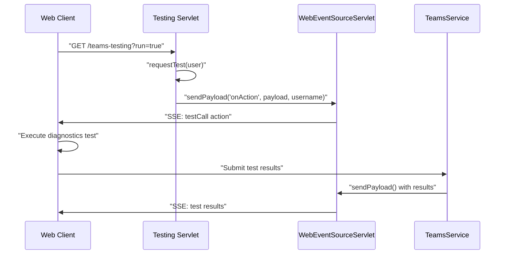

# Client Applications

> **Relevant source files**
> * [classes/wwwroot/teams-app/manifest/manifest.json](https://github.com/ComitFS/cas-service/blob/b7087e8d/classes/wwwroot/teams-app/manifest/manifest.json)
> * [classes/wwwroot/teams-app/manifest/manifest.zip](https://github.com/ComitFS/cas-service/blob/b7087e8d/classes/wwwroot/teams-app/manifest/manifest.zip)
> * [src/java/com/ifsoft/openlink/view/Testing.java](https://github.com/ComitFS/cas-service/blob/b7087e8d/src/java/com/ifsoft/openlink/view/Testing.java)

This document covers the various client applications that interact with the CAS service, including the Microsoft Teams application, web-based interfaces, and standalone clients. For information about the server-side REST API that these clients consume, see [REST API Layer](./2.2-rest-api-layer.md). For details about real-time communication protocols used by clients, see [Real-time Communication](./4-real-time-communication.md).

## Microsoft Teams Application

The CAS system includes a comprehensive Microsoft Teams application that provides multiple interfaces for communication automation and management. The Teams app is defined by a manifest and includes both static tabs for personal use and configurable tabs for team collaboration.

### Application Structure

**Sources:** [classes/wwwroot/teams-app/manifest/manifest.json L1-L163](https://github.com/ComitFS/cas-service/blob/b7087e8d/classes/wwwroot/teams-app/manifest/manifest.json#L1-L163)

### Teams App Manifest Configuration

The Teams application is configured through `manifest.json` with the following key components:

| Component | Entity ID | Content URL | Scope |
| --- | --- | --- | --- |
| Ready For Business | `com.comitfs.workflow.cas-rfb` | `https://comitfs.github.io/cas-omni/companion/cas-rfb/` | personal, privateChatTab |
| Call Lists | `com.comitfs.workflow.call-lists` | `https://comitfs.github.io/cas-omni/companion/call-lists/` | personal, privateChatTab |
| CAS Dialer | `com.comitfs.workflow.cas-dialer` | `https://comitfs.github.io/cas-omni/companion/dialer/` | personal, privateChatTab |

The application supports both personal and group contexts, with configurable tabs available for group chats, meeting chats, and meeting side panels.

**Sources:** [classes/wwwroot/teams-app/manifest/manifest.json L43-L83](https://github.com/ComitFS/cas-service/blob/b7087e8d/classes/wwwroot/teams-app/manifest/manifest.json#L43-L83)

### Bot Integration

The Teams app includes an AI Assistant bot with the following capabilities:

* **Bot ID**: `b0435d07-bbf1-4881-973c-e065e078eb14`
* **Scopes**: Personal conversations
* **File Support**: Enabled (`supportsFiles: true`)
* **Commands**: AI Assistant prompt handling

The bot provides conversational AI capabilities and can process file uploads, making it suitable for interactive communication automation tasks.

**Sources:** [classes/wwwroot/teams-app/manifest/manifest.json L88-L113](https://github.com/ComitFS/cas-service/blob/b7087e8d/classes/wwwroot/teams-app/manifest/manifest.json#L88-L113)

## Web-Based Interfaces

The CAS service provides several web-based interfaces for system administration, testing, and user interaction. These interfaces are implemented as Java servlets and provide both administrative and end-user functionality.

### Testing and Diagnostics Interface

The primary web interface for testing and diagnostics is implemented in the `Testing` servlet, which provides comprehensive client testing capabilities.

**Sources:** [src/java/com/ifsoft/openlink/view/Testing.java L31-L394](https://github.com/ComitFS/cas-service/blob/b7087e8d/src/java/com/ifsoft/openlink/view/Testing.java#L31-L394)

### Client Diagnostics Data Structure

The testing interface displays detailed client information stored in user properties as JSON data:

**Sources:** [src/java/com/ifsoft/openlink/view/Testing.java L247-L334](https://github.com/ComitFS/cas-service/blob/b7087e8d/src/java/com/ifsoft/openlink/view/Testing.java#L247-L334)

### Web Interface Controls

The testing interface provides various control buttons that interact with backend services:

| Control | Action | Backend Method |
| --- | --- | --- |
| Refresh | Reload page | `response.sendRedirect()` |
| Prompt | Trigger RfB prompt | `TeamsService.self.promptRfB(user)` |
| Call User | Initiate Teams call | `TeamsService.self.callUser()` |
| Call Phone | Call phone number | `TeamsService.self.callPhoneNumber()` |
| Run Diagnostics | Request client test | `requestTest(user)` via `WebEventSourceServlet` |
| Stream | Start audio streaming | JavaScript `index.js` |
| Record | Begin recording | JavaScript recording controls |

**Sources:** [src/java/com/ifsoft/openlink/view/Testing.java L73-L371](https://github.com/ComitFS/cas-service/blob/b7087e8d/src/java/com/ifsoft/openlink/view/Testing.java#L73-L371)

## Client-Server Communication Patterns

The client applications communicate with the CAS service through multiple protocols and interfaces, providing both synchronous and asynchronous interaction patterns.

### Communication Architecture

**Sources:** [src/java/com/ifsoft/openlink/view/Testing.java L52-L89](https://github.com/ComitFS/cas-service/blob/b7087e8d/src/java/com/ifsoft/openlink/view/Testing.java#L52-L89)

 [classes/wwwroot/teams-app/manifest/manifest.json L125-L131](https://github.com/ComitFS/cas-service/blob/b7087e8d/classes/wwwroot/teams-app/manifest/manifest.json#L125-L131)

### Real-time Event Flow

Client applications receive real-time updates through the `WebEventSourceServlet` which implements Server-Sent Events (SSE):

**Sources:** [src/java/com/ifsoft/openlink/view/Testing.java L382-L393](https://github.com/ComitFS/cas-service/blob/b7087e8d/src/java/com/ifsoft/openlink/view/Testing.java#L382-L393)

### User State Management

The testing interface tracks user state through multiple mechanisms:

* **Online Status**: Determined by presence in `WebEventSourceServlet.webSources`
* **User Properties**: Stored in Openfire user properties (`ms_teams_test`, `ms_teams_id`, `ms_phone_number`)
* **Session State**: Maintained through servlet session management

**Sources:** [src/java/com/ifsoft/openlink/view/Testing.java L211-L226](https://github.com/ComitFS/cas-service/blob/b7087e8d/src/java/com/ifsoft/openlink/view/Testing.java#L211-L226)