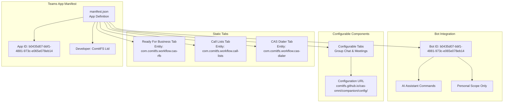
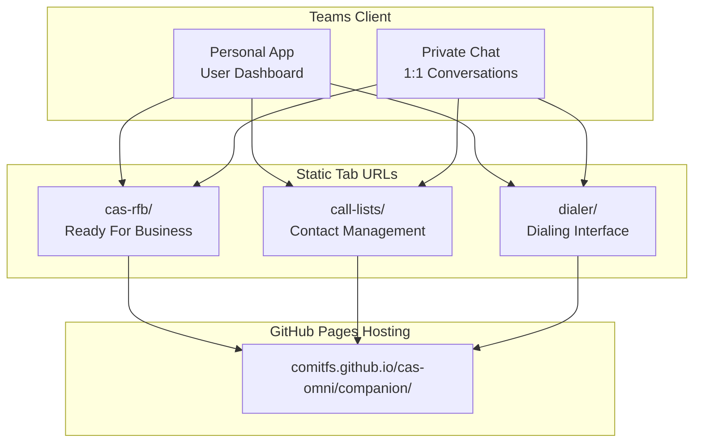
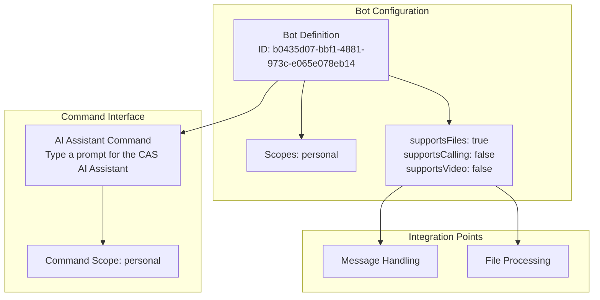
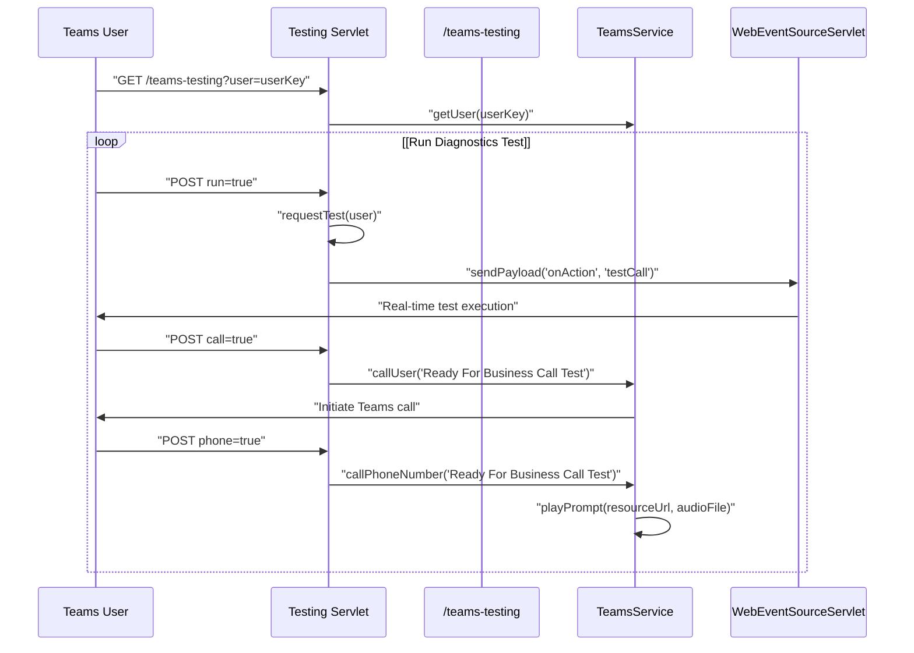
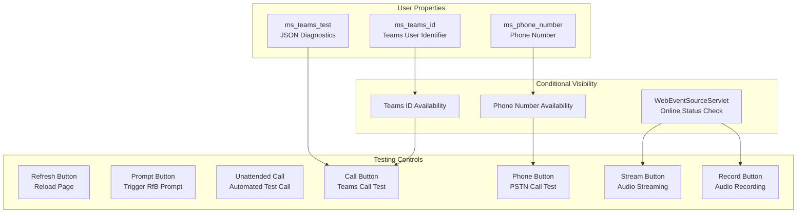

# Microsoft Teams Application

> **Relevant source files**
> * [classes/wwwroot/teams-app/manifest/manifest.json](https://github.com/ComitFS/cas-service/blob/b7087e8d/classes/wwwroot/teams-app/manifest/manifest.json)
> * [classes/wwwroot/teams-app/manifest/manifest.zip](https://github.com/ComitFS/cas-service/blob/b7087e8d/classes/wwwroot/teams-app/manifest/manifest.zip)
> * [src/java/com/ifsoft/openlink/view/Testing.java](https://github.com/ComitFS/cas-service/blob/b7087e8d/src/java/com/ifsoft/openlink/view/Testing.java)

This document covers the Microsoft Teams application component of the CAS service, specifically the Teams app manifest configuration, tab implementations, bot integration, and testing capabilities. The Teams application serves as the primary user interface for CAS functionality within the Microsoft Teams environment.

For information about the underlying REST API that powers these Teams interfaces, see [REST API Layer](./2.2-rest-api-layer.md). For details about the test automation framework used by the testing components, see [Test Automation Framework](./3-test-automation-framework.md).

## Teams App Manifest Structure

The CAS Companion Teams application is defined by a comprehensive manifest that configures multiple interaction surfaces within Teams. The manifest establishes the app identity, capabilities, and integration points.

Sources: [classes/wwwroot/teams-app/manifest/manifest.json L1-L163](https://github.com/ComitFS/cas-service/blob/b7087e8d/classes/wwwroot/teams-app/manifest/manifest.json#L1-L163)

## Static Tab Configuration

The Teams application provides three primary static tabs that offer different functional areas within the CAS ecosystem. Each tab is configured with specific entity IDs and content URLs hosted on GitHub Pages.

| Tab Name | Entity ID | Content URL | Purpose |
| --- | --- | --- | --- |
| Ready For Business | `com.comitfs.workflow.cas-rfb` | `comitfs.github.io/cas-omni/companion/cas-rfb/` | Primary workflow interface |
| Call Lists | `com.comitfs.workflow.call-lists` | `comitfs.github.io/cas-omni/companion/call-lists/` | Contact management |
| CAS Dialer | `com.comitfs.workflow.cas-dialer` | `comitfs.github.io/cas-omni/companion/dialer/` | Dialing interface |

All static tabs are configured for both `personalTab` and `privateChatTab` contexts, ensuring consistent availability across different Teams interaction modes.

Sources: [classes/wwwroot/teams-app/manifest/manifest.json L43-L83](https://github.com/ComitFS/cas-service/blob/b7087e8d/classes/wwwroot/teams-app/manifest/manifest.json#L43-L83)

## Bot Integration and AI Assistant

The Teams application includes a bot component that provides AI assistant functionality. The bot shares the same application ID as the main app and operates exclusively in personal scope interactions.

The bot configuration enables file handling but explicitly disables calling and video capabilities, focusing on conversational AI interactions.

Sources: [classes/wwwroot/teams-app/manifest/manifest.json L88-L112](https://github.com/ComitFS/cas-service/blob/b7087e8d/classes/wwwroot/teams-app/manifest/manifest.json#L88-L112)

## Permissions and Device Access

The Teams application requests comprehensive permissions to enable full CAS functionality within the Teams environment. These permissions cover both application-level capabilities and device-level access.

**Application Permissions:**

* `identity` - Access to user identity information
* `messageTeamMembers` - Ability to message team members

**Device Permissions:**

* `geolocation` - Location services for context-aware features
* `media` - Audio/video device access for communication features
* `notifications` - System notification capabilities
* `midi` - MIDI device access for specialized audio handling
* `openExternal` - External link opening capabilities

**Resource-Specific Permissions:**

* `ChannelSettings.Read.Group` (Application-level)
* `ChannelMeetingParticipant.Read.Group` (Delegated)

Sources: [classes/wwwroot/teams-app/manifest/manifest.json L114-L146](https://github.com/ComitFS/cas-service/blob/b7087e8d/classes/wwwroot/teams-app/manifest/manifest.json#L114-L146)

## Testing and Diagnostics Integration

The Teams application integrates with the CAS testing framework through the `Testing` servlet, which provides comprehensive diagnostics and testing capabilities for Teams users.

The testing interface provides several diagnostic capabilities:

* **Client Diagnostics**: Browser, OS, connectivity, and bandwidth testing
* **Device Testing**: Microphone, camera, and speaker functionality verification
* **Media Quality**: Jitter, packet loss, and RTT measurements for audio/video
* **Call Testing**: Automated test calls to Teams users and phone numbers
* **Real-time Monitoring**: Live audio waveform display and recording capabilities

Sources: [src/java/com/ifsoft/openlink/view/Testing.java L31-L394](https://github.com/ComitFS/cas-service/blob/b7087e8d/src/java/com/ifsoft/openlink/view/Testing.java#L31-L394)

## Testing Interface Components

The testing servlet generates a comprehensive HTML interface that displays real-time diagnostics and provides interactive testing controls.

| Component | Purpose | Data Source |
| --- | --- | --- |
| Client Information | Browser, OS, connection status | `ms_teams_test` user property |
| Media Diagnostics | Audio/video jitter, packet loss, RTT | Device diagnostics JSON |
| Control Interface | Test execution buttons | Request parameters |
| Waveform Display | Real-time audio visualization | Canvas element (online users only) |

The interface dynamically adapts based on user online status (determined by `WebEventSourceServlet.webSources` presence) and available user properties like `ms_teams_id` and `ms_phone_number`.

Sources: [src/java/com/ifsoft/openlink/view/Testing.java L210-L371](https://github.com/ComitFS/cas-service/blob/b7087e8d/src/java/com/ifsoft/openlink/view/Testing.java#L210-L371)

## Deployment Package Structure

The Teams application is packaged as a ZIP file containing the manifest and associated assets required for Teams App Store deployment or sideloading.

The deployment package includes:

* `manifest.json` - Main application definition
* `color.png` - Full-color application icon (PNG format)
* `outline.png` - Monochrome outline icon for Teams UI integration

The package structure ensures compliance with Microsoft Teams application requirements and enables proper icon display across different Teams interface contexts.

Sources: [classes/wwwroot/teams-app/manifest/manifest.zip L1-L196](https://github.com/ComitFS/cas-service/blob/b7087e8d/classes/wwwroot/teams-app/manifest/manifest.zip#L1-L196)

 [classes/wwwroot/teams-app/manifest/manifest.json L20-L23](https://github.com/ComitFS/cas-service/blob/b7087e8d/classes/wwwroot/teams-app/manifest/manifest.json#L20-L23)