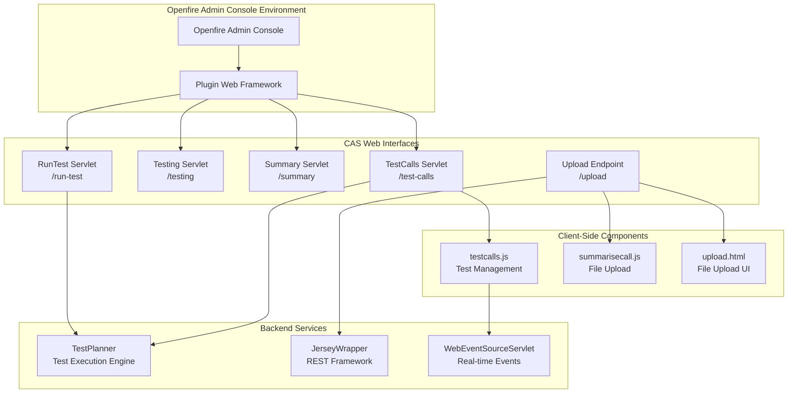
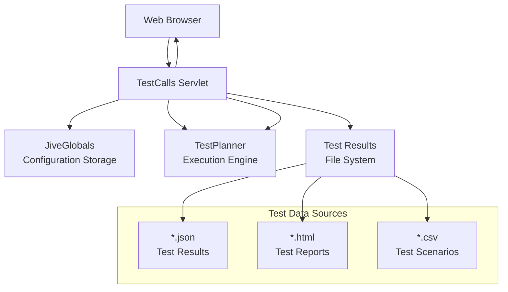
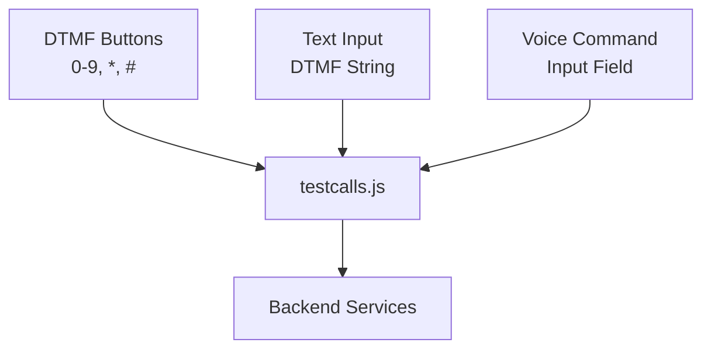

# Web-Based Interfaces

> **Relevant source files**
> * [src/java/com/ifsoft/openlink/view/TestCalls.java](https://github.com/ComitFS/cas-service/blob/b7087e8d/src/java/com/ifsoft/openlink/view/TestCalls.java)
> * [src/java/org/jivesoftware/openfire/plugin/rest/service/JerseyWrapper.java](https://github.com/ComitFS/cas-service/blob/b7087e8d/src/java/org/jivesoftware/openfire/plugin/rest/service/JerseyWrapper.java)
> * [src/web/javascripts/summarisecall.js](https://github.com/ComitFS/cas-service/blob/b7087e8d/src/web/javascripts/summarisecall.js)
> * [src/web/tests/test1.csv](https://github.com/ComitFS/cas-service/blob/b7087e8d/src/web/tests/test1.csv)
> * [src/web/tests/test2.csv](https://github.com/ComitFS/cas-service/blob/b7087e8d/src/web/tests/test2.csv)
> * [src/web/upload.html](https://github.com/ComitFS/cas-service/blob/b7087e8d/src/web/upload.html)

## Purpose and Scope

This document covers the browser-based administrative and user interfaces provided by the CAS Service Plugin for system management, test automation, and operational monitoring. These interfaces are implemented as Java servlets running within the Openfire server and provide web-based access to core system functionality.

For Microsoft Teams-specific interfaces, see [Microsoft Teams Application](./5.1-microsoft-teams-application.md). For the video calling client interface, see [Call Composite Client](./5.3-call-composite-client.md).

## Web Interface Architecture

The CAS Service Plugin provides several web-based interfaces accessible through the Openfire Admin Console and standalone web endpoints. These interfaces leverage both traditional servlet-based HTML generation and modern JavaScript modules for enhanced functionality.



**Sources:** [src/java/com/ifsoft/openlink/view/TestCalls.java L34-L295](https://github.com/ComitFS/cas-service/blob/b7087e8d/src/java/com/ifsoft/openlink/view/TestCalls.java#L34-L295)

 [src/java/org/jivesoftware/openfire/plugin/rest/service/JerseyWrapper.java L35-L142](https://github.com/ComitFS/cas-service/blob/b7087e8d/src/java/org/jivesoftware/openfire/plugin/rest/service/JerseyWrapper.java#L35-L142)

## Test Management Interface

The primary web interface for test automation is provided by the `TestCalls` servlet, which offers comprehensive test management capabilities including test scheduling, execution, and results viewing.

### Test Dashboard

The `TestCalls` servlet generates a complete HTML interface for managing automated tests. The interface displays a table of all configured tests with their schedules, execution status, and results.



The servlet reads test configurations from `JiveGlobals` properties with the prefix `cas.cron.` and displays them in a structured table format [src/java/com/ifsoft/openlink/view/TestCalls.java L104-L110](https://github.com/ComitFS/cas-service/blob/b7087e8d/src/java/com/ifsoft/openlink/view/TestCalls.java#L104-L110)

### Test Creation and Scheduling

The interface provides a form for creating new tests with cron-based scheduling. Users can upload test script files and define execution schedules using Quartz cron expressions.

| Field | Purpose | Example |
| --- | --- | --- |
| Schedule | Cron expression for test timing | `0 15 10 * * ? 2025` |
| Script File | CSV or JavaScript test file | `test1.csv` |

The test creation process involves file upload and cron job registration [src/java/com/ifsoft/openlink/view/TestCalls.java L63-L73](https://github.com/ComitFS/cas-service/blob/b7087e8d/src/java/com/ifsoft/openlink/view/TestCalls.java#L63-L73)

### Manual Test Execution

The interface includes controls for manual test call execution with configurable parameters:

* **Language Selection**: `en-US`, `de-DE`, `fr-FR`, `it-IT`
* **Gender Selection**: Male/Female voice options
* **Caller ID**: Selectable from configured numbers
* **Target Phone Number**: Input field for test destination

### Real-Time Call Control

The interface provides DTMF tone generation and voice command capabilities for interactive call testing:



**Sources:** [src/java/com/ifsoft/openlink/view/TestCalls.java L263-L285](https://github.com/ComitFS/cas-service/blob/b7087e8d/src/java/com/ifsoft/openlink/view/TestCalls.java#L263-L285)

 [src/web/javascripts/testcalls.js](https://github.com/ComitFS/cas-service/blob/b7087e8d/src/web/javascripts/testcalls.js)

## File Upload Interface

The system provides dedicated file upload capabilities for test assets and media files through both standalone HTML pages and integrated upload functionality.

### Standalone Upload Interface

The `upload.html` file provides a simple drag-and-drop interface for file uploads [src/web/upload.html L32-L35](https://github.com/ComitFS/cas-service/blob/b7087e8d/src/web/upload.html#L32-L35)

:

```xml
<label role="button">
  <h3>Upload a picture</h3>
  <input accept="image/*" type="file" />
</label>
```

### JavaScript Upload Implementation

The upload functionality is implemented using the Fetch API with authentication headers [src/web/upload.html L39-L43](https://github.com/ComitFS/cas-service/blob/b7087e8d/src/web/upload.html#L39-L43)

:

```javascript
async function upload() {
  const file = input.files[0];
  const resp = await fetch("/plugins/casapi/upload?name=" + file.name, { 
    method: "PUT", 
    body: file,  
    headers: {authorization: "ZGVsZTpXZWxjb21lMTIz"} 
  });
}
```

The same upload pattern is used in `summarisecall.js` for integrated file upload within other interfaces [src/web/javascripts/summarisecall.js L11-L16](https://github.com/ComitFS/cas-service/blob/b7087e8d/src/web/javascripts/summarisecall.js#L11-L16)

**Sources:** [src/web/upload.html L36-L46](https://github.com/ComitFS/cas-service/blob/b7087e8d/src/web/upload.html#L36-L46)

 [src/web/javascripts/summarisecall.js L8-L18](https://github.com/ComitFS/cas-service/blob/b7087e8d/src/web/javascripts/summarisecall.js#L8-L18)

## REST API Framework Integration

The web interfaces integrate with the CAS Service REST API through the `JerseyWrapper` framework, which provides the underlying REST service infrastructure.

### Service Registration

The `JerseyWrapper` class registers multiple REST services including the `CasCompanionService` that powers many web interface operations [src/java/org/jivesoftware/openfire/plugin/rest/service/JerseyWrapper.java L102-L119](https://github.com/ComitFS/cas-service/blob/b7087e8d/src/java/org/jivesoftware/openfire/plugin/rest/service/JerseyWrapper.java#L102-L119)

:

```
registerClasses(
    ClusteringService.class,
    GroupService.class,
    MessageService.class,
    // ... other services
    CasCompanionService.class
);
```

### Authentication and CORS

The framework configures authentication filters and CORS support for cross-origin requests from web interfaces [src/java/org/jivesoftware/openfire/plugin/rest/service/JerseyWrapper.java L96-L99](https://github.com/ComitFS/cas-service/blob/b7087e8d/src/java/org/jivesoftware/openfire/plugin/rest/service/JerseyWrapper.java#L96-L99)

:

* `AuthFilter` or custom authentication filters
* `CORSFilter` for cross-origin request handling
* `StatisticsFilter` for request monitoring

### Service Endpoint Structure

All REST endpoints are mounted under the `/casapi/v1/*` path pattern, providing a consistent API surface for web interface interactions [src/java/org/jivesoftware/openfire/plugin/rest/service/JerseyWrapper.java L44](https://github.com/ComitFS/cas-service/blob/b7087e8d/src/java/org/jivesoftware/openfire/plugin/rest/service/JerseyWrapper.java#L44-L44)

**Sources:** [src/java/org/jivesoftware/openfire/plugin/rest/service/JerseyWrapper.java L35-L142](https://github.com/ComitFS/cas-service/blob/b7087e8d/src/java/org/jivesoftware/openfire/plugin/rest/service/JerseyWrapper.java#L35-L142)

## Test Data Management

The web interfaces handle various types of test data files that define automated test scenarios and expected behaviors.

### CSV Test Scenarios

Test scenarios are defined in CSV format with specific column structures for test automation [src/web/tests/test1.csv L1-L13](https://github.com/ComitFS/cas-service/blob/b7087e8d/src/web/tests/test1.csv#L1-L13)

 [src/web/tests/test2.csv L1-L6](https://github.com/ComitFS/cas-service/blob/b7087e8d/src/web/tests/test2.csv#L1-L6)

:

| Column | Purpose | Example Values |
| --- | --- | --- |
| Prompt | Expected system response | `welcome to ubs` |
| Timeout | Wait time in seconds | `10` |
| Action | Test action type | `DTMF`, `VOICE`, `START`, `STOP` |
| Value1 | Primary action parameter | `+41584049146`, `446666666` |
| Value2 | Secondary action parameter | `+441933718587`, `en-GB` |

### Test Result Storage

Test results are stored in multiple formats within the `/plugins/casapi/web/tests/` directory:

* **JSON Files**: Machine-readable test results with success percentages and duration
* **HTML Files**: Human-readable test reports with detailed execution logs
* **Timestamp Tracking**: File modification times track test execution dates

The `TestCalls` servlet reads these files to populate the test dashboard with current status information [src/java/com/ifsoft/openlink/view/TestCalls.java L119-L139](https://github.com/ComitFS/cas-service/blob/b7087e8d/src/java/com/ifsoft/openlink/view/TestCalls.java#L119-L139)

**Sources:** [src/web/tests/test1.csv L1-L13](https://github.com/ComitFS/cas-service/blob/b7087e8d/src/web/tests/test1.csv#L1-L13)

 [src/web/tests/test2.csv L1-L6](https://github.com/ComitFS/cas-service/blob/b7087e8d/src/web/tests/test2.csv#L1-L6)

 [src/java/com/ifsoft/openlink/view/TestCalls.java L112-L139](https://github.com/ComitFS/cas-service/blob/b7087e8d/src/java/com/ifsoft/openlink/view/TestCalls.java#L112-L139)