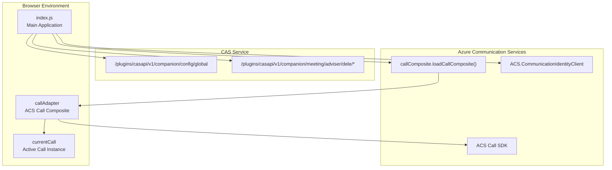
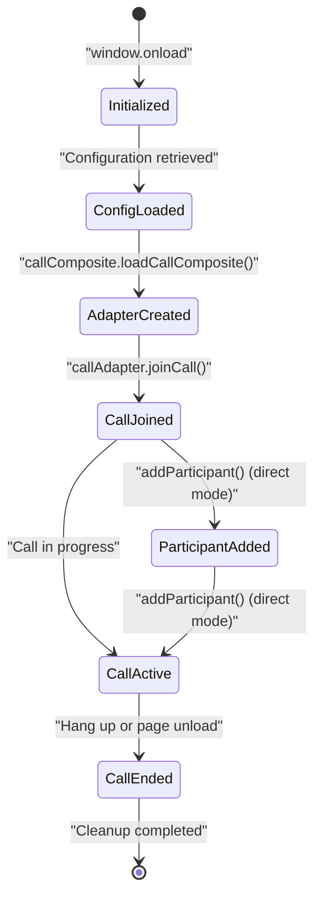
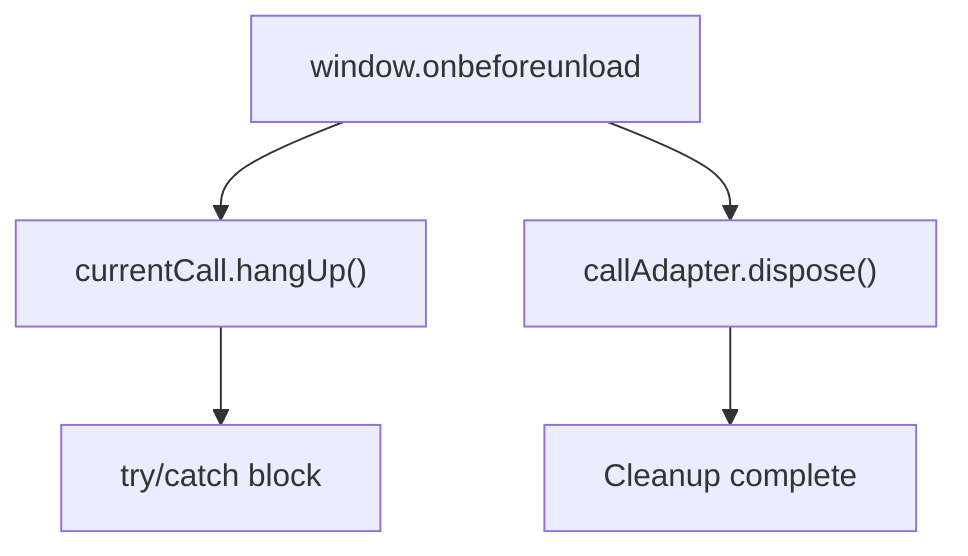

# Call Composite Client

> **Relevant source files**
> * [classes/wwwroot/client-app/index.js](https://github.com/ComitFS/cas-service/blob/b7087e8d/classes/wwwroot/client-app/index.js)
> * [classes/wwwroot/client-app/main.js](https://github.com/ComitFS/cas-service/blob/b7087e8d/classes/wwwroot/client-app/main.js)
> * [classes/wwwroot/teams-app/manifest/color.png](https://github.com/ComitFS/cas-service/blob/b7087e8d/classes/wwwroot/teams-app/manifest/color.png)
> * [classes/wwwroot/teams-app/manifest/outline.png](https://github.com/ComitFS/cas-service/blob/b7087e8d/classes/wwwroot/teams-app/manifest/outline.png)

This document covers the browser-based video calling client application that provides a user interface for video calls using Azure Communication Services (ACS). The Call Composite Client is a standalone web application that integrates with the CAS service to enable video conferencing capabilities.

For information about the Microsoft Teams application integration, see [Microsoft Teams Application](./5.1-microsoft-teams-application.md). For details about other web-based interfaces, see [Web-Based Interfaces](./5.2-web-based-interfaces.md).

## Purpose and Architecture

The Call Composite Client is a browser-based video calling application built on Azure Communication Services' Call Composite SDK. It serves as a standalone video conferencing interface that can be embedded or launched independently to facilitate video calls between users.

The client operates in two primary modes:

* **Direct mode**: Configuration passed via URL parameters
* **Service mode**: Configuration fetched from CAS service endpoints



**Sources:** [classes/wwwroot/client-app/index.js L1-L59](https://github.com/ComitFS/cas-service/blob/b7087e8d/classes/wwwroot/client-app/index.js#L1-L59)

## Configuration and Initialization

The application initializes through the `window.onload` event handler and supports two configuration methods based on URL parameters.

### Direct Configuration Mode

When a `data` URL parameter is present, the client decodes base64-encoded configuration:

```mermaid
sequenceDiagram
  participant Browser
  participant index.js
  participant callComposite.loadCallComposite()
  participant callAdapter

  Browser->>index.js: "window.onload"
  index.js->>index.js: "urlParam('data')"
  index.js->>index.js: "JSON.parse(atob(dataString))"
  note over index.js: "Extract: displayName, userId, token, locator"
  index.js->>callComposite.loadCallComposite(): "loadCallComposite({displayName, locator, userId, token})"
  callComposite.loadCallComposite()->>callAdapter: "Return callAdapter instance"
  index.js->>callAdapter: "joinCall()"
  callAdapter->>index.js: "Return currentCall"
  index.js->>index.js: "addParticipant(data.destination)"
```

**Sources:** [classes/wwwroot/client-app/index.js L4-L26](https://github.com/ComitFS/cas-service/blob/b7087e8d/classes/wwwroot/client-app/index.js#L4-L26)

### Service Configuration Mode

When no data parameter is present, the client fetches configuration from the CAS service:

```mermaid
sequenceDiagram
  participant index.js
  participant CAS Service API
  participant ACS.CommunicationIdentityClient
  participant callComposite.loadCallComposite()

  index.js->>CAS Service API: "GET /plugins/casapi/v1/companion/config/global"
  note over index.js: "Authorization: Basic auth (jjgartland:Welcome123)"
  CAS Service API->>index.js: "Return config with acs_endpoint"
  index.js->>ACS.CommunicationIdentityClient: "new CommunicationIdentityClient(config.acs_endpoint)"
  index.js->>ACS.CommunicationIdentityClient: "getToken(userId, ['chat', 'voip'])"
  ACS.CommunicationIdentityClient->>index.js: "Return token"
  index.js->>CAS Service API: "POST /plugins/casapi/v1/companion/meeting/adviser/dele/%2B441634251467"
  CAS Service API->>index.js: "Return meetingLink"
  index.js->>callComposite.loadCallComposite(): "loadCallComposite({displayName, locator, userId, token})"
```

**Sources:** [classes/wwwroot/client-app/index.js L27-L47](https://github.com/ComitFS/cas-service/blob/b7087e8d/classes/wwwroot/client-app/index.js#L27-L47)

## Azure Communication Services Integration

The client integrates with Azure Communication Services through multiple SDK components:

| Component | Purpose | Configuration |
| --- | --- | --- |
| `CommunicationIdentityClient` | Token generation and user identity | ACS endpoint from config |
| `callComposite.loadCallComposite()` | Call UI component initialization | User credentials and call locator |
| Call Adapter | Call state management | Desktop form factor |

### Identity and Token Management

The application uses hardcoded user identity in service mode:

```javascript
const userId = { 
    communicationUserId: '8:acs:7278b90e-91bb-4a42-8913-9233b5d4ad4f_0000000d-ce88-0aa9-0cf9-9c3a0d004831' 
};
```

**Sources:** [classes/wwwroot/client-app/index.js L31-L32](https://github.com/ComitFS/cas-service/blob/b7087e8d/classes/wwwroot/client-app/index.js#L31-L32)

### Call Composite Configuration

The call composite is configured with desktop form factor and timestamped keys:

```
callAdapter = await callComposite.loadCallComposite(
    {displayName, locator, userId, token}, 
    content, 
    {formFactor: 'desktop', key: new Date()}
);
```

**Sources:** [classes/wwwroot/client-app/index.js L23](https://github.com/ComitFS/cas-service/blob/b7087e8d/classes/wwwroot/client-app/index.js#L23-L23)

 [classes/wwwroot/client-app/index.js L46](https://github.com/ComitFS/cas-service/blob/b7087e8d/classes/wwwroot/client-app/index.js#L46-L46)

## Call Management

The application manages call lifecycle through several key operations:



### Participant Management

In direct configuration mode, the application automatically adds a destination participant:

```
currentCall = await callAdapter.joinCall();
currentCall.addParticipant(data.destination, {});
```

**Sources:** [classes/wwwroot/client-app/index.js L24-L25](https://github.com/ComitFS/cas-service/blob/b7087e8d/classes/wwwroot/client-app/index.js#L24-L25)

## Lifecycle Management

The application implements cleanup logic to ensure proper resource disposal:



### Cleanup Implementation

```javascript
window.onbeforeunload = () => {
    try {
        if (currentCall) currentCall.hangUp();
    } catch (e) {}
    
    if (callAdapter) callAdapter.dispose();
};
```

**Sources:** [classes/wwwroot/client-app/index.js L50-L56](https://github.com/ComitFS/cas-service/blob/b7087e8d/classes/wwwroot/client-app/index.js#L50-L56)

## API Endpoints and Authentication

The client interacts with specific CAS service endpoints using Basic authentication:

| Endpoint | Method | Purpose |
| --- | --- | --- |
| `/plugins/casapi/v1/companion/config/global` | GET | Retrieve ACS configuration |
| `/plugins/casapi/v1/companion/meeting/adviser/dele/{phoneNumber}` | POST | Create meeting link |

### Authentication Details

```javascript
const authorization = btoa("jjgartland:Welcome123");
const response = await fetch(url, {
    method: "GET", 
    headers: {authorization}
});
```

**Sources:** [classes/wwwroot/client-app/index.js L32-L34](https://github.com/ComitFS/cas-service/blob/b7087e8d/classes/wwwroot/client-app/index.js#L32-L34)

 [classes/wwwroot/client-app/index.js L40-L41](https://github.com/ComitFS/cas-service/blob/b7087e8d/classes/wwwroot/client-app/index.js#L40-L41)

## Deployment and Access

The Call Composite Client is deployed as a static web application accessible through the CAS service's web root. The application files are located in the `classes/wwwroot/client-app/` directory and served directly by the web server.

**Sources:** [classes/wwwroot/client-app/index.js L1-L59](https://github.com/ComitFS/cas-service/blob/b7087e8d/classes/wwwroot/client-app/index.js#L1-L59)