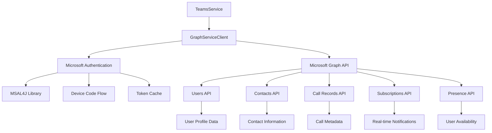
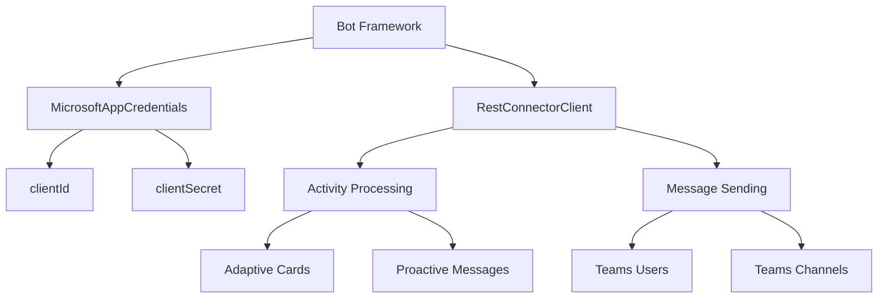
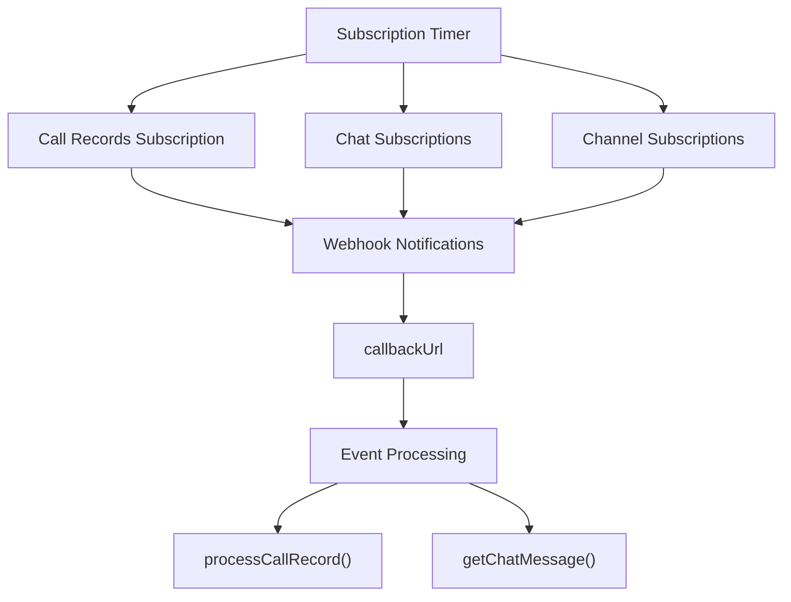
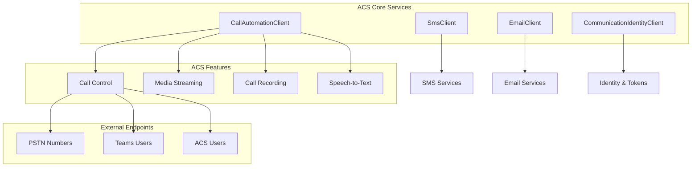
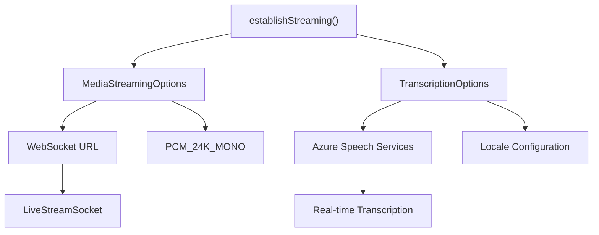
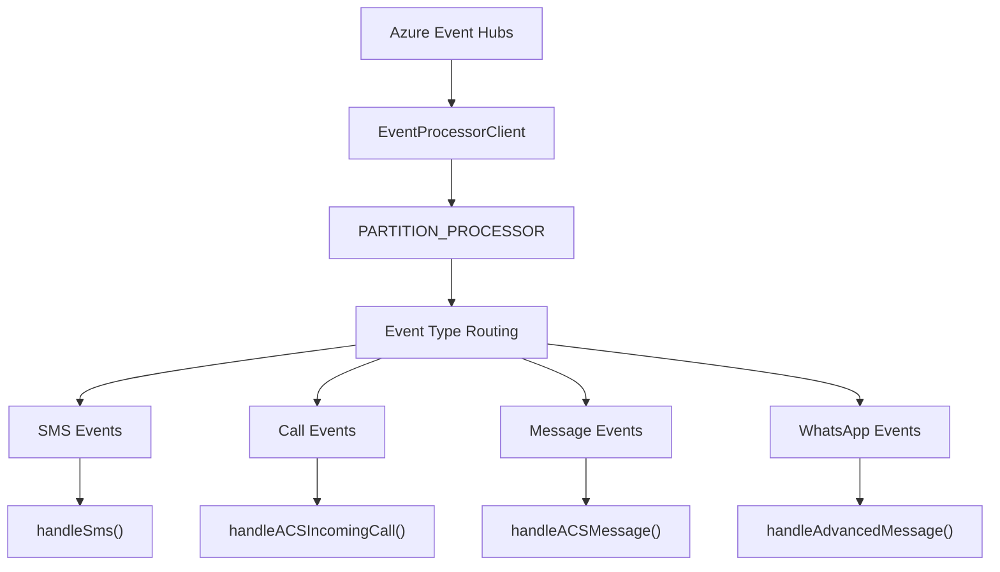
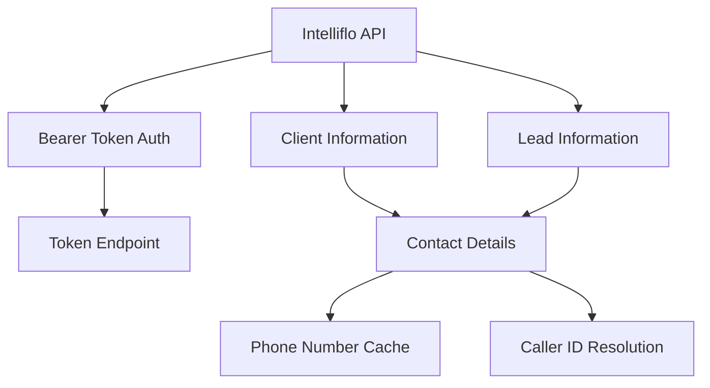
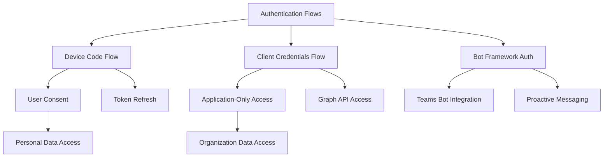

# External Integrations

> **Relevant source files**
> * [src/java/com/comitfs/openfire/TeamsService.java](https://github.com/ComitFS/cas-service/blob/b7087e8d/src/java/com/comitfs/openfire/TeamsService.java)

## Purpose and Scope

This document covers the external service integrations implemented by the CAS Service Plugin. The system integrates with Microsoft cloud services, Azure Communication Services, and third-party platforms to provide unified communication capabilities within the Openfire XMPP server environment.

For information about the core TeamsService integration hub, see [TeamsService Integration Hub](./2.1-teamsservice-integration-hub.md). For details about client applications that consume these integrations, see [Client Applications](./5-client-applications.md).

## Microsoft Services Integration

The CAS Service integrates deeply with the Microsoft ecosystem through Graph API, Teams, and authentication services.

### Microsoft Graph API Integration

The system establishes Graph API connectivity through the `GraphServiceClient` with OAuth2 authentication flows.

**Graph API Client Creation**

The `createGraphAPI` method establishes authenticated connections with proxy support and credential management:

Sources: [src/java/com/comitfs/openfire/TeamsService.java L426-L473](https://github.com/ComitFS/cas-service/blob/b7087e8d/src/java/com/comitfs/openfire/TeamsService.java#L426-L473)

**User Authentication Flow**

Device code authentication enables users to authenticate with Microsoft services:

Sources: [src/java/com/comitfs/openfire/TeamsService.java L858-L922](https://github.com/ComitFS/cas-service/blob/b7087e8d/src/java/com/comitfs/openfire/TeamsService.java#L858-L922)

### Microsoft Teams Bot Framework

The system implements Bot Framework integration for Teams application interactions.

**Bot Message Sending**

The `sendTextToUser` method delivers messages to Teams users through the Bot Framework:

Sources: [src/java/com/comitfs/openfire/TeamsService.java L960-L988](https://github.com/ComitFS/cas-service/blob/b7087e8d/src/java/com/comitfs/openfire/TeamsService.java#L960-L988)

**Adaptive Card Creation**

The `sendCallCardToActivity` method creates rich interactive cards for call notifications:

Sources: [src/java/com/comitfs/openfire/TeamsService.java L3008-L3062](https://github.com/ComitFS/cas-service/blob/b7087e8d/src/java/com/comitfs/openfire/TeamsService.java#L3008-L3062)

### Real-time Subscriptions

The system maintains Graph API subscriptions for real-time event notifications.

**Subscription Management**

The `requestSubscriptions` method manages periodic subscription renewal:

Sources: [src/java/com/comitfs/openfire/TeamsService.java L475-L559](https://github.com/ComitFS/cas-service/blob/b7087e8d/src/java/com/comitfs/openfire/TeamsService.java#L475-L559)

## Azure Communication Services Integration

Azure Communication Services provides the telephony and real-time communication backbone.

### ACS Service Architecture

**ACS Client Initialization**

The `setupACS` method configures all ACS service clients:

Sources: [src/java/com/comitfs/openfire/TeamsService.java L514-L619](https://github.com/ComitFS/cas-service/blob/b7087e8d/src/java/com/comitfs/openfire/TeamsService.java#L514-L619)

### Call Automation Integration

The call automation functionality enables programmatic call control and media processing.

**Outbound Call Initiation**

The `makeOmniCall` method supports calls to PSTN, Teams users, and ACS users:

Sources: [src/java/com/comitfs/openfire/TeamsService.java L645-L684](https://github.com/ComitFS/cas-service/blob/b7087e8d/src/java/com/comitfs/openfire/TeamsService.java#L645-L684)

**Test Call Management**

The `startTestCall` method creates managed test calls with media streaming:

Sources: [src/java/com/comitfs/openfire/TeamsService.java L686-L726](https://github.com/ComitFS/cas-service/blob/b7087e8d/src/java/com/comitfs/openfire/TeamsService.java#L686-L726)

**DTMF and Voice Commands**

The system supports both DTMF tone sending and text-to-speech playback:

Sources: [src/java/com/comitfs/openfire/TeamsService.java L762-L817](https://github.com/ComitFS/cas-service/blob/b7087e8d/src/java/com/comitfs/openfire/TeamsService.java#L762-L817)

### Media Streaming and Transcription

Real-time audio streaming and transcription are established through WebSocket connections.

**Media Streaming Setup**

The `establishStreaming` method configures WebSocket-based audio streaming:

Sources: [src/java/com/comitfs/openfire/TeamsService.java L850-L882](https://github.com/ComitFS/cas-service/blob/b7087e8d/src/java/com/comitfs/openfire/TeamsService.java#L850-L882)

## Azure Event Processing

The system processes real-time events from Azure services through Event Hubs and Relay connections.

### Event Hub Integration

**Event Processing Logic**

The `PARTITION_PROCESSOR` handles various event types from Azure services:

Sources: [src/java/com/comitfs/openfire/TeamsService.java L4890-L5012](https://github.com/ComitFS/cas-service/blob/b7087e8d/src/java/com/comitfs/openfire/TeamsService.java#L4890-L5012)

### Azure Relay Integration

The system uses Azure Relay for secure cloud-to-on-premises communication.

**Relay Connection Setup**

The relay listener processes incoming webhook events from Azure services:

Sources: [src/java/com/comitfs/openfire/TeamsService.java L525-L589](https://github.com/ComitFS/cas-service/blob/b7087e8d/src/java/com/comitfs/openfire/TeamsService.java#L525-L589)

## Third-Party Service Integrations

### Intelliflo CRM Integration

The system integrates with Intelliflo CRM for financial services client management.

**Intelliflo Data Retrieval**

The `getAdviserEntities` method fetches client and lead data:

Sources: [src/java/com/comitfs/openfire/TeamsService.java L5520-L5601](https://github.com/ComitFS/cas-service/blob/b7087e8d/src/java/com/comitfs/openfire/TeamsService.java#L5520-L5601)

**Contact Caching**

Phone number lookups are cached for caller identification:

Sources: [src/java/com/comitfs/openfire/TeamsService.java L3103-L3112](https://github.com/ComitFS/cas-service/blob/b7087e8d/src/java/com/comitfs/openfire/TeamsService.java#L3103-L3112)

### WhatsApp Business API

WhatsApp message handling is implemented through Azure Communication Services Advanced Messages.

**WhatsApp Message Processing**

The `handleAdvancedMessage` method processes incoming WhatsApp messages:

Sources: [src/java/com/comitfs/openfire/TeamsService.java L5160-L5221](https://github.com/ComitFS/cas-service/blob/b7087e8d/src/java/com/comitfs/openfire/TeamsService.java#L5160-L5221)

### Email Services Integration

Both ACS email services and SMTP are supported for notification delivery.

**Email Sending**

The `sendEmail` method supports both ACS and SMTP email delivery:

Sources: [src/java/com/comitfs/openfire/TeamsService.java L5398-L5519](https://github.com/ComitFS/cas-service/blob/b7087e8d/src/java/com/comitfs/openfire/TeamsService.java#L5398-L5519)

## Authentication and Security

### Microsoft Authentication Flows

The system implements multiple authentication patterns for different integration scenarios.

**Token Management**

The `acquireTokenDeviceCode` method manages user authentication tokens:

Sources: [src/java/com/comitfs/openfire/TeamsService.java L858-L922](https://github.com/ComitFS/cas-service/blob/b7087e8d/src/java/com/comitfs/openfire/TeamsService.java#L858-L922)

### Configuration Security

Sensitive configuration values are managed through Openfire's property system with encryption support.

**Connection String Management**

ACS and other service connection strings are configured as system properties:

Sources: [src/java/com/comitfs/openfire/TeamsService.java L199-L223](https://github.com/ComitFS/cas-service/blob/b7087e8d/src/java/com/comitfs/openfire/TeamsService.java#L199-L223)

## Development and Testing Integration

### DevTunnel Integration

The system integrates Microsoft DevTunnel for development and testing scenarios.

**DevTunnel Process Management**

Local development tunneling is managed through process spawning:

Sources: [src/java/com/comitfs/openfire/TeamsService.java L591-L618](https://github.com/ComitFS/cas-service/blob/b7087e8d/src/java/com/comitfs/openfire/TeamsService.java#L591-L618)

### Test Automation

External service testing is integrated with the TestPlanner framework for automated validation.

Sources: [src/java/com/comitfs/openfire/TeamsService.java L360-L362](https://github.com/ComitFS/cas-service/blob/b7087e8d/src/java/com/comitfs/openfire/TeamsService.java#L360-L362)