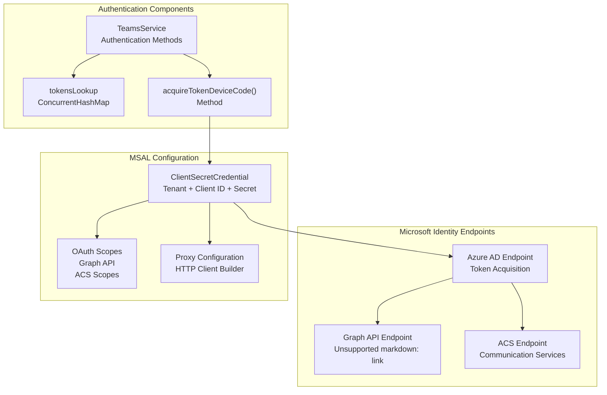
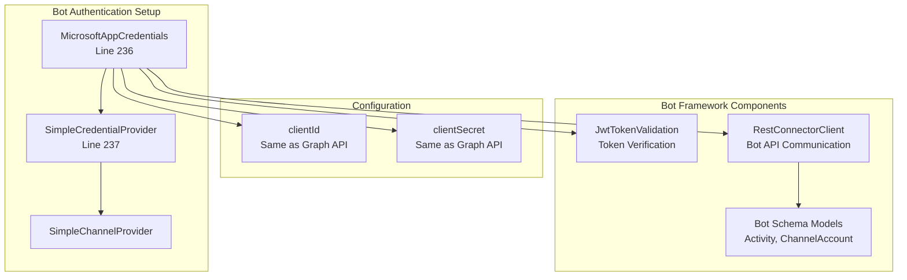
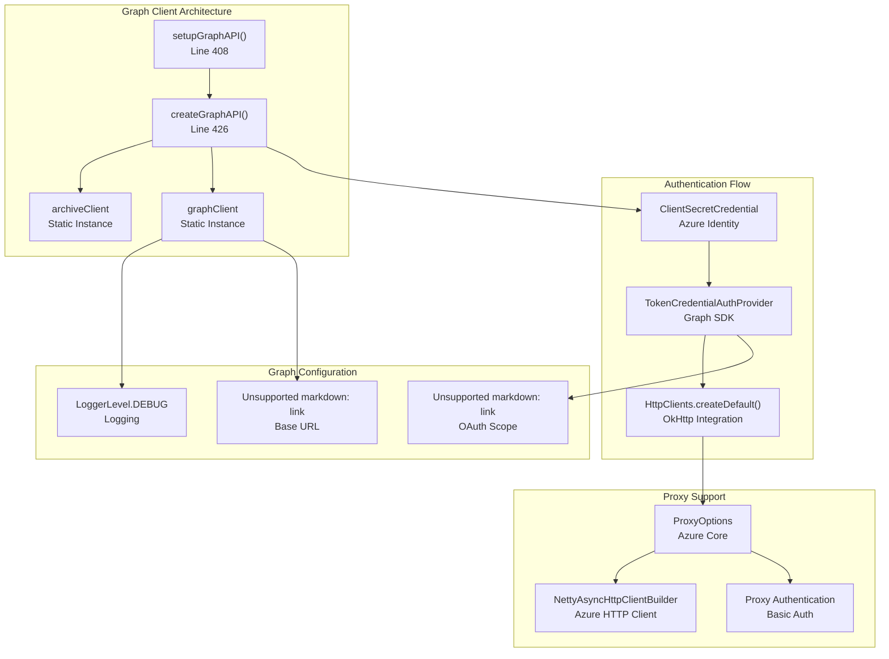
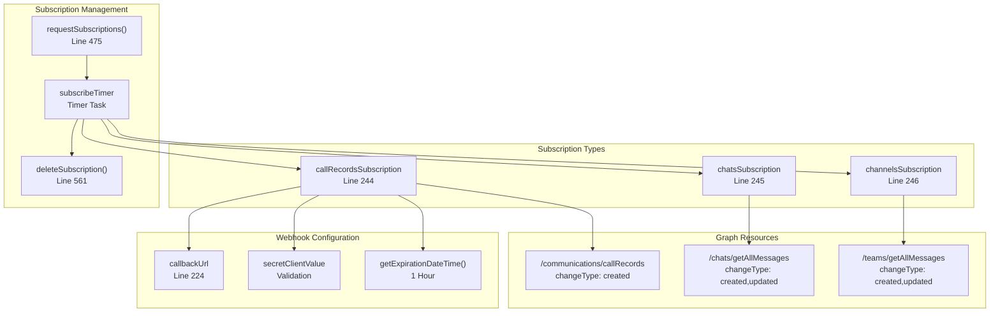
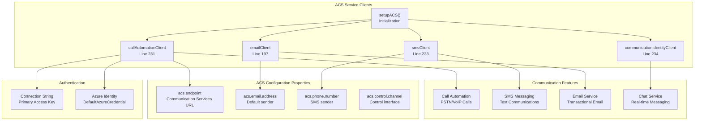
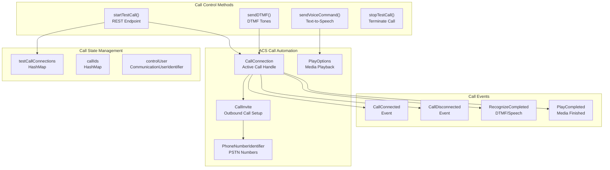
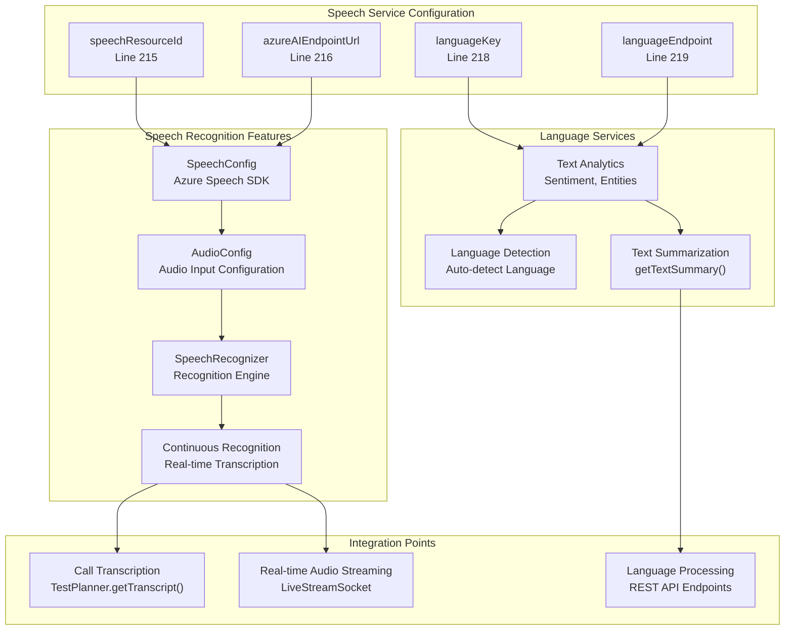
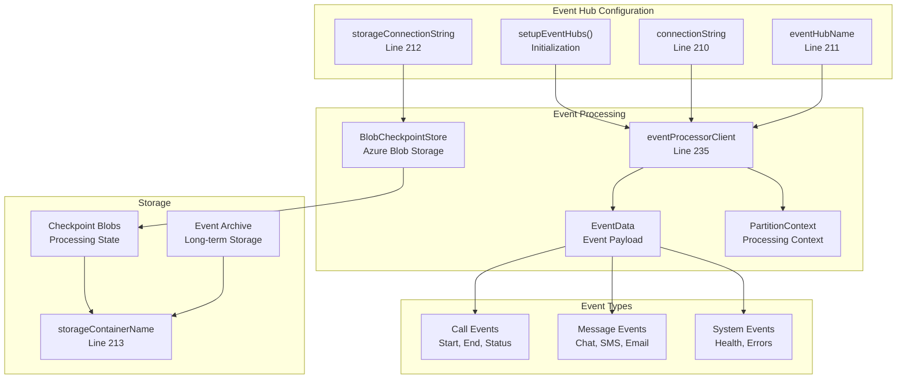

# Microsoft Services Integration

> **Relevant source files**
> * [src/java/com/comitfs/openfire/TeamsService.java](https://github.com/ComitFS/cas-service/blob/b7087e8d/src/java/com/comitfs/openfire/TeamsService.java)
> * [src/java/com/ifsoft/openlink/view/Summary.java](https://github.com/ComitFS/cas-service/blob/b7087e8d/src/java/com/ifsoft/openlink/view/Summary.java)
> * [src/java/org/jivesoftware/openfire/plugin/rest/service/CasCompanionService.java](https://github.com/ComitFS/cas-service/blob/b7087e8d/src/java/org/jivesoftware/openfire/plugin/rest/service/CasCompanionService.java)

## Purpose and Scope

This page documents the integration of Microsoft services within the CAS Service Plugin. The system provides deep integration with Microsoft's ecosystem including Teams, Graph API, Azure Communication Services, Bot Framework, and Azure AI services. These integrations enable enterprise communication workflows, call automation, presence management, and Teams application functionality.

For information about the Teams client application itself, see [Microsoft Teams Application](./5.1-microsoft-teams-application.md). For Azure Communication Services call automation specifically, see [Azure Communication Services](./6.2-azure-communication-services.md). For third-party integrations beyond Microsoft services, see [Third-Party Service Integrations](./6.3-third-party-service-integrations.md).

## Core Microsoft Services Architecture

The CAS system integrates with multiple Microsoft service tiers, from identity and authentication through to application-level services like Teams and communication automation.

```mermaid
flowchart TD

TeamsService["TeamsService<br>(Primary Integration Hub)"]
CasCompanionService["CasCompanionService<br>(REST API Layer)"]
Summary["Summary<br>(Status Monitoring)"]
MSALAuth["MSAL Authentication<br>ClientSecretCredential"]
DeviceCode["Device Code Flow<br>acquireTokenDeviceCode()"]
TokenCache["Token Management<br>tokensLookup Map"]
GraphClient["GraphServiceClient<br>graphClient"]
ArchiveClient["GraphServiceClient<br>archiveClient"]
Subscriptions["Graph Subscriptions<br>callRecordsSubscription<br>chatsSubscription<br>channelsSubscription"]
BotCredentials["MicrosoftAppCredentials<br>credentials"]
BotProvider["SimpleCredentialProvider<br>credentialProvider"]
RestConnector["RestConnectorClient"]
CallAutomation["CallAutomationClient<br>callAutomationClient"]
SMSClient["SmsClient<br>smsClient"]
EmailClient["EmailClient<br>emailClient"]
IdentityClient["CommunicationIdentityClient<br>communicationIdentityClient"]
SpeechServices["Azure Speech Services<br>Cognitive Services"]
LanguageServices["Azure Language Services<br>Text Analytics"]

TeamsService --> MSALAuth
TeamsService --> GraphClient
TeamsService --> BotCredentials
TeamsService --> CallAutomation
TeamsService --> SpeechServices

subgraph subGraph5 ["Azure AI Services"]
    SpeechServices
    LanguageServices
end

subgraph subGraph4 ["Azure Communication Services"]
    CallAutomation
    SMSClient
    EmailClient
    IdentityClient
end

subgraph subGraph3 ["Microsoft Bot Framework"]
    BotCredentials
    BotProvider
    RestConnector
end

subgraph subGraph2 ["Microsoft Graph API"]
    GraphClient
    ArchiveClient
    Subscriptions
    GraphClient --> Subscriptions
    GraphClient --> ArchiveClient
end

subgraph subGraph1 ["Microsoft Identity Platform"]
    MSALAuth
    DeviceCode
    TokenCache
    MSALAuth --> DeviceCode
    MSALAuth --> TokenCache
end

subgraph subGraph0 ["CAS Service Plugin"]
    TeamsService
    CasCompanionService
    Summary
    CasCompanionService --> TeamsService
end
```

**Microsoft Services Integration Flow**

Sources: [src/java/com/comitfs/openfire/TeamsService.java L1-L300](https://github.com/ComitFS/cas-service/blob/b7087e8d/src/java/com/comitfs/openfire/TeamsService.java#L1-L300)

 [src/java/org/jivesoftware/openfire/plugin/rest/service/CasCompanionService.java L1-L100](https://github.com/ComitFS/cas-service/blob/b7087e8d/src/java/org/jivesoftware/openfire/plugin/rest/service/CasCompanionService.java#L1-L100)

## Authentication and Identity Management

The system uses Microsoft's identity platform with multiple authentication mechanisms depending on the service and use case.

### MSAL (Microsoft Authentication Library) Integration

The primary authentication mechanism uses MSAL4J for OAuth2 flows with Microsoft identity platform.

**MSAL Authentication Configuration**

| Configuration Property | Default Value | Purpose |
| --- | --- | --- |
| `plugin.callmetadata.msteams.tenant.id` | `a83ec96f-82b0-456e-90a2-a6ba1ce7fc4e` | Azure AD tenant identifier |
| `plugin.callmetadata.msteams.client.id` | `b0435d07-bbf1-4881-973c-e065e078eb14` | Application client ID |
| `plugin.callmetadata.msteams.client.secret` | (encrypted) | Client secret for authentication |
| `ms.teams.proxy.host` | null | HTTP proxy host for corporate networks |
| `ms.teams.proxy.port` | 0 | HTTP proxy port |

Sources: [src/java/com/comitfs/openfire/TeamsService.java L199-L205](https://github.com/ComitFS/cas-service/blob/b7087e8d/src/java/com/comitfs/openfire/TeamsService.java#L199-L205)

 [src/java/com/comitfs/openfire/TeamsService.java L425-L472](https://github.com/ComitFS/cas-service/blob/b7087e8d/src/java/com/comitfs/openfire/TeamsService.java#L425-L472)

 [src/java/org/jivesoftware/openfire/plugin/rest/service/CasCompanionService.java L213-L229](https://github.com/ComitFS/cas-service/blob/b7087e8d/src/java/org/jivesoftware/openfire/plugin/rest/service/CasCompanionService.java#L213-L229)

### Bot Framework Authentication

For Teams bot integration, the system uses Microsoft Bot Framework credentials with different authentication flow.

Sources: [src/java/com/comitfs/openfire/TeamsService.java L89-L95](https://github.com/ComitFS/cas-service/blob/b7087e8d/src/java/com/comitfs/openfire/TeamsService.java#L89-L95)

 [src/java/com/comitfs/openfire/TeamsService.java L236-L237](https://github.com/ComitFS/cas-service/blob/b7087e8d/src/java/com/comitfs/openfire/TeamsService.java#L236-L237)

## Microsoft Graph API Integration

The Graph API integration provides access to Teams data, user information, calendar events, and communication subscriptions.

### Graph Client Setup and Configuration

**Graph API Service Methods**

| Method | Endpoint | Purpose |
| --- | --- | --- |
| `getContacts()` | `/me/contacts?$top=500` | Retrieve user contacts |
| `getPeople()` | `/me/people?$top=500` | Get Office 365 people interactions |
| `getMeetings()` | `/me/calendarView` | Fetch calendar meetings |
| `getUserByEmail()` | `/users/{email}` | Get user details by email |
| `getPresence()` | `/users/{userid}/presence` | Query user presence status |

Sources: [src/java/com/comitfs/openfire/TeamsService.java L408-L473](https://github.com/ComitFS/cas-service/blob/b7087e8d/src/java/com/comitfs/openfire/TeamsService.java#L408-L473)

 [src/java/org/jivesoftware/openfire/plugin/rest/service/CasCompanionService.java L481-L498](https://github.com/ComitFS/cas-service/blob/b7087e8d/src/java/org/jivesoftware/openfire/plugin/rest/service/CasCompanionService.java#L481-L498)

 [src/java/org/jivesoftware/openfire/plugin/rest/service/CasCompanionService.java L511-L533](https://github.com/ComitFS/cas-service/blob/b7087e8d/src/java/org/jivesoftware/openfire/plugin/rest/service/CasCompanionService.java#L511-L533)

### Graph Subscriptions and Webhooks

The system establishes webhooks to receive real-time notifications from Microsoft Graph for call records, chats, and channel messages.

**Subscription Lifecycle Configuration**

| Property | Value | Purpose |
| --- | --- | --- |
| `ms.teams.check.subscribe` | `3540000` ms (59 min) | Subscription renewal interval |
| `ms.teams.enable.subscription` | `false` | Enable/disable subscriptions |
| `callbackUrl` | `{publicUrl}/notify-call-records` | Webhook endpoint |
| `expirationDateTime` | Current time + 1 hour | Subscription expiry |

Sources: [src/java/com/comitfs/openfire/TeamsService.java L475-L559](https://github.com/ComitFS/cas-service/blob/b7087e8d/src/java/com/comitfs/openfire/TeamsService.java#L475-L559)

 [src/java/com/comitfs/openfire/TeamsService.java L221-L224](https://github.com/ComitFS/cas-service/blob/b7087e8d/src/java/com/comitfs/openfire/TeamsService.java#L221-L224)

## Azure Communication Services Integration

Azure Communication Services (ACS) provides programmable communication capabilities including SMS, email, calling, and chat services.

### ACS Client Configuration

**ACS Configuration Properties**

| Property | Default | Purpose |
| --- | --- | --- |
| `acs.endpoint` | null | ACS resource endpoint URL |
| `acs.email.address` | `DoNotReply@{domain}.azurecomm.net` | Default email sender |
| `acs.phone.number` | null | SMS-enabled phone number |
| `acs.control.channel` | null | Control channel identifier |

Sources: [src/java/com/comitfs/openfire/TeamsService.java L206-L213](https://github.com/ComitFS/cas-service/blob/b7087e8d/src/java/com/comitfs/openfire/TeamsService.java#L206-L213)

 [src/java/com/comitfs/openfire/TeamsService.java L319-L322](https://github.com/ComitFS/cas-service/blob/b7087e8d/src/java/com/comitfs/openfire/TeamsService.java#L319-L322)

 [src/java/org/jivesoftware/openfire/plugin/rest/service/CasCompanionService.java L113-L116](https://github.com/ComitFS/cas-service/blob/b7087e8d/src/java/org/jivesoftware/openfire/plugin/rest/service/CasCompanionService.java#L113-L116)

### Call Automation Integration

The call automation functionality enables programmatic control of PSTN and VoIP calls through ACS.

Sources: [src/java/com/comitfs/openfire/TeamsService.java L257-L262](https://github.com/ComitFS/cas-service/blob/b7087e8d/src/java/com/comitfs/openfire/TeamsService.java#L257-L262)

 [src/java/org/jivesoftware/openfire/plugin/rest/service/CasCompanionService.java L746-L758](https://github.com/ComitFS/cas-service/blob/b7087e8d/src/java/org/jivesoftware/openfire/plugin/rest/service/CasCompanionService.java#L746-L758)

 [src/java/org/jivesoftware/openfire/plugin/rest/service/CasCompanionService.java L770-L780](https://github.com/ComitFS/cas-service/blob/b7087e8d/src/java/org/jivesoftware/openfire/plugin/rest/service/CasCompanionService.java#L770-L780)

## Azure AI Services Integration

The system integrates with Azure Cognitive Services for speech recognition, text analytics, and language understanding.

### Speech Services Configuration

**Azure AI Configuration Properties**

| Property | Purpose |
| --- | --- |
| `acs.speech.resource.id` | Speech service resource identifier |
| `acs.ai.endpoint` | Cognitive services endpoint URL |
| `acs.language.key` | Language service API key |
| `acs.language.endpont` | Language service endpoint URL |

Sources: [src/java/com/comitfs/openfire/TeamsService.java L215-L219](https://github.com/ComitFS/cas-service/blob/b7087e8d/src/java/com/comitfs/openfire/TeamsService.java#L215-L219)

 [src/java/org/jivesoftware/openfire/plugin/rest/service/CasCompanionService.java L1017-L1030](https://github.com/ComitFS/cas-service/blob/b7087e8d/src/java/org/jivesoftware/openfire/plugin/rest/service/CasCompanionService.java#L1017-L1030)

## Event Hubs Integration

Azure Event Hubs provides scalable event streaming for high-volume communication events and logging.

**Event Hub Configuration Properties**

| Property | Default | Purpose |
| --- | --- | --- |
| `acs.eventhubs.connection` | (connection string) | Event Hubs namespace connection |
| `acs.eventhubs.name` | `twowaysms` | Target event hub name |
| `acs.storage.connection` | (connection string) | Blob storage for checkpoints |
| `acs.storage.container` | `twowaysms` | Storage container name |
| `acs.eventhubs.enabled` | `false` | Enable event hub processing |

Sources: [src/java/com/comitfs/openfire/TeamsService.java L210-L213](https://github.com/ComitFS/cas-service/blob/b7087e8d/src/java/com/comitfs/openfire/TeamsService.java#L210-L213)

 [src/java/com/comitfs/openfire/TeamsService.java L323-L325](https://github.com/ComitFS/cas-service/blob/b7087e8d/src/java/com/comitfs/openfire/TeamsService.java#L323-L325)

 [src/java/com/ifsoft/openlink/view/Summary.java L180-L186](https://github.com/ComitFS/cas-service/blob/b7087e8d/src/java/com/ifsoft/openlink/view/Summary.java#L180-L186)

## Service Health Monitoring

The system provides comprehensive health monitoring for all Microsoft service integrations through the Summary servlet.

```mermaid
flowchart TD

SummaryServlet["Summary<br>Health Check Servlet"]
CredentialsCheck["Token Validation<br>credentials.getToken()"]
ComponentStatus["Component Status<br>Success/Error Images"]
JerseyStatus["REST API Status<br>JerseyWrapper.getLoadingStatusMessage()"]
GraphClientStatus["GraphClient Status<br>TeamsService.graphClient != null"]
ArchiveClientStatus["ArchiveClient Status<br>TeamsService.archiveClient != null"]
SubscriptionStatus["Subscription Status<br>JiveGlobals properties"]
IdentityStatus["ACS Identity<br>communicationIdentityClient != null"]
EmailStatus["ACS Email<br>emailClient != null"]
SMSStatus["ACS SMS<br>smsClient != null"]
EventHubStatus["Event Hub<br>eventProcessorClient != null"]
SuccessIcon["success-16x16.gif<br>Service Operational"]
ErrorIcon["error-16x16.gif<br>Service Failed"]
ForbiddenIcon["forbidden-16x16.gif<br>Service Disabled"]

ComponentStatus --> JerseyStatus
ComponentStatus --> GraphClientStatus
ComponentStatus --> ArchiveClientStatus
ComponentStatus --> SubscriptionStatus
ComponentStatus --> IdentityStatus
ComponentStatus --> EmailStatus
ComponentStatus --> SMSStatus
ComponentStatus --> EventHubStatus
ComponentStatus --> SuccessIcon
ComponentStatus --> ErrorIcon
ComponentStatus --> ForbiddenIcon

subgraph subGraph3 ["Status Indicators"]
    SuccessIcon
    ErrorIcon
    ForbiddenIcon
end

subgraph subGraph2 ["ACS Service Status"]
    IdentityStatus
    EmailStatus
    SMSStatus
    EventHubStatus
end

subgraph subGraph1 ["Monitored Services"]
    JerseyStatus
    GraphClientStatus
    ArchiveClientStatus
    SubscriptionStatus
end

subgraph subGraph0 ["Health Check Components"]
    SummaryServlet
    CredentialsCheck
    ComponentStatus
    SummaryServlet --> CredentialsCheck
    SummaryServlet --> ComponentStatus
end
```

**Health Check Status Table**

| Component | Property Check | Success Condition |
| --- | --- | --- |
| REST API | `JerseyWrapper.getLoadingStatusMessage()` | Returns `"ok"` |
| Bot Credentials | `credentials.getToken()` | Token exists and valid |
| Graph Client | `TeamsService.graphClient` | Not null |
| Archive Client | `TeamsService.archiveClient` | Not null |
| Call Records Subscription | `ms.teams.callrecords.subscription` | Property exists |
| Teams Chats Subscription | `ms.teams.chats.subscription` | Property exists |
| Teams Channels Subscription | `ms.teams.channels.subscription` | Property exists |
| ACS Identity | `communicationIdentityClient` | Not null |
| ACS Email | `emailClient` | Not null |
| ACS SMS | `smsClient` | Not null |
| Event Hub | `eventProcessorClient` | Not null |

Sources: [src/java/com/ifsoft/openlink/view/Summary.java L47-L187](https://github.com/ComitFS/cas-service/blob/b7087e8d/src/java/com/ifsoft/openlink/view/Summary.java#L47-L187)

 [src/java/com/ifsoft/openlink/view/Summary.java L116-L178](https://github.com/ComitFS/cas-service/blob/b7087e8d/src/java/com/ifsoft/openlink/view/Summary.java#L116-L178)