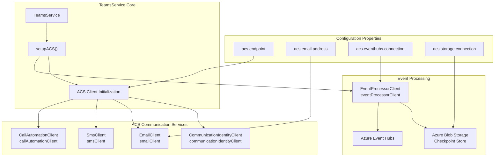
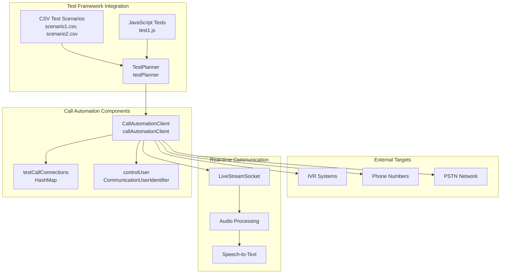
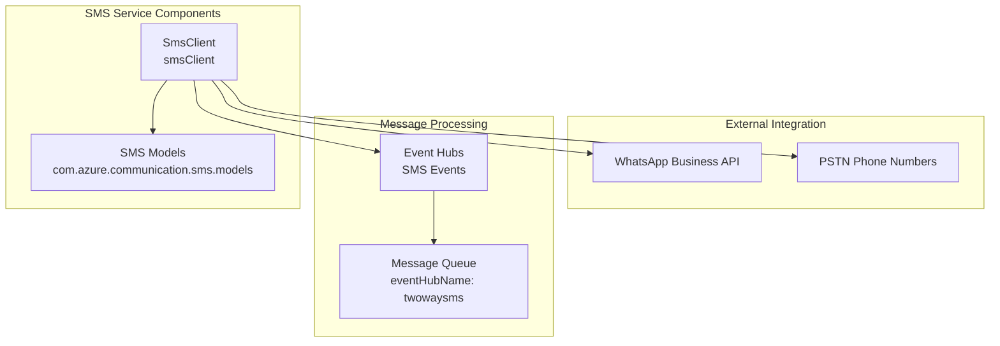
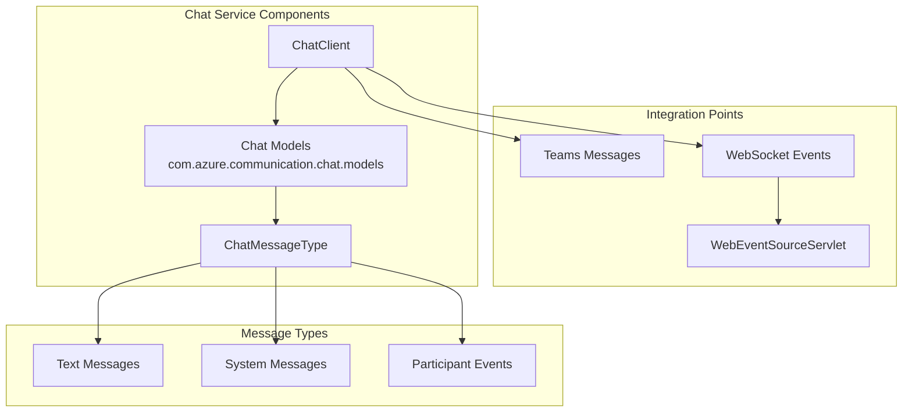
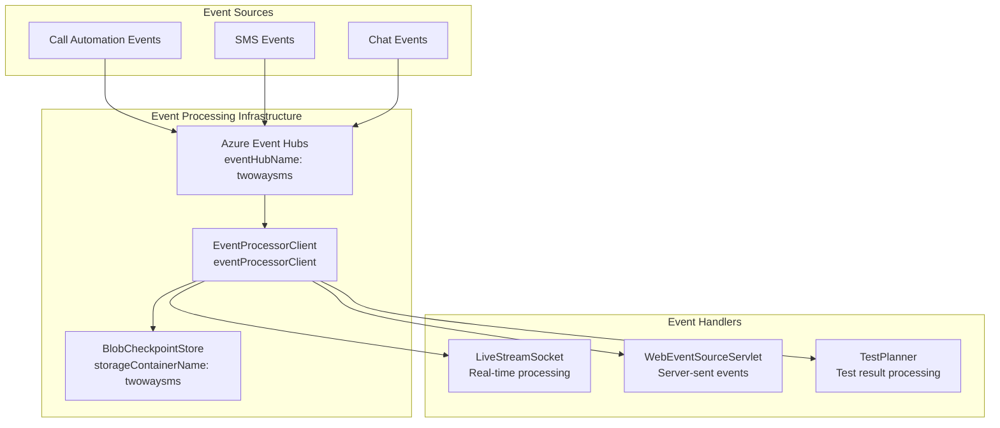
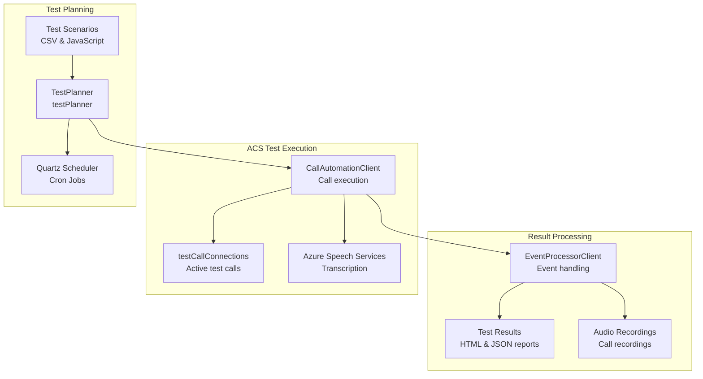

# Azure Communication Services

> **Relevant source files**
> * [documentation/acs_voicemail_solution.txt](https://github.com/ComitFS/cas-service/blob/b7087e8d/documentation/acs_voicemail_solution.txt)
> * [src/java/com/comitfs/openfire/TeamsService.java](https://github.com/ComitFS/cas-service/blob/b7087e8d/src/java/com/comitfs/openfire/TeamsService.java)

## Purpose and Scope

This document covers the integration of Azure Communication Services (ACS) within the CAS Service Plugin. ACS provides the core communication capabilities including call automation, SMS, email, chat, and identity management. The integration enables automated call testing, real-time communication features, and multi-modal messaging capabilities.

For Microsoft Teams-specific integrations, see [Microsoft Services Integration](./6.1-microsoft-services-integration.md). For third-party communication platforms, see [Third-Party Service Integrations](./6.3-third-party-service-integrations.md).

## ACS Services Architecture

The CAS system integrates multiple Azure Communication Services through a centralized configuration and client management approach in the `TeamsService` class.

### ACS Service Integration Overview

Sources: [src/java/com/comitfs/openfire/TeamsService.java L206-L214](https://github.com/ComitFS/cas-service/blob/b7087e8d/src/java/com/comitfs/openfire/TeamsService.java#L206-L214)

 [src/java/com/comitfs/openfire/TeamsService.java L231-L237](https://github.com/ComitFS/cas-service/blob/b7087e8d/src/java/com/comitfs/openfire/TeamsService.java#L231-L237)

 [src/java/com/comitfs/openfire/TeamsService.java L319-L325](https://github.com/ComitFS/cas-service/blob/b7087e8d/src/java/com/comitfs/openfire/TeamsService.java#L319-L325)

## Call Automation Integration

The call automation functionality is the primary ACS integration, enabling automated call testing and real-time call control.

### Call Automation Architecture

Sources: [src/java/com/comitfs/openfire/TeamsService.java L231](https://github.com/ComitFS/cas-service/blob/b7087e8d/src/java/com/comitfs/openfire/TeamsService.java#L231-L231)

 [src/java/com/comitfs/openfire/TeamsService.java L259-L262](https://github.com/ComitFS/cas-service/blob/b7087e8d/src/java/com/comitfs/openfire/TeamsService.java#L259-L262)

 [src/java/com/comitfs/openfire/TeamsService.java L360-L362](https://github.com/ComitFS/cas-service/blob/b7087e8d/src/java/com/comitfs/openfire/TeamsService.java#L360-L362)

### Call Automation Configuration

The call automation client is configured during service initialization with endpoint and authentication credentials:

| Configuration Property | Purpose | Example Value |
| --- | --- | --- |
| `acs.endpoint` | ACS resource endpoint URL | `https://cas-acs.communication.azure.com/` |
| `acs.eventhubs.connection` | Event Hubs connection string | Event processing connection |
| `acs.storage.connection` | Blob storage for checkpoints | Checkpoint store configuration |

Sources: [src/java/com/comitfs/openfire/TeamsService.java L206-L213](https://github.com/ComitFS/cas-service/blob/b7087e8d/src/java/com/comitfs/openfire/TeamsService.java#L206-L213)

## Communication Services

### SMS Integration

The SMS functionality enables sending text messages through ACS SMS services:

Sources: [src/java/com/comitfs/openfire/TeamsService.java L114-L115](https://github.com/ComitFS/cas-service/blob/b7087e8d/src/java/com/comitfs/openfire/TeamsService.java#L114-L115)

 [src/java/com/comitfs/openfire/TeamsService.java L233](https://github.com/ComitFS/cas-service/blob/b7087e8d/src/java/com/comitfs/openfire/TeamsService.java#L233-L233)

 [src/java/com/comitfs/openfire/TeamsService.java L211](https://github.com/ComitFS/cas-service/blob/b7087e8d/src/java/com/comitfs/openfire/TeamsService.java#L211-L211)

### Email Services

Email functionality is provided through the ACS Email Client:

| Component | Description | Code Reference |
| --- | --- | --- |
| `EmailClient` | Main email service client | [TeamsService L197](https://github.com/ComitFS/cas-service/blob/b7087e8d/TeamsService#L197-L197) |
| `EmailAddress` | Email addressing model | [TeamsService L116-L118](https://github.com/ComitFS/cas-service/blob/b7087e8d/TeamsService#L116-L118) |
| `acsEmailAddress` | Default sender address | [TeamsService L207](https://github.com/ComitFS/cas-service/blob/b7087e8d/TeamsService#L207-L207) |

Sources: [src/java/com/comitfs/openfire/TeamsService.java L197](https://github.com/ComitFS/cas-service/blob/b7087e8d/src/java/com/comitfs/openfire/TeamsService.java#L197-L197)

 [src/java/com/comitfs/openfire/TeamsService.java L116-L118](https://github.com/ComitFS/cas-service/blob/b7087e8d/src/java/com/comitfs/openfire/TeamsService.java#L116-L118)

 [src/java/com/comitfs/openfire/TeamsService.java L207](https://github.com/ComitFS/cas-service/blob/b7087e8d/src/java/com/comitfs/openfire/TeamsService.java#L207-L207)

### Chat Integration

Chat services leverage ACS chat capabilities for real-time messaging:

Sources: [src/java/com/comitfs/openfire/TeamsService.java L110-L113](https://github.com/ComitFS/cas-service/blob/b7087e8d/src/java/com/comitfs/openfire/TeamsService.java#L110-L113)

 [src/java/com/comitfs/openfire/TeamsService.java L164](https://github.com/ComitFS/cas-service/blob/b7087e8d/src/java/com/comitfs/openfire/TeamsService.java#L164-L164)

## Identity Management

ACS Identity services manage communication identities and access tokens for secure service access.

### Identity Service Components

| Service | Purpose | Implementation |
| --- | --- | --- |
| `CommunicationIdentityClient` | Creates and manages user identities | [TeamsService L234](https://github.com/ComitFS/cas-service/blob/b7087e8d/TeamsService#L234-L234) |
| `CommunicationUserIdentifier` | Represents ACS user identity | [TeamsService L260](https://github.com/ComitFS/cas-service/blob/b7087e8d/TeamsService#L260-L260) |
| `AccessTokenCredential` | Manages authentication tokens | Used with clients |

The `controlUser` identity is used for test automation scenarios where the system needs to act as a communication participant.

Sources: [src/java/com/comitfs/openfire/TeamsService.java L119-L120](https://github.com/ComitFS/cas-service/blob/b7087e8d/src/java/com/comitfs/openfire/TeamsService.java#L119-L120)

 [src/java/com/comitfs/openfire/TeamsService.java L234](https://github.com/ComitFS/cas-service/blob/b7087e8d/src/java/com/comitfs/openfire/TeamsService.java#L234-L234)

 [src/java/com/comitfs/openfire/TeamsService.java L260](https://github.com/ComitFS/cas-service/blob/b7087e8d/src/java/com/comitfs/openfire/TeamsService.java#L260-L260)

## Event Processing Architecture

ACS events are processed through Azure Event Hubs for real-time communication event handling.

### Event Processing Flow

Sources: [src/java/com/comitfs/openfire/TeamsService.java L210-L213](https://github.com/ComitFS/cas-service/blob/b7087e8d/src/java/com/comitfs/openfire/TeamsService.java#L210-L213)

 [src/java/com/comitfs/openfire/TeamsService.java L235](https://github.com/ComitFS/cas-service/blob/b7087e8d/src/java/com/comitfs/openfire/TeamsService.java#L235-L235)

 [src/java/com/comitfs/openfire/TeamsService.java L323-L325](https://github.com/ComitFS/cas-service/blob/b7087e8d/src/java/com/comitfs/openfire/TeamsService.java#L323-L325)

### Event Hub Configuration

Event processing is configured through several connection strings and storage settings:

| Property | Purpose | Default Value |
| --- | --- | --- |
| `acs.eventhubs.connection` | Event Hubs namespace connection | Service Bus connection string |
| `acs.eventhubs.name` | Event Hub name | `twowaysms` |
| `acs.storage.connection` | Checkpoint storage connection | Blob storage connection |
| `acs.storage.container` | Checkpoint container name | `twowaysms` |

Sources: [src/java/com/comitfs/openfire/TeamsService.java L210-L213](https://github.com/ComitFS/cas-service/blob/b7087e8d/src/java/com/comitfs/openfire/TeamsService.java#L210-L213)

## Integration with Test Automation

ACS services are deeply integrated with the test automation framework for comprehensive call flow testing.

### Test Integration Architecture

Sources: [src/java/com/comitfs/openfire/TeamsService.java L360-L362](https://github.com/ComitFS/cas-service/blob/b7087e8d/src/java/com/comitfs/openfire/TeamsService.java#L360-L362)

 [src/java/com/comitfs/openfire/TeamsService.java L259](https://github.com/ComitFS/cas-service/blob/b7087e8d/src/java/com/comitfs/openfire/TeamsService.java#L259-L259)

 [src/java/com/comitfs/openfire/TeamsService.java L235](https://github.com/ComitFS/cas-service/blob/b7087e8d/src/java/com/comitfs/openfire/TeamsService.java#L235-L235)

The test automation system uses ACS Call Automation to execute test scenarios against IVR systems and phone numbers, with results processed through the event system and stored for analysis.

## Service Initialization and Configuration

ACS services are initialized during the `TeamsService` startup process through the `setupACS()` method, which is called when the ACS endpoint is configured.

### Initialization Flow

The initialization process involves:

1. **Endpoint Validation**: Checking for `acsEndpoint` configuration
2. **Client Creation**: Instantiating ACS service clients
3. **Event Hub Setup**: Configuring event processing if enabled
4. **Test Framework Integration**: Connecting with TestPlanner

Sources: [src/java/com/comitfs/openfire/TeamsService.java L319-L325](https://github.com/ComitFS/cas-service/blob/b7087e8d/src/java/com/comitfs/openfire/TeamsService.java#L319-L325)

 [src/java/com/comitfs/openfire/TeamsService.java L305-L334](https://github.com/ComitFS/cas-service/blob/b7087e8d/src/java/com/comitfs/openfire/TeamsService.java#L305-L334)