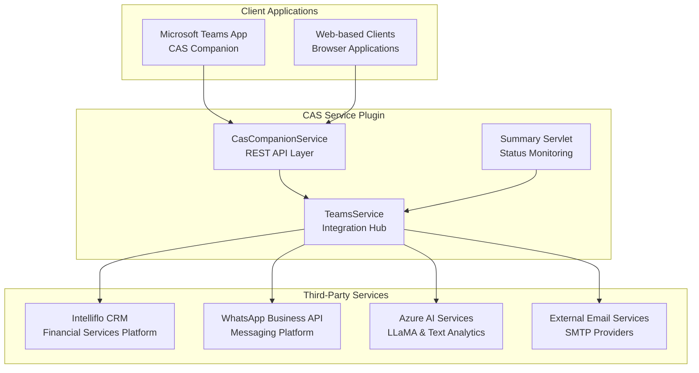
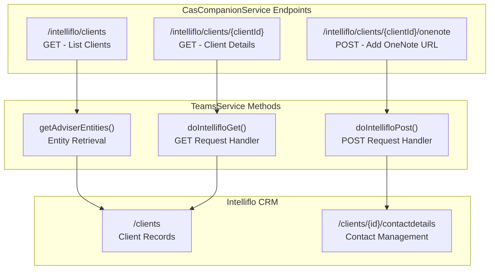
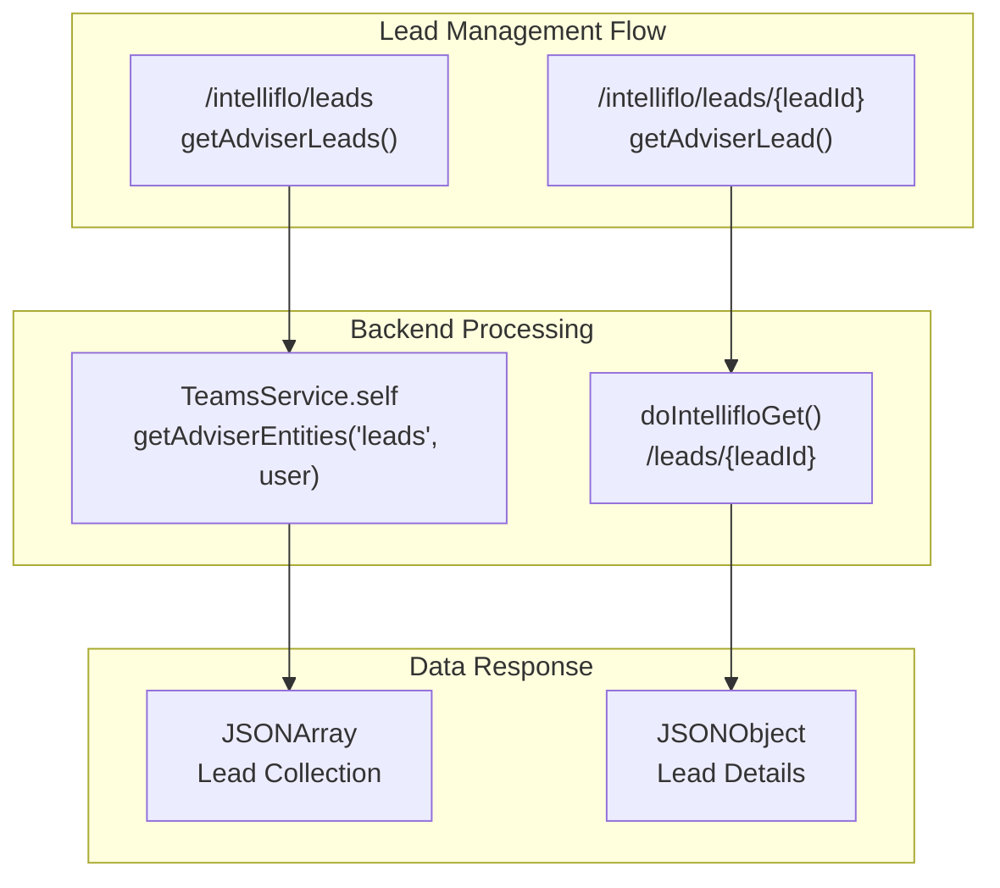
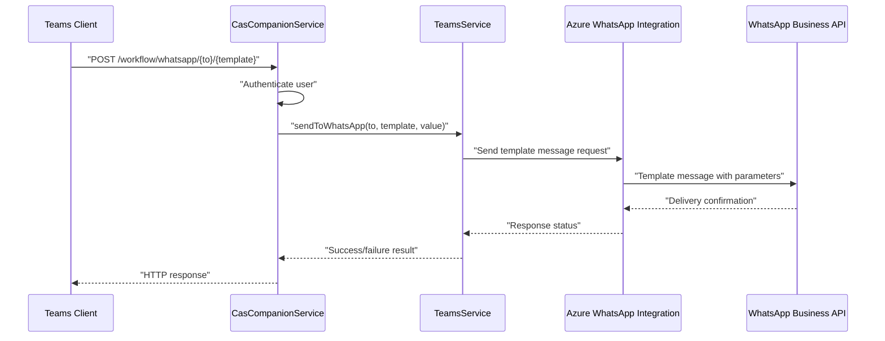
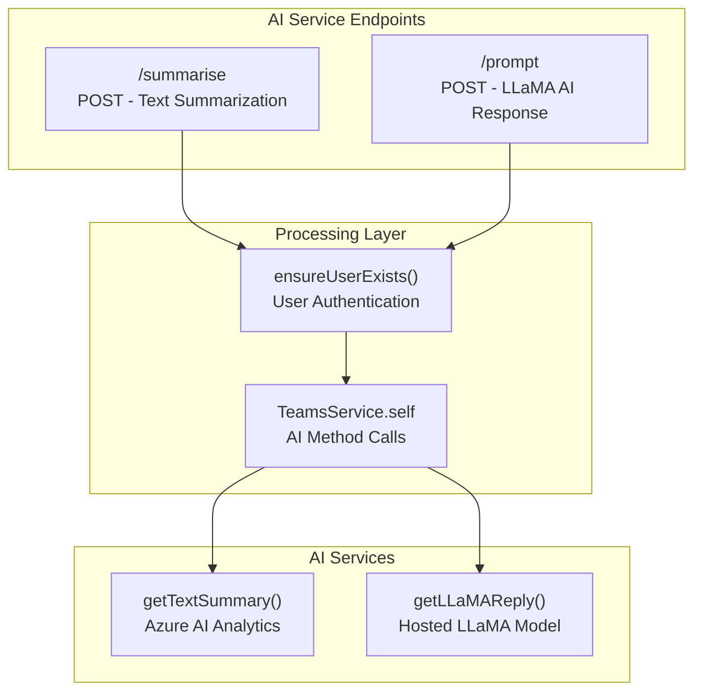
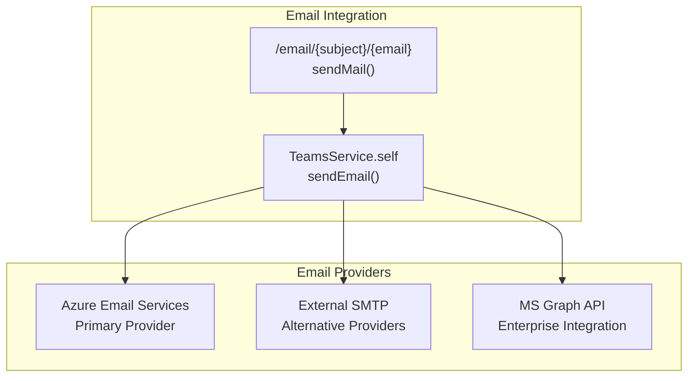
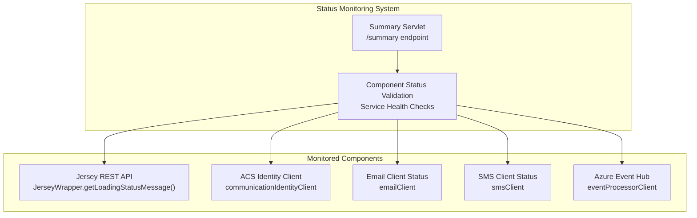
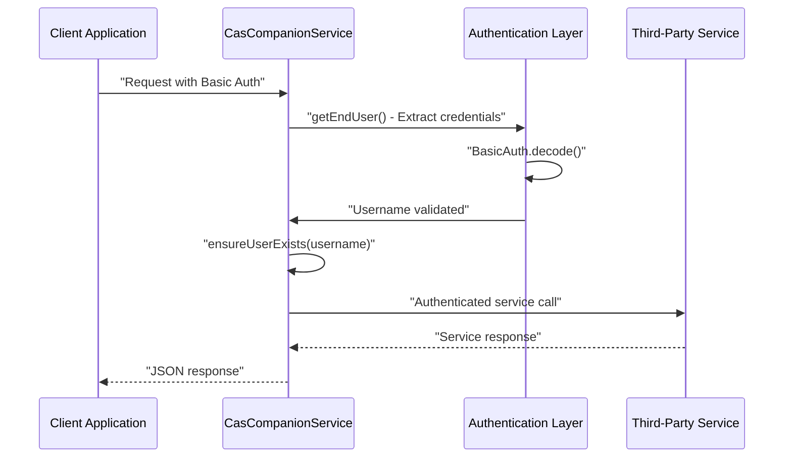

# Third-Party Service Integrations

> **Relevant source files**
> * [src/java/com/ifsoft/openlink/view/Summary.java](https://github.com/ComitFS/cas-service/blob/b7087e8d/src/java/com/ifsoft/openlink/view/Summary.java)
> * [src/java/org/jivesoftware/openfire/plugin/rest/service/CasCompanionService.java](https://github.com/ComitFS/cas-service/blob/b7087e8d/src/java/org/jivesoftware/openfire/plugin/rest/service/CasCompanionService.java)

This document covers the integration of external third-party services with the CAS Service Plugin, excluding Microsoft core services and Azure Communication Services which are documented separately. For Microsoft services integration, see [Microsoft Services Integration](./6.1-microsoft-services-integration.md). For Azure Communication Services integration, see [Azure Communication Services](./6.2-azure-communication-services.md).

The CAS system integrates with several third-party platforms to provide comprehensive business workflow capabilities including CRM functionality, messaging services, and AI-powered features. These integrations are primarily exposed through the `CasCompanionService` REST API and managed by the `TeamsService` integration hub.

## Integration Architecture Overview

The third-party service integrations follow a consistent pattern where external services are accessed through the `TeamsService` integration hub, exposed via REST endpoints in `CasCompanionService`, and monitored through the system status framework.

**Sources:** [src/java/org/jivesoftware/openfire/plugin/rest/service/CasCompanionService.java L75-L79](https://github.com/ComitFS/cas-service/blob/b7087e8d/src/java/org/jivesoftware/openfire/plugin/rest/service/CasCompanionService.java#L75-L79)

 [src/java/com/ifsoft/openlink/view/Summary.java L24-L25](https://github.com/ComitFS/cas-service/blob/b7087e8d/src/java/com/ifsoft/openlink/view/Summary.java#L24-L25)

## Intelliflo CRM Integration

The CAS system provides comprehensive integration with Intelliflo, a financial services CRM platform, enabling financial advisers to access client and lead information directly through the Teams application interface.

### Client Management APIs

The Intelliflo integration exposes client management functionality through dedicated REST endpoints that allow financial advisers to retrieve and manage client information.

The client management functionality is implemented through several REST endpoints:

| Endpoint | Method | Purpose | Implementation |
| --- | --- | --- | --- |
| `/intelliflo/clients` | GET | Retrieve adviser's client list | `getAdviserClients()` |
| `/intelliflo/clients/{clientId}` | GET | Get specific client details | `getAdviserClient()` |
| `/intelliflo/clients/{clientId}/onenote` | POST | Add OneNote URL to client | `addClientOneNoteUrl()` |

**Sources:** [src/java/org/jivesoftware/openfire/plugin/rest/service/CasCompanionService.java L1429-L1499](https://github.com/ComitFS/cas-service/blob/b7087e8d/src/java/org/jivesoftware/openfire/plugin/rest/service/CasCompanionService.java#L1429-L1499)

### Lead Management APIs

The system provides similar functionality for managing leads, allowing financial advisers to track potential clients through the CRM integration.

**Sources:** [src/java/org/jivesoftware/openfire/plugin/rest/service/CasCompanionService.java L1501-L1545](https://github.com/ComitFS/cas-service/blob/b7087e8d/src/java/org/jivesoftware/openfire/plugin/rest/service/CasCompanionService.java#L1501-L1545)

## WhatsApp Business API Integration

The CAS system integrates with WhatsApp Business API through Azure's messaging infrastructure to enable automated WhatsApp messaging capabilities for client communication.

### WhatsApp Template Messaging

The WhatsApp integration uses template-based messaging to ensure compliance with WhatsApp Business API requirements and enable automated client notifications.

The WhatsApp integration endpoint accepts template-based messages with the following parameters:

* **to**: Destination telephone number
* **template**: WhatsApp template name
* **value**: Template parameter values

**Sources:** [src/java/org/jivesoftware/openfire/plugin/rest/service/CasCompanionService.java L1107-L1124](https://github.com/ComitFS/cas-service/blob/b7087e8d/src/java/org/jivesoftware/openfire/plugin/rest/service/CasCompanionService.java#L1107-L1124)

## Azure AI Services Integration

The CAS system incorporates AI-powered features through Azure AI services, providing text summarization and generative AI capabilities for enhanced user productivity.

### Text Summarization Service

The text summarization feature uses Azure AI services to provide automated content summarization for business communications and documents.

### AI Service Implementation

Both AI services follow a consistent pattern:

1. **User Authentication**: Validate the requesting user through `ensureUserExists()`
2. **Service Delegation**: Forward requests to `TeamsService` for processing
3. **Response Handling**: Return AI-generated content to the client

| Service | Endpoint | Method | Purpose |
| --- | --- | --- | --- |
| Text Summarization | `/summarise` | POST | Summarize provided text using Azure AI |
| LLaMA AI | `/prompt` | POST | Generate responses using hosted LLaMA model |

**Sources:** [src/java/org/jivesoftware/openfire/plugin/rest/service/CasCompanionService.java L1008-L1054](https://github.com/ComitFS/cas-service/blob/b7087e8d/src/java/org/jivesoftware/openfire/plugin/rest/service/CasCompanionService.java#L1008-L1054)

## External Email Services Integration

The CAS system supports external email services beyond Azure Communication Services, providing flexibility in email delivery and integration with existing enterprise email infrastructure.

### Email Service Configuration

The email integration is managed through the `TeamsService.sendEmail()` method, which can route messages through various email providers based on system configuration.

The email service accepts the following parameters:

* **subject**: Email subject line
* **email**: Destination email address
* **body**: Email content (request body)

**Sources:** [src/java/org/jivesoftware/openfire/plugin/rest/service/CasCompanionService.java L974-L1000](https://github.com/ComitFS/cas-service/blob/b7087e8d/src/java/org/jivesoftware/openfire/plugin/rest/service/CasCompanionService.java#L974-L1000)

## Service Status Monitoring

The system provides comprehensive status monitoring for all third-party service integrations through the `Summary` servlet, enabling administrators to verify service connectivity and health.

### Status Monitoring Implementation

The status monitoring system checks various service components and displays their health status through visual indicators:

* **Success**: Green checkmark icon (`success-16x16.gif`)
* **Error**: Red error icon (`error-16x16.gif`)
* **Forbidden**: Warning icon (`forbidden-16x16.gif`)

**Sources:** [src/java/com/ifsoft/openlink/view/Summary.java L112-L187](https://github.com/ComitFS/cas-service/blob/b7087e8d/src/java/com/ifsoft/openlink/view/Summary.java#L112-L187)

## Integration Security and Authentication

All third-party service integrations implement consistent security patterns through the CAS authentication framework, ensuring secure access to external services while maintaining user context and permissions.

### Authentication Flow

The authentication process ensures that:

1. All requests are authenticated using HTTP Basic Authentication
2. User accounts are validated against the Openfire user database
3. Service calls maintain user context for authorization
4. Responses are properly formatted and secured

**Sources:** [src/java/org/jivesoftware/openfire/plugin/rest/service/CasCompanionService.java L560-L578](https://github.com/ComitFS/cas-service/blob/b7087e8d/src/java/org/jivesoftware/openfire/plugin/rest/service/CasCompanionService.java#L560-L578)