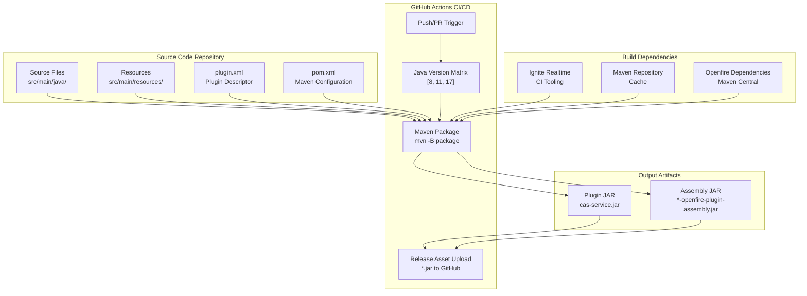
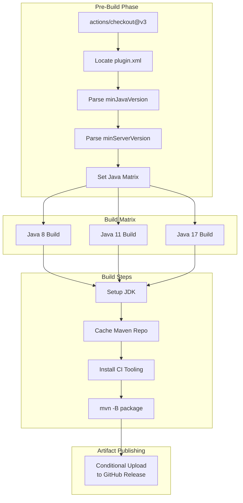
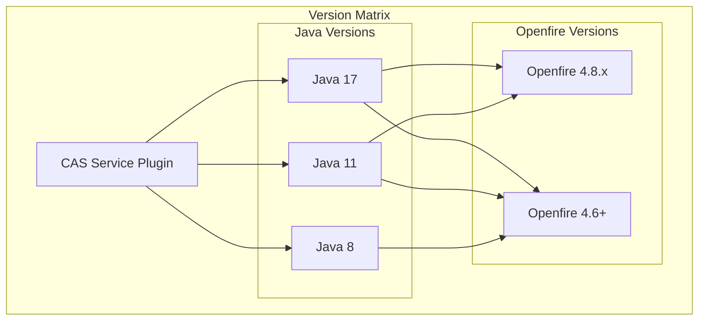

# Development & Deployment

> **Relevant source files**
> * [.github/workflows/build.yml](https://github.com/ComitFS/cas-service/blob/b7087e8d/.github/workflows/build.yml)

This page documents the development tools, build processes, and deployment procedures for the CAS Service Plugin. It covers the continuous integration pipeline, Maven build configuration, development utilities, and system requirements necessary for building and deploying the plugin to Openfire servers.

For information about the plugin architecture and configuration, see [Plugin Architecture & Configuration](./2.3-plugin-architecture-and-configuration.md). For details about development tools specific to testing, see [Development Tools](./7.2-development-tools.md).

## Build System Overview

The CAS Service Plugin uses a Maven-based build system with automated CI/CD through GitHub Actions. The build process supports multiple Java versions and automatically handles plugin packaging and release distribution.

### Build Architecture



Sources: [.github/workflows/build.yml L1-L125](https://github.com/ComitFS/cas-service/blob/b7087e8d/.github/workflows/build.yml#L1-L125)

### Maven Configuration

The build system uses Maven with specialized configuration for Openfire plugin development. The CI pipeline automatically detects Java version requirements from `plugin.xml` and builds against appropriate Java versions.

#### Java Version Matrix

The build system dynamically determines which Java versions to build against based on plugin requirements:

| Plugin Min Java | Openfire Version | Build Matrix |
| --- | --- | --- |
| 11 | Any | [11, 17] |
| Any | 4.8.x | [11, 17] |
| 8 or unspecified | Other | [8, 11, 17] |

This configuration is handled by the `select_java` job in the GitHub Actions workflow [.github/workflows/build.yml L44-L52](https://github.com/ComitFS/cas-service/blob/b7087e8d/.github/workflows/build.yml#L44-L52)

Sources: [.github/workflows/build.yml L44-L52](https://github.com/ComitFS/cas-service/blob/b7087e8d/.github/workflows/build.yml#L44-L52)

## Continuous Integration Pipeline

### Workflow Structure



Sources: [.github/workflows/build.yml L5-L125](https://github.com/ComitFS/cas-service/blob/b7087e8d/.github/workflows/build.yml#L5-L125)

### Build Process

The CI pipeline executes the following steps for each Java version in the matrix:

1. **Environment Setup**: Configures the appropriate JDK version using the `temurin` distribution [.github/workflows/build.yml L89-L93](https://github.com/ComitFS/cas-service/blob/b7087e8d/.github/workflows/build.yml#L89-L93)
2. **Dependency Caching**: Implements Maven repository caching to optimize build times [.github/workflows/build.yml L95-L102](https://github.com/ComitFS/cas-service/blob/b7087e8d/.github/workflows/build.yml#L95-L102)
3. **CI Tooling Installation**: Downloads and configures Ignite Realtime CI tooling for Openfire plugin builds [.github/workflows/build.yml L104-L108](https://github.com/ComitFS/cas-service/blob/b7087e8d/.github/workflows/build.yml#L104-L108)
4. **Maven Build**: Executes the package goal with batch mode enabled [.github/workflows/build.yml L110-L113](https://github.com/ComitFS/cas-service/blob/b7087e8d/.github/workflows/build.yml#L110-L113)
5. **Artifact Upload**: Conditionally uploads the built JAR to GitHub releases for tagged builds [.github/workflows/build.yml L115-L124](https://github.com/ComitFS/cas-service/blob/b7087e8d/.github/workflows/build.yml#L115-L124)

### Release Automation

The pipeline automatically publishes plugin artifacts to GitHub releases when:

* The repository belongs to the ComitFS organization
* The trigger is a push event
* The reference contains a git tag
* The build uses Java 8, or Java 11 when the matrix is `[11,17]`

The uploaded artifact is renamed from `*-openfire-plugin-assembly.jar` to `{pluginId}.jar` for consistency [.github/workflows/build.yml L121-L123](https://github.com/ComitFS/cas-service/blob/b7087e8d/.github/workflows/build.yml#L121-L123)

Sources: [.github/workflows/build.yml L115-L124](https://github.com/ComitFS/cas-service/blob/b7087e8d/.github/workflows/build.yml#L115-L124)

## Development Environment Setup

### Prerequisites

The development environment requires:

* **Java Development Kit**: Version 8, 11, or 17 (Temurin distribution recommended)
* **Maven**: Version 3.6+ with access to Maven Central
* **Git**: For version control and CI tooling download
* **Openfire Server**: For local testing and development

### Maven Settings Configuration

The build system uses specialized Maven settings provided by the Ignite Realtime community. These settings are automatically configured in CI but should be manually applied for local development:

```
git clone --depth 1 https://github.com/igniterealtime/ci-tooling.git target/ci-tooling
cp target/ci-tooling/maven-settings-for-openfire-plugins.xml $HOME/.m2/settings.xml
```

Sources: [.github/workflows/build.yml L104-L108](https://github.com/ComitFS/cas-service/blob/b7087e8d/.github/workflows/build.yml#L104-L108)

### Local Build Commands

| Command | Purpose |
| --- | --- |
| `mvn clean compile` | Compile source code |
| `mvn package` | Build plugin JAR |
| `mvn install` | Install to local repository |
| `mvn test` | Run unit tests |

## Deployment Procedures

### Plugin Installation

The CAS Service Plugin deploys as an Openfire plugin following standard Openfire plugin deployment patterns:

1. **JAR Deployment**: Copy the built JAR file to the Openfire `plugins/` directory
2. **Hot Deployment**: Openfire automatically detects and loads new plugins
3. **Configuration**: Access plugin configuration through the Openfire admin console

### Version Compatibility

The plugin supports multiple Openfire and Java version combinations as determined by `plugin.xml`:



Sources: [.github/workflows/build.yml L28-L52](https://github.com/ComitFS/cas-service/blob/b7087e8d/.github/workflows/build.yml#L28-L52)

### Release Distribution

Plugin releases are automatically distributed through GitHub releases with the following naming convention:

* **Source**: `{artifactId}-openfire-plugin-assembly.jar`
* **Release**: `{artifactId}.jar`

The release process extracts the artifact ID from `pom.xml` and uses it for consistent naming across releases [.github/workflows/build.yml L66-L87](https://github.com/ComitFS/cas-service/blob/b7087e8d/.github/workflows/build.yml#L66-L87)

Sources: [.github/workflows/build.yml L66-L87](https://github.com/ComitFS/cas-service/blob/b7087e8d/.github/workflows/build.yml#L66-L87)