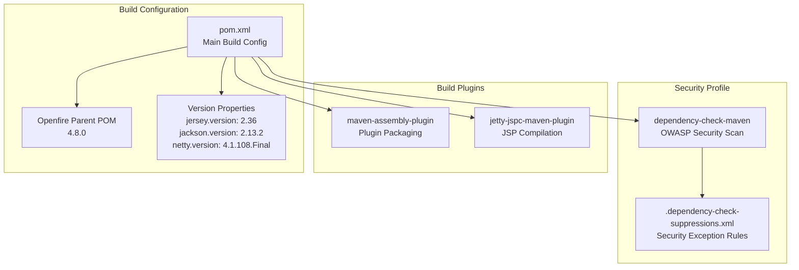
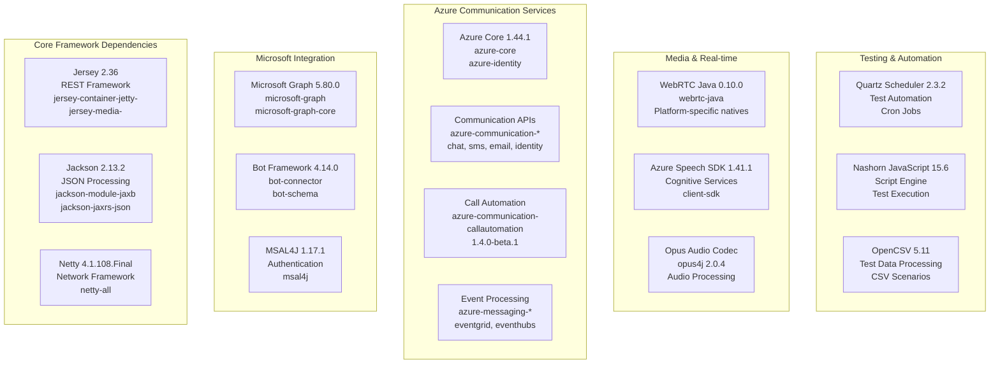
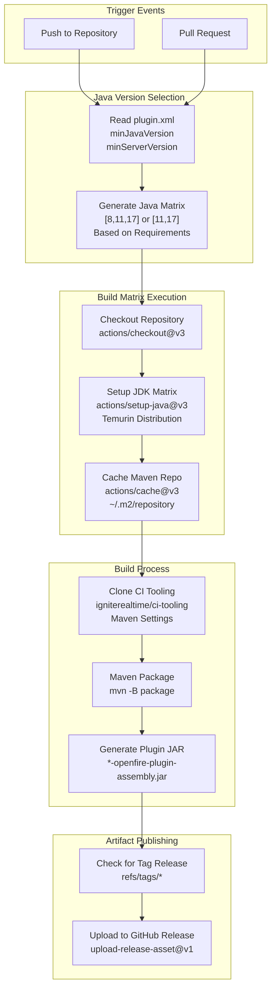
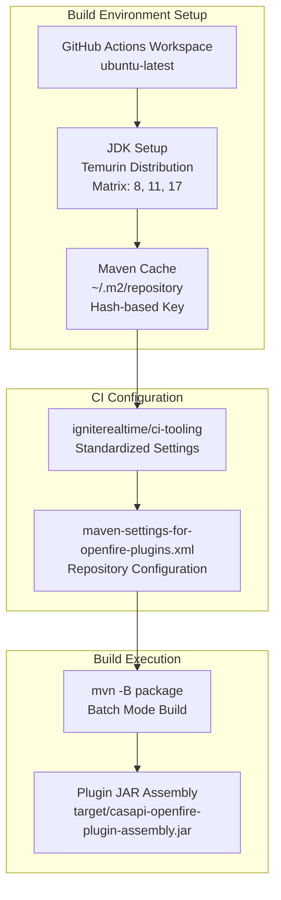
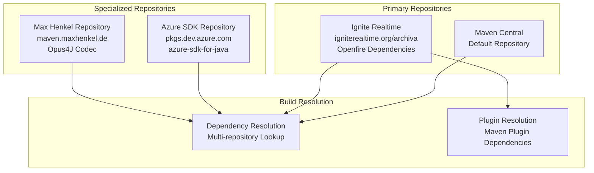

# Build System & CI/CD

> **Relevant source files**
> * [.github/workflows/build.yml](https://github.com/ComitFS/cas-service/blob/b7087e8d/.github/workflows/build.yml)
> * [changelog.html](https://github.com/ComitFS/cas-service/blob/b7087e8d/changelog.html)
> * [pom.xml](https://github.com/ComitFS/cas-service/blob/b7087e8d/pom.xml)

This document covers the Maven-based build system and GitHub Actions CI/CD pipeline used to compile, test, package, and deploy the CAS Service Plugin. The build system handles dependency management, Openfire plugin assembly, multi-Java version compatibility, and automated security scanning.

For information about deployment and development tools, see [Development Tools](./7.2-development-tools.md). For system requirements and architectural decisions, see [Requirements & Documentation](./7.3-requirements-and-documentation.md).

## Maven Build Configuration

The CAS Service Plugin uses Maven as its primary build system, configured as an Openfire plugin through the parent POM structure. The project inherits from the Openfire plugins parent and extends it with comprehensive dependency management for Microsoft services integration.

### Project Structure

| Property | Value | Purpose |
| --- | --- | --- |
| `groupId` | `org.igniterealtime.openfire.plugins` | Openfire plugin namespace |
| `artifactId` | `casapi` | Plugin identifier |
| `version` | `0.4.0-SNAPSHOT` | Current development version |
| `parent.version` | `4.8.0` | Openfire compatibility target |

The build configuration defines specific version properties for major dependency groups:

Sources: [pom.xml L1-L45](https://github.com/ComitFS/cas-service/blob/b7087e8d/pom.xml#L1-L45)

### Dependency Management

The build system manages an extensive set of dependencies organized into functional groups. The dependency structure supports the plugin's integration with Microsoft services, Azure Communication Services, and real-time communication features.

Sources: [pom.xml L47-L340](https://github.com/ComitFS/cas-service/blob/b7087e8d/pom.xml#L47-L340)

### Build Profiles and Security

The Maven configuration includes a security-focused build profile that integrates OWASP dependency checking to identify known vulnerabilities in the dependency tree.

| Profile | Purpose | Key Plugin |
| --- | --- | --- |
| `deps` | Security vulnerability scanning | `dependency-check-maven:7.1.1` |

The security profile configuration:

* Skips provided and runtime scopes to focus on bundled dependencies
* Uses custom suppression rules from `.dependency-check-suppressions.xml`
* Integrates with CI/CD for automated security gates

Sources: [pom.xml L342-L369](https://github.com/ComitFS/cas-service/blob/b7087e8d/pom.xml#L342-L369)

## CI/CD Pipeline Architecture

The GitHub Actions workflow implements a comprehensive CI/CD pipeline that supports multiple Java versions, automated testing, and conditional artifact publishing. The pipeline is designed to ensure compatibility across different Java runtime environments.

### Pipeline Stages

Sources: [.github/workflows/build.yml L1-L125](https://github.com/ComitFS/cas-service/blob/b7087e8d/.github/workflows/build.yml#L1-L125)

### Java Version Compatibility Matrix

The CI/CD system dynamically determines Java version compatibility based on plugin metadata:

| Condition | Java Versions | Rationale |
| --- | --- | --- |
| `minJavaVersion == 11` OR `minServerVersion =~ 4.8.*` | `[11, 17]` | Modern Openfire compatibility |
| Default | `[8, 11, 17]` | Broad compatibility testing |

The pipeline uses conditional logic in the `select_java` job to read the `plugin.xml` file and determine appropriate Java versions for testing:

Sources: [.github/workflows/build.yml L44-L52](https://github.com/ComitFS/cas-service/blob/b7087e8d/.github/workflows/build.yml#L44-L52)

### Build Environment Configuration

The CI system sets up a standardized build environment:

1. **Repository Caching**: Maven repository artifacts are cached using a composite key based on OS, Java version, and POM file hash
2. **CI Tooling Integration**: Downloads Ignite Realtime CI tooling for standardized Maven settings
3. **Artifact Generation**: Produces deployable JAR files with the naming pattern `{artifactId}-openfire-plugin-assembly.jar`

Sources: [.github/workflows/build.yml L89-L113](https://github.com/ComitFS/cas-service/blob/b7087e8d/.github/workflows/build.yml#L89-L113)

## Build Artifacts and Packaging

The build system produces Openfire-compatible plugin artifacts through the Maven assembly process. The packaging integrates with Openfire's plugin architecture while bundling all necessary dependencies.

### Artifact Structure

| Artifact Type | Location | Purpose |
| --- | --- | --- |
| Plugin JAR | `target/casapi-openfire-plugin-assembly.jar` | Deployable Openfire plugin |
| Compiled Classes | `target/classes/` | Java bytecode |
| Web Resources | Integrated into JAR | Servlet and static content |
| Dependencies | Bundled in JAR | Runtime libraries |

The assembly process uses the `maven-assembly-plugin` to create a complete plugin package that includes:

* Compiled Java classes from `src/java`
* Web application resources
* Dependency libraries
* Plugin metadata (`plugin.xml`)

Sources: [pom.xml L34-L45](https://github.com/ComitFS/cas-service/blob/b7087e8d/pom.xml#L34-L45)

 [.github/workflows/build.yml L110-L113](https://github.com/ComitFS/cas-service/blob/b7087e8d/.github/workflows/build.yml#L110-L113)

### Repository Configuration

The build system integrates with multiple Maven repositories to resolve dependencies:

Sources: [pom.xml L371-L413](https://github.com/ComitFS/cas-service/blob/b7087e8d/pom.xml#L371-L413)

## Version Management and Releases

The project follows semantic versioning with snapshot development cycles. The current development version `0.4.0-SNAPSHOT` indicates active development toward the next minor release.

### Release History

| Version | Release Date | Milestone |
| --- | --- | --- |
| `0.1.0` | October 21, 2024 | Initial release |
| `0.2.0` | November 30, 2024 | Feature expansion |
| `0.4.0-SNAPSHOT` | Current | Active development |

The CI/CD pipeline automatically publishes artifacts to GitHub Releases when tags are pushed, but only for specific Java versions to avoid duplicate artifacts:

* Java 8 builds are published for broad compatibility
* Java 11 builds are published when it's the minimum supported version
* Java 17 builds provide testing but don't produce separate artifacts

Sources: [changelog.html L47-L55](https://github.com/ComitFS/cas-service/blob/b7087e8d/changelog.html#L47-L55)

 [.github/workflows/build.yml L115-L124](https://github.com/ComitFS/cas-service/blob/b7087e8d/.github/workflows/build.yml#L115-L124)