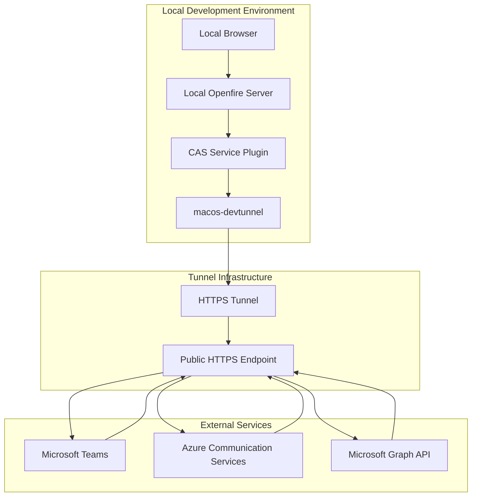
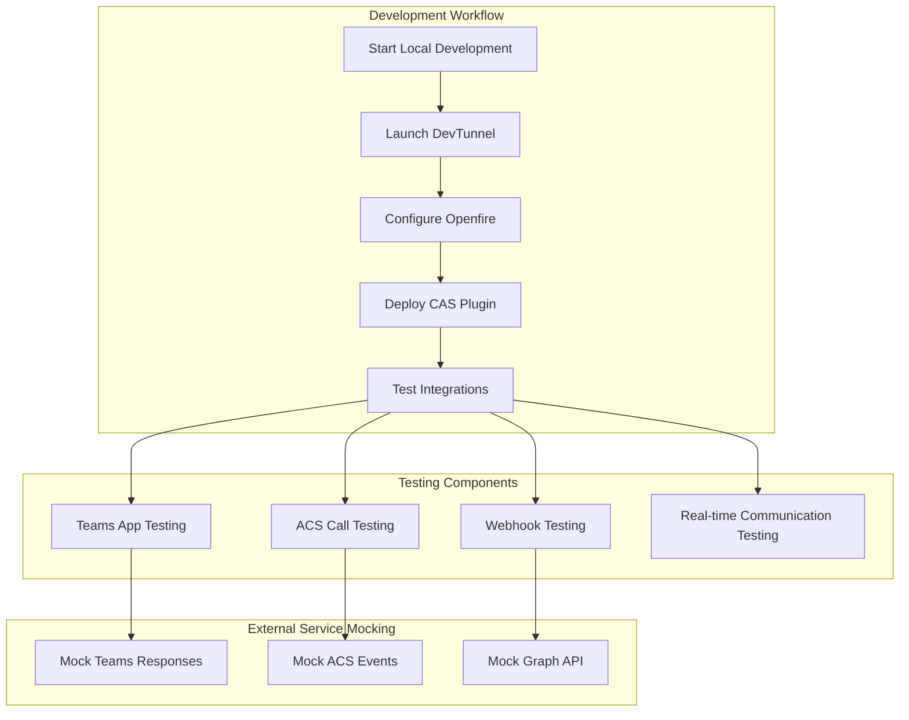
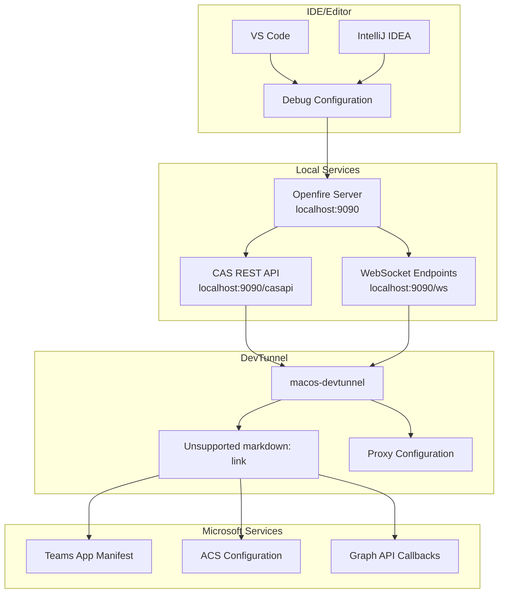
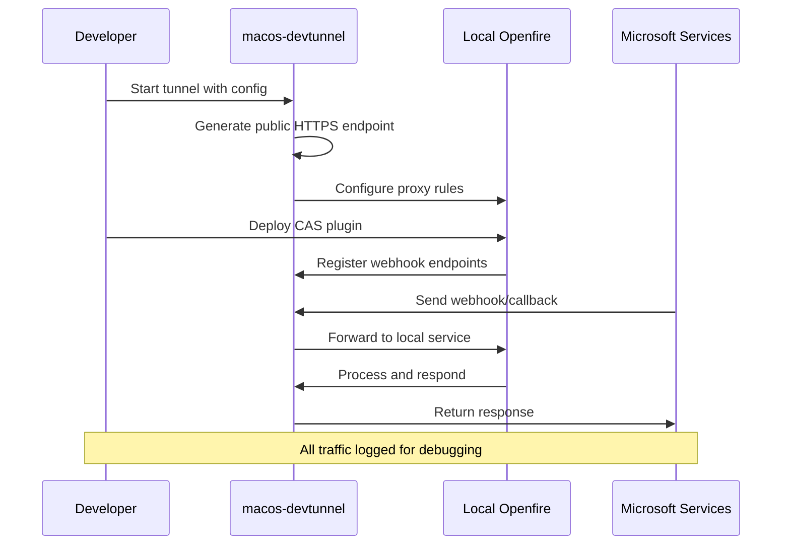

# Development Tools

> **Relevant source files**
> * [classes/apps/linux-devtunnel](https://github.com/ComitFS/cas-service/blob/b7087e8d/classes/apps/linux-devtunnel)
> * [classes/apps/macos-devtunnel](https://github.com/ComitFS/cas-service/blob/b7087e8d/classes/apps/macos-devtunnel)
> * [classes/apps/win-devtunnel.exe](https://github.com/ComitFS/cas-service/blob/b7087e8d/classes/apps/win-devtunnel.exe)

This document covers the development tools and utilities provided for local testing and debugging of the CAS Service Plugin. These tools facilitate development workflow by enabling secure tunneling, local testing environments, and debugging capabilities for the Openfire plugin and its integrations with Microsoft services.

For information about the build system and CI/CD processes, see [Build System & CI/CD](./7.1-build-system-and-cicd.md). For deployment procedures and system requirements, see [Requirements & Documentation](./7.3-requirements-and-documentation.md).

## DevTunnel Applications

The CAS service includes platform-specific development tunnel applications that enable secure local development and testing of the Openfire plugin without requiring full cloud deployment.

### macOS DevTunnel

The primary development tool is the macOS DevTunnel application, which provides secure tunneling capabilities for local development environments.

**DevTunnel Application Architecture**

The DevTunnel creates a secure HTTPS tunnel that exposes local development instances to external Microsoft services, enabling webhook callbacks and OAuth flows to function properly during development.

Sources: [classes/apps/macos-devtunnel](https://github.com/ComitFS/cas-service/blob/b7087e8d/classes/apps/macos-devtunnel)

### Key Capabilities

| Feature | Description | Use Case |
| --- | --- | --- |
| **HTTPS Tunneling** | Creates secure tunnel from local development to public endpoint | Testing webhook callbacks from Microsoft services |
| **OAuth Integration** | Enables proper OAuth redirect flows during development | Testing Microsoft Teams app authentication |
| **Webhook Support** | Allows external services to send webhooks to local development | Testing Azure Communication Services event callbacks |
| **SSL Termination** | Handles SSL/TLS termination for local HTTPS requirements | Meeting Microsoft API security requirements |

## Local Testing Infrastructure

The development tools support comprehensive local testing of the CAS service components and their integrations.

**Local Development Testing Flow**

This diagram shows how the DevTunnel integrates into the local development workflow, enabling comprehensive testing of Microsoft service integrations.

### Testing Scenarios

The development tools support testing of key CAS service scenarios:

* **Microsoft Teams App Integration**: Testing tab functionality, bot responses, and authentication flows
* **Azure Communication Services**: Testing call automation, DTMF handling, and voice interactions
* **Real-time Communication**: Testing WebSocket connections, audio streaming, and live transcription
* **Webhook Processing**: Testing incoming webhooks from Microsoft services and third-party integrations

Sources: [classes/apps/macos-devtunnel](https://github.com/ComitFS/cas-service/blob/b7087e8d/classes/apps/macos-devtunnel)

## Development Workflow Integration

The DevTunnel application integrates with the broader development ecosystem to provide seamless local development experience.

**Development Environment Integration**

This diagram illustrates how the DevTunnel bridges local development services with external Microsoft service requirements.

### Configuration Management

The DevTunnel supports flexible configuration for different development scenarios:

* **Environment-specific endpoints**: Different tunnel URLs for development, staging, and testing
* **Service-specific routing**: Routing different API paths to appropriate local services
* **Security configurations**: SSL certificate management and authentication handling
* **Logging and monitoring**: Request/response logging for debugging integration issues

## Debugging Utilities

The development tools provide comprehensive debugging capabilities for troubleshooting CAS service integrations and functionality.

### Debug Features

| Utility | Purpose | Technical Details |
| --- | --- | --- |
| **Request Logging** | Log all HTTP requests/responses through tunnel | Captures Microsoft service webhook payloads and API responses |
| **WebSocket Monitoring** | Monitor real-time communication streams | Debug audio streaming and live transcription issues |
| **Authentication Debugging** | Trace OAuth and authentication flows | Verify Microsoft Graph and Teams authentication |
| **Event Tracing** | Track Azure Communication Services events | Monitor call automation and DTMF event processing |

### Local Development Configuration

**Development Tunnel Communication Flow**

This sequence diagram shows how the DevTunnel facilitates bidirectional communication between local development and Microsoft services.

The development tools ensure that local testing closely mirrors production behavior while providing the debugging visibility needed for efficient development and troubleshooting.

Sources: [classes/apps/macos-devtunnel](https://github.com/ComitFS/cas-service/blob/b7087e8d/classes/apps/macos-devtunnel)