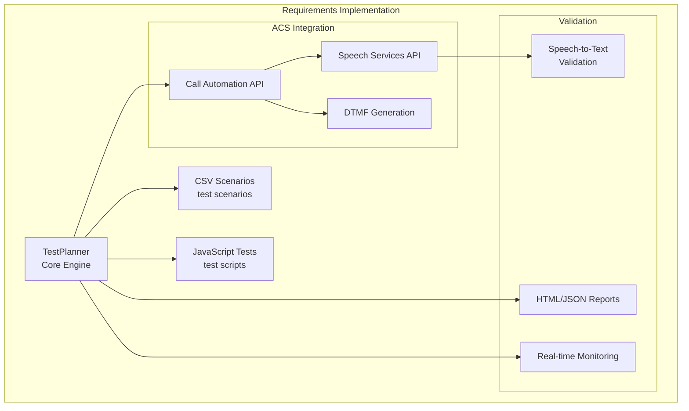
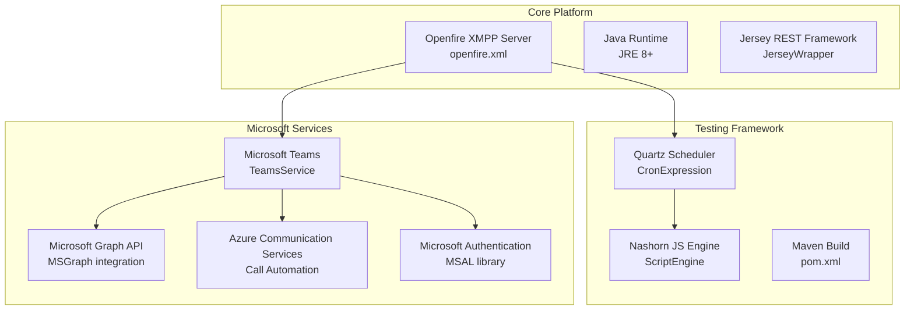
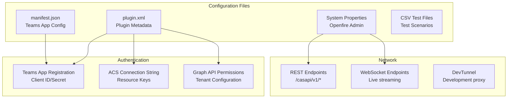
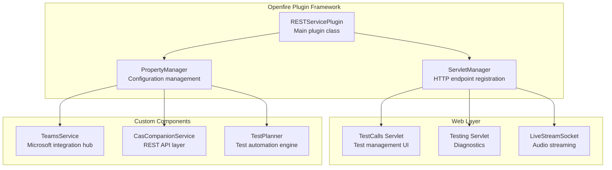

# Requirements & Documentation

> **Relevant source files**
> * [documentation/CAS Call Automation Services.docx](https://github.com/ComitFS/cas-service/blob/b7087e8d/documentation/CAS Call Automation Services.docx)
> * [documentation/CAS Call Automation Services.pptx](https://github.com/ComitFS/cas-service/blob/b7087e8d/documentation/CAS Call Automation Services.pptx)
> * [documentation/cas-streaming.pptx](https://github.com/ComitFS/cas-service/blob/b7087e8d/documentation/cas-streaming.pptx)
> * [documentation/requirements.txt](https://github.com/ComitFS/cas-service/blob/b7087e8d/documentation/requirements.txt)
> * [documentation/teams-phone-extensibility.txt](https://github.com/ComitFS/cas-service/blob/b7087e8d/documentation/teams-phone-extensibility.txt)

This page documents the system requirements, architectural decisions, and documentation resources for the CAS Service Plugin. It covers functional requirements for call automation testing, technical dependencies, and configuration specifications that drive the system design.

For information about the build system and CI/CD processes, see [Build System & CI/CD](./7.1-build-system-and-cicd.md). For development tools and debugging utilities, see [Development Tools](./7.2-development-tools.md).

## Functional Requirements

The CAS system was designed to meet specific contact center testing automation requirements, particularly for IVR (Interactive Voice Response) system validation and call flow testing.

### Core Testing Requirements

Based on client specifications, the system must provide:

| Requirement Category | Description | Implementation Status |
| --- | --- | --- |
| **API-Driven Call Initiation** | Trigger calls to servicelines with configurable parameters | ✅ Implemented via ACS Call Automation |
| **IVR Navigation** | Navigate complex multi-layered menu flows via DTMF and voice control | ✅ DTMF implemented, Voice control supported |
| **Message Validation** | Validate IVR announcements and messages for correctness | ✅ Speech-to-text transcription validation |
| **Caller ID Manipulation** | Modify caller number (ANI) for authentication testing | ✅ ACS caller ID configuration |
| **Bulk Testing** | Configure concurrent/load testing scenarios | ✅ CSV scenario support with scheduling |
| **Automation** | No manual intervention required | ✅ Fully automated via TestPlanner engine |



**Sources:** [documentation/requirements.txt L24-L40](https://github.com/ComitFS/cas-service/blob/b7087e8d/documentation/requirements.txt#L24-L40)

### Contact Center Integration Requirements

The system addresses both current Genesys-based solutions and future cloud-based contact center platforms:

* **Current Platform**: Windows-based Workspace Desktop Edition (WDE) integration
* **Future Platform**: Web-based contact center solution compatibility
* **Channel Support**: Voice, chat, email, and other communication channels
* **Agent Simulation**: Ability to simulate client calls and route to agents

**Sources:** [documentation/requirements.txt L8-L22](https://github.com/ComitFS/cas-service/blob/b7087e8d/documentation/requirements.txt#L8-L22)

## Technical Requirements

### Runtime Dependencies



**Sources:** [src/main/java/org/jivesoftware/openfire/plugin/rest/RESTServicePlugin.java L1-L50](https://github.com/ComitFS/cas-service/blob/b7087e8d/src/main/java/org/jivesoftware/openfire/plugin/rest/RESTServicePlugin.java#L1-L50)

 [pom.xml L1-L100](https://github.com/ComitFS/cas-service/blob/b7087e8d/pom.xml#L1-L100)

### System Architecture Requirements

The system follows a plugin-based architecture with specific dependency requirements:

| Component | Version | Purpose |
| --- | --- | --- |
| **Openfire Server** | 4.6.0+ | XMPP server platform and plugin host |
| **Java Runtime** | JRE 8+ | Core runtime environment |
| **Jersey Framework** | 2.x | REST API implementation |
| **Quartz Scheduler** | 2.x | Test scheduling and automation |
| **Nashorn Engine** | Built-in | JavaScript test execution |
| **Azure SDK** | Latest | ACS and Graph API integration |

### Configuration Requirements



**Sources:** [plugin.xml L1-L30](https://github.com/ComitFS/cas-service/blob/b7087e8d/plugin.xml#L1-L30)

 [src/main/webapp/teams-app/manifest.json L1-L50](https://github.com/ComitFS/cas-service/blob/b7087e8d/src/main/webapp/teams-app/manifest.json#L1-L50)

 [documentation/teams-phone-extensibility.txt L1-L5](https://github.com/ComitFS/cas-service/blob/b7087e8d/documentation/teams-phone-extensibility.txt#L1-L5)

## Architectural Decisions

### Plugin Architecture Choice

The system is implemented as an Openfire plugin to leverage:

* **XMPP Infrastructure**: Built-in real-time messaging and presence
* **Administrative Framework**: Openfire's web-based configuration system
* **Security Model**: Integrated authentication and authorization
* **Extensibility**: Plugin ecosystem and lifecycle management



**Sources:** [src/main/java/org/jivesoftware/openfire/plugin/rest/RESTServicePlugin.java L1-L100](https://github.com/ComitFS/cas-service/blob/b7087e8d/src/main/java/org/jivesoftware/openfire/plugin/rest/RESTServicePlugin.java#L1-L100)

 [src/main/java/org/jivesoftware/openfire/plugin/rest/service/TeamsService.java L1-L50](https://github.com/ComitFS/cas-service/blob/b7087e8d/src/main/java/org/jivesoftware/openfire/plugin/rest/service/TeamsService.java#L1-L50)

### Microsoft Teams Integration Strategy

Integration with Microsoft Teams was chosen to provide:

* **Native User Experience**: Teams-based interface for familiar workflows
* **Enterprise SSO**: Leverage existing Microsoft authentication
* **Bot Framework**: Conversational AI capabilities
* **Call Composite**: Video calling integration via ACS

### Test Automation Design

The testing framework supports multiple scenario types:

* **CSV-Driven Tests**: Structured data scenarios for bulk testing
* **JavaScript Tests**: Programmatic test logic with custom validation
* **Scheduled Execution**: Cron-based automation via Quartz scheduler
* **Real-time Monitoring**: Live audio streaming and transcription

**Sources:** [src/main/java/org/jivesoftware/openfire/plugin/rest/service/TestPlanner.java L1-L100](https://github.com/ComitFS/cas-service/blob/b7087e8d/src/main/java/org/jivesoftware/openfire/plugin/rest/service/TestPlanner.java#L1-L100)

## Documentation Resources

### Primary Documentation

| Document | Location | Purpose |
| --- | --- | --- |
| **Requirements Specification** | `documentation/requirements.txt` | Client requirements and functional specifications |
| **Teams Extensibility Guide** | `documentation/teams-phone-extensibility.txt` | PowerShell configuration commands |
| **API Documentation** | `documentation/CAS Call Automation Services.docx` | Comprehensive API reference |

### Configuration Examples

#### ACS Teams Registration

```markdown
# Register ACS resource with Teams
Set-CsOnlineApplicationInstance -ApplicationId b0435d07-bbf1-4881-973c-e065e078eb14 -AcsResourceId 7278b90e-91bb-4a42-8913-9233b5d4ad4f -Identity casbot@olajide.net

# Sync application instance
Sync-CsOnlineApplicationInstance -ObjectId 7b12bd64-381e-4112-b78b-3b265b0cff67 -ApplicationId b0435d07-bbf1-4881-973c-e065e078eb14
```

**Sources:** [documentation/teams-phone-extensibility.txt L1-L5](https://github.com/ComitFS/cas-service/blob/b7087e8d/documentation/teams-phone-extensibility.txt#L1-L5)

### Test Scenario Documentation

Test scenarios are defined in structured formats:

* **CSV Format**: Tabular data with predefined columns for call parameters
* **JavaScript Format**: Programmatic tests with custom logic and validation
* **HTML Reports**: Generated test results with detailed execution logs
* **JSON Data**: Machine-readable test outcomes for integration

**Sources:** [src/main/webapp/testcalls.html L1-L50](https://github.com/ComitFS/cas-service/blob/b7087e8d/src/main/webapp/testcalls.html#L1-L50)

 [src/main/webapp/js/testcalls.js L1-L100](https://github.com/ComitFS/cas-service/blob/b7087e8d/src/main/webapp/js/testcalls.js#L1-L100)

### Development Resources

#### Build Configuration

The system uses Maven for dependency management and build automation:

```xml
<!-- Key dependencies -->
<dependency>
    <groupId>org.igniterealtime.openfire</groupId>
    <artifactId>xmppserver</artifactId>
</dependency>
<dependency>
    <groupId>org.glassfish.jersey.core</groupId>
    <artifactId>jersey-server</artifactId>
</dependency>
```

#### Environment Setup

Development requires:

* **DevTunnel**: Local development proxy for Teams app testing
* **Openfire Server**: Local or remote server instance
* **Azure Subscriptions**: ACS and Azure AI services access
* **Teams App Registration**: Developer tenant configuration

**Sources:** [pom.xml L1-L200](https://github.com/ComitFS/cas-service/blob/b7087e8d/pom.xml#L1-L200)

 [src/devtunnel/devtunnel-casapi.py L1-L50](https://github.com/ComitFS/cas-service/blob/b7087e8d/src/devtunnel/devtunnel-casapi.py#L1-L50)

### Deployment Documentation

Deployment involves multiple configuration steps:

1. **Plugin Installation**: Deploy JAR to Openfire plugins directory
2. **Property Configuration**: Set system properties via Openfire admin console
3. **Teams App Deployment**: Upload manifest to Teams app catalog
4. **Azure Resource Configuration**: Configure ACS and Graph API permissions
5. **Test Scenario Setup**: Upload CSV files and JavaScript test scripts

The system supports both development and production deployment scenarios with appropriate configuration management.

**Sources:** [plugin.xml L1-L50](https://github.com/ComitFS/cas-service/blob/b7087e8d/plugin.xml#L1-L50)

 [src/main/webapp/teams-app/manifest.json L1-L100](https://github.com/ComitFS/cas-service/blob/b7087e8d/src/main/webapp/teams-app/manifest.json#L1-L100)